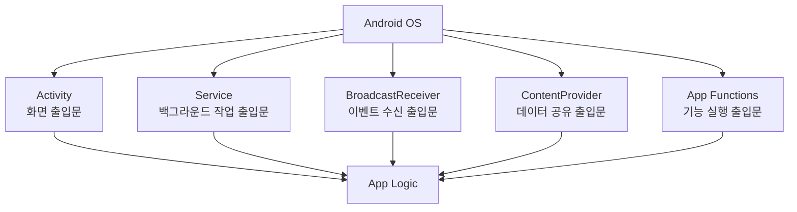

# 안드로이드 앱은 "OS가 실행하는 컴포넌트 묶음"이다

상위 노트: [[android-modern-architecture-components]]

웹 앱이나 데스크톱 앱은 보통 `main()` 함수 하나에서 프로그램이 시작됩니다. 하지만 안드로이드 앱은 다릅니다.

안드로이드 앱은 **유저가 아이콘을 눌렀을 때만 실행되는 프로그램**이 아니라, 아래처럼 여러 상황에서 OS가 필요한 컴포넌트를 직접 깨워 실행하는 구조입니다.

* 유저가 앱 아이콘을 누름 → `Activity` 실행
* 음악을 백그라운드에서 재생해야 함 → `Service` 실행
* 충전기 연결, 부팅 완료, 네트워크 변화 같은 시스템 이벤트 발생 → `BroadcastReceiver` 호출
* 다른 앱이 내 앱의 데이터를 조회하려 함 → `ContentProvider` 호출
* 시스템/AI agent가 내 앱의 특정 기능을 실행하려 함 → `App Functions` 호출

즉, 안드로이드 앱은 하나의 커다란 실행 파일이라기보다 **OS에게 등록해 둔 여러 출입문들의 묶음**에 가깝습니다.

> [!IMPORTANT]
> 전통적인 4대 컴포넌트는 모두 **안드로이드 OS가 이름을 알고 직접 실행할 수 있는 공식 진입점**입니다. 그래서 대부분 `AndroidManifest.xml`에 등록하거나,
> 코드에서 시스템 API를 통해 명시적으로 연결해야 합니다.

---
