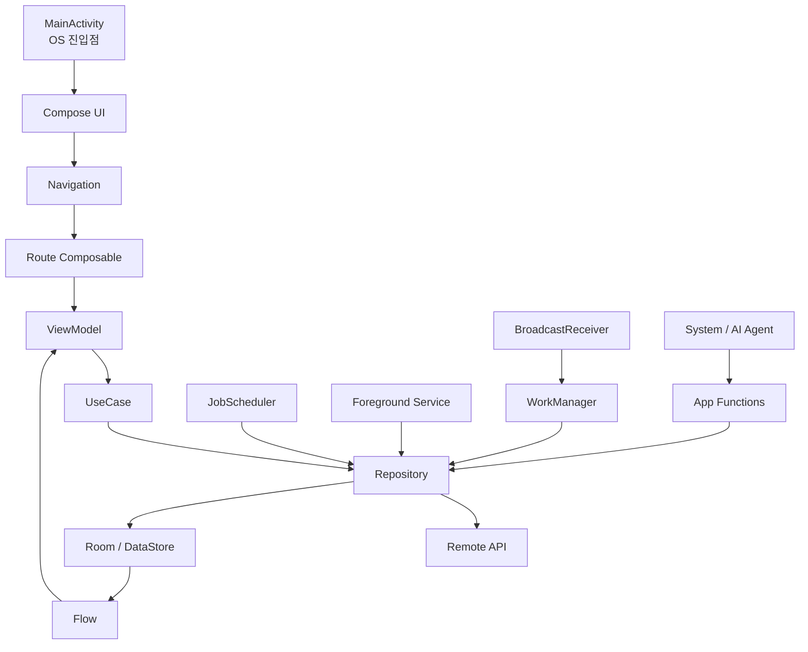

# 실무 아키텍처 예시

상위 노트: [[android-modern-architecture-components]]

아래는 현대 Android 앱에서 흔히 사용하는 책임 분리 구조입니다.



### 10-1. 화면 데이터 로딩

```kotlin
class BenefitRepository(
    private val api: BenefitApi,
    private val dao: BenefitDao,
) {
    fun observeBenefits(): Flow<List<Benefit>> {
        return dao.observeBenefits()
    }

    suspend fun refreshBenefits() {
        val benefits = api.fetchBenefits()
        dao.replaceAll(benefits)
    }
}
```

```kotlin
class BenefitViewModel(
    private val repository: BenefitRepository,
) : ViewModel() {
    val benefits: StateFlow<List<Benefit>> =
        repository.observeBenefits()
            .stateIn(
                scope = viewModelScope,
                started = SharingStarted.WhileSubscribed(5_000),
                initialValue = emptyList(),
            )

    fun refresh() {
        viewModelScope.launch {
            repository.refreshBenefits()
        }
    }
}
```

### 10-2. 백그라운드 동기화

```kotlin
class BenefitSyncWorker(
    appContext: Context,
    params: WorkerParameters,
) : CoroutineWorker(appContext, params) {
    private val repository =
        (appContext.applicationContext as MyBenefitApplication)
            .appContainer
            .benefitRepository

    override suspend fun doWork(): Result {
        return try {
            repository.refreshBenefits()
            Result.success()
        } catch (e: IOException) {
            Result.retry()
        }
    }
}
```

> [!NOTE]
> Hilt나 별도 `WorkerFactory`를 쓰는 프로젝트라면 `BenefitRepository`를 Worker 생성자에 직접 주입할 수 있습니다. 위 예시는 의존성 주입
> 프레임워크를 전제하지 않는 가장 단순한 구조입니다.

이 구조에서 `Activity`는 화면을 올리고, `ViewModel`은 UI 상태를 만들고, `Repository`는 데이터 출처를 숨깁니다. `Flow`는 앱 내부의 상태
변화를 UI까지 전달하고, `WorkManager`/`JobScheduler`는 앱이 화면 밖으로 나간 뒤에도 필요한 예약 작업을 OS에게 맡기며,
`Foreground Service`는 음악 재생처럼 즉시 계속 돌아야 하는 사용자 인지 작업을 담당합니다. `App Functions`는 시스템/AI agent가 내 앱의 기능을
구조적으로 실행해야 할 때 Repository/UseCase 경계로 들어오는 새 외부 진입점입니다.

---
