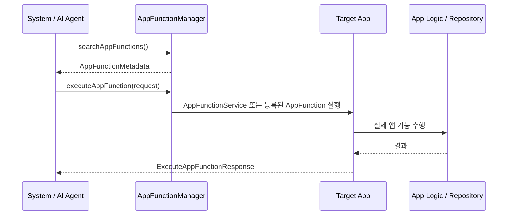

# App Functions: 시스템/AI agent에게 앱 기능을 공개하는 현대 경계

상위 노트: [[android-modern-architecture-components]]

### 7-1. App Functions란?

`App Functions`는 앱 안의 특정 기능을 **시스템이나 신뢰된 agent가 발견하고 실행할 수 있도록 공개하는 API**입니다.

예를 들어 agent가 다음과 같은 기능을 앱을 열지 않고도 호출할 수 있게 만드는 방향입니다.

* 노트 앱의 `createNote`
* 음악 앱의 `playSong`
* 캘린더 앱의 `createEvent`
* 음식 주문 앱의 `orderAgain`



> [!IMPORTANT]
> App Functions는 전통적인 4대 컴포넌트 중 하나는 아닙니다. 하지만 현대 Android에서는 `Intent`, `ContentProvider`,
`FileProvider`와 함께 **앱 밖에서 내 앱 기능에 접근하는 공식 경계**로 봐야 합니다.

### 7-2. 왜 현대 구조에 포함해야 하나?

전통적인 앱 간 연동은 보통 아래 중 하나였습니다.

| 방식                     | 잘하는 일                        | 한계                            |
|:-----------------------|:-----------------------------|:------------------------------|
| `Intent`               | 화면 열기, 공유하기, 한 번의 액션 요청      | 파라미터/결과 구조가 느슨함               |
| `ContentProvider`      | 다른 앱이 내 데이터를 조회/수정           | "동작 실행"보다 "데이터 창구"에 가까움       |
| `FileProvider`         | 파일을 안전하게 공유                  | 파일 URI 공유에 특화                 |
| Bound Service / Binder | 강한 IPC 계약                    | 구현/권한/버전 관리가 무거움              |
| **App Functions**      | 기능을 메타데이터로 선언하고 agent가 검색/실행 | 최신/실험적 기능이므로 적용 범위와 호환성 확인 필요 |

AI assistant와 agentic workflow가 중요해지면 "앱을 여는 것"보다 **앱의 기능을 구조화해서 실행하는 것**이 중요해집니다. App Functions는 이
지점에 들어갑니다.

### 7-3. 제공 방식: AppFunctionService와 런타임 등록

공식 API 기준으로 앱은 기능을 두 방식으로 제공할 수 있습니다.

| 제공 방식                | 언제 적합한가                                   | 핵심 API                                      |
|:---------------------|:------------------------------------------|:--------------------------------------------|
| `AppFunctionService` | 앱 전체에서 항상 제공 가능한 기능                       | `AppFunctionService`, `onExecuteFunction()` |
| 런타임 등록               | 특정 Activity나 foreground service 상태에 묶인 기능 | `AppFunctionManager.registerAppFunction()`  |

`AppFunctionService` 방식은 시스템이 필요할 때 앱을 깨워 기능을 실행할 수 있습니다.

```xml

<service android:name=".NoteAppFunctionService"
    android:permission="android.permission.BIND_APP_FUNCTION_SERVICE" android:exported="true">
    <property android:name="android.app.appfunctions" android:value="note_app_functions.xml" />
    <intent-filter>
        <action android:name="android.app.appfunctions.AppFunctionService" />
    </intent-filter>
</service>
```

```kotlin
class NoteAppFunctionService : AppFunctionService() {
    override fun onExecuteFunction(
        request: ExecuteAppFunctionRequest,
        callingPackage: String,
        callingPackageSigningInfo: SigningInfo,
        cancellationSignal: CancellationSignal,
        callback: OutcomeReceiver<ExecuteAppFunctionResponse, AppFunctionException>,
    ) {
        when (request.functionIdentifier) {
            "createNote" -> {
                // repository.createNote(...)
                callback.onResult(ExecuteAppFunctionResponse(...))
            }
            else -> {
                callback.onError(
                    AppFunctionException(
                        AppFunctionException.FUNCTION_NOT_FOUND,
                        "Unknown function: ${request.functionIdentifier}",
                    )
                )
            }
        }
    }
}
```

> [!NOTE]
> App Functions는 함수 메타데이터를 XML asset으로 선언하고, 이를 `android.app.appfunctions` property로 연결합니다. Android
> SDK 문서 기준으로 앱 하나에는 활성 `AppFunctionService` 구현이 하나만 있을 수 있습니다.

### 7-4. Intent, ContentProvider, Flow와의 차이

| 비교 대상                | App Functions와의 차이                                                            |
|:---------------------|:------------------------------------------------------------------------------|
| `Intent`             | Intent는 "이 화면/액션을 처리해줘"에 가깝고, App Functions는 agent가 검색 가능한 구조화된 기능 계약에 가깝습니다. |
| `ContentProvider`    | ContentProvider는 데이터를 조회/수정하는 창구이고, App Functions는 앱의 동작을 실행하는 창구입니다.         |
| `Flow` / `StateFlow` | Flow는 앱 내부 프로세스의 상태 흐름이고, App Functions는 앱 밖의 시스템/agent가 호출하는 경계입니다.          |
| `WorkManager`        | WorkManager는 내 앱의 백그라운드 작업 예약이고, App Functions는 외부 agent가 내 앱 기능을 실행하는 통로입니다. |

### 7-5. 현재 문서에서 빠졌던 이유

이 문서가 처음에는 전통적인 4대 컴포넌트와 Jetpack 아키텍처 이동에 초점을 맞췄기 때문에, `App Functions` 같은 최신 agent-facing API를 다루지
않았습니다.

하지만 현대 Android 구조를 설명하려면 이제 다음처럼 분리해서 봐야 합니다.

```text
앱 내부 상태/이벤트 흐름
-> ViewModel, Flow, StateFlow, SharedFlow, Repository

앱 내부 백그라운드 작업
-> WorkManager, JobScheduler, Foreground Service

앱 밖에서 들어오는 화면/데이터/기능 경계
-> Activity, Intent, ContentProvider, FileProvider, App Functions
```

> [!WARNING]
> App Functions는 현재 Android API reference에서 beta/experimental preview로 표시됩니다. 일반 앱의 기본 구조에 무조건 넣는
> 기능이라기보다는, assistant/agent가 앱 기능을 호출해야 하는 제품 요구사항이 있을 때 검토하는 현대적 확장 경계로 보는 편이 정확합니다.

---
