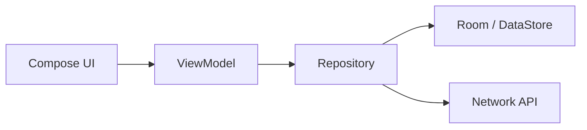

# ContentProvider: 앱 간 데이터 공유 창구에서 "특수한 공개 API"로

상위 노트: [[android-modern-architecture-components]]

### 6-1. ContentProvider란?

`ContentProvider`는 앱의 데이터를 다른 앱이나 시스템이 정해진 URI로 조회/삽입/수정/삭제할 수 있게 열어주는 컴포넌트입니다.

대표적인 예시는 연락처 앱입니다.

```text
content://contacts/people/3
```

이 URI는 웹의 URL처럼 보이지만, 실제로는 안드로이드 기기 내부에서 특정 앱의 데이터 창구를 가리키는 주소입니다.

```kotlin
val cursor = context.contentResolver.query(
    ContactsContract.Contacts.CONTENT_URI,
    null,
    null,
    null,
    null,
)
```

### 6-2. ContentProvider가 필요한 이유

안드로이드 앱은 기본적으로 각자의 샌드박스 안에 갇혀 있습니다. A 앱은 B 앱의 DB 파일을 직접 열 수 없습니다.

ContentProvider는 이 문제를 해결하기 위해 **권한, URI, 표준 CRUD 인터페이스를 갖춘 공식 데이터 공유 창구**를 제공합니다.

| 역할       | 설명                                    |
|:---------|:--------------------------------------|
| 데이터 주소화  | `content://...` URI로 데이터 위치 표현        |
| 권한 통제    | 읽기/쓰기 권한, URI 임시 권한 부여                |
| 표준 인터페이스 | `query`, `insert`, `update`, `delete` |
| 앱 간 공유   | 다른 앱이나 시스템 UI가 안전하게 접근                |

### 6-3. 현대 앱에서 사용 빈도가 낮아진 이유

일반적인 앱은 더 이상 자기 내부 데이터를 다른 앱에 직접 공개하지 않습니다.

현대 앱 데이터 흐름은 보통 아래처럼 닫힌 구조입니다.



내 앱 안에서만 쓰는 데이터라면 ContentProvider를 만들 필요가 없습니다. `Flow`는 이 내부 데이터를 화면과 ViewModel에 흘려보내는 도구이고,
ContentProvider는 앱 밖으로 공개 API를 여는 도구입니다.

대신:

* 관계형 로컬 DB → `Room`
* 키-값 설정값 → `DataStore`
* 화면 자동 갱신 → `Flow`
* 서버 데이터 동기화 → `Repository + WorkManager`
* 파일 공유 → `FileProvider`

### 6-4. 그래도 ContentProvider가 필요한 경우

ContentProvider는 사라진 기술이 아니라 **앱 간 데이터 공유가 제품 요구사항일 때 필요한 공식 창구**입니다.

| 상황                             | 예시                             |
|:-------------------------------|:-------------------------------|
| 다른 앱이 내 데이터를 검색해야 함            | 연락처, 캘린더, 사전 앱                 |
| 시스템 검색/추천에 데이터를 노출해야 함         | 검색 가능한 콘텐츠                     |
| 파일을 안전하게 공유해야 함                | `FileProvider`로 이미지/PDF URI 공유 |
| 기업/플랫폼 앱이 여러 앱에 공통 데이터를 제공해야 함 | 사내 계정, 공통 인증, 공통 설정            |

### 6-5. FileProvider 예시

일반 앱에서 가장 자주 만나는 ContentProvider 계열은 직접 Provider를 구현하는 것이 아니라 `FileProvider`를 사용하는 경우입니다.

```xml

<provider android:name="androidx.core.content.FileProvider"
    android:authorities="${applicationId}.fileprovider" android:exported="false"
    android:grantUriPermissions="true">
    <meta-data android:name="android.support.FILE_PROVIDER_PATHS"
        android:resource="@xml/file_paths" />
</provider>
```

```kotlin
val uri = FileProvider.getUriForFile(
    context,
    "${context.packageName}.fileprovider",
    pdfFile,
)

val intent = Intent(Intent.ACTION_SEND).apply {
    type = "application/pdf"
    putExtra(Intent.EXTRA_STREAM, uri)
    addFlags(Intent.FLAG_GRANT_READ_URI_PERMISSION)
}
context.startActivity(Intent.createChooser(intent, "공유"))
```

> [!IMPORTANT]
> 파일 경로(`/storage/.../invoice.pdf`)를 다른 앱에 직접 넘기는 방식은 안전하지 않습니다. `content://` URI와 임시 권한을 주는
`FileProvider`가 현대 Android의 표준 방식입니다.

---
