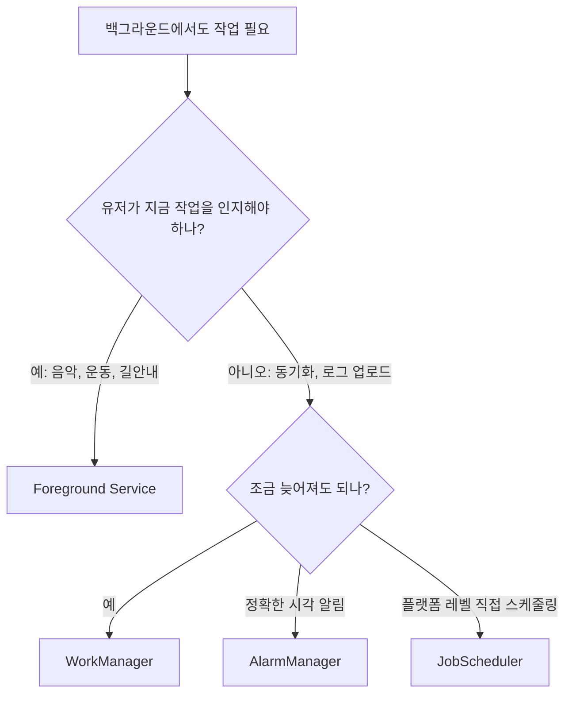

# Service: 백그라운드 만능 도구에서 "특수 작업용 경계"로

상위 노트: [[android-modern-architecture-components]]

### 4-1. Service란?

`Service`는 화면 없이 실행되는 컴포넌트입니다.

전통적으로는 아래 같은 작업에 Service를 많이 사용했습니다.

* 음악 재생
* 파일 다운로드/업로드
* 위치 추적
* 주기적인 서버 동기화
* 블루투스/센서 연결 유지

```kotlin
class MusicService : Service() {
    override fun onBind(intent: Intent?): IBinder? = null

    override fun onStartCommand(intent: Intent?, flags: Int, startId: Int): Int {
        // 백그라운드 음악 재생 시작
        return START_STICKY
    }
}
```

```xml

<service android:name=".MusicService" android:exported="false" />
```

### 4-2. Service의 종류

| 종류                     | 역할                          | 대표 사례               |
|:-----------------------|:----------------------------|:--------------------|
| **Started Service**    | 한 번 시작하면 작업이 끝날 때까지 실행      | 예전 다운로드 서비스         |
| **Bound Service**      | 다른 컴포넌트가 연결해서 메서드를 호출       | 앱 내부 플레이어 컨트롤러      |
| **Foreground Service** | 유저가 인지해야 하는 장기 실행 작업. 알림 필수 | 음악 재생, 운동 기록, 내비게이션 |

### 4-3. 왜 Service 사용이 줄었나?

스마트폰은 배터리, 발열, 메모리 제약이 매우 강한 기기입니다. 앱들이 마음대로 Service를 오래 실행하면 폰 전체 성능이 무너집니다.

그래서 Android는 시간이 지나며 백그라운드 실행을 강하게 제한했습니다.

| 문제                | OS의 방향                             |
|:------------------|:-----------------------------------|
| 앱이 몰래 계속 실행       | 백그라운드 Service 제한 강화                |
| 배터리 과소모           | Doze, App Standby, 배터리 최적화         |
| 유저가 모르는 위치/녹음/동기화 | Foreground Service 알림과 권한 요구       |
| 주기 작업 남발          | JobScheduler/WorkManager로 스케줄링 표준화 |

결과적으로 Service는 **아무 백그라운드 작업에나 쓰는 도구**가 아니라, 정말로 OS 레벨 실행이 필요한 특수 컴포넌트가 되었습니다.

### 4-4. Background Service라는 말이 헷갈리는 이유

예전 Android 문서나 오래된 코드에서는 "background service"라는 표현을 자주 볼 수 있습니다. 보통 **화면이 없는 Service를 백그라운드에서 계속 돌린다
**는 뜻으로 쓰였습니다.

하지만 현대 Android에서는 이 표현을 조심해서 봐야 합니다.

| 표현                 | 현대적으로 해석해야 하는 의미                                                                   |
|:-------------------|:-----------------------------------------------------------------------------------|
| Background Service | 앱이 화면에 보이지 않는 동안 몰래 오래 실행되는 일반 Service. Android 8.0 이후 강하게 제한됨                     |
| Foreground Service | 유저가 인지할 수 있는 알림을 띄우고 즉시 계속 실행되는 Service                                            |
| Background work    | 앱 화면 밖에서도 끝나야 하는 작업 전체. WorkManager, JobScheduler, Foreground Service 등을 포함하는 넓은 말 |

음악 재생, 운동 기록, 내비게이션처럼 유저가 명확히 인지하고 있고 **지금 당장 계속 돌아야 하는 작업**은 일반 background service가 아니라 *
*Foreground Service**가 맞습니다.



> [!IMPORTANT]
> "앱이 백그라운드에 있어도 계속 돌아야 한다"는 말만으로 Service를 고르면 안 됩니다. **계속 실행되어야 하는 실시간 사용자 인지 작업**인지, **언젠가 완료되면 되는
보장 작업**인지 먼저 나눠야 합니다.

### 4-5. JobScheduler: OS 레벨 작업 예약기

`JobScheduler`는 Android 프레임워크가 제공하는 **OS 레벨 작업 예약 API**입니다. 네트워크 연결, 충전 중, 대기 시간, 주기 실행 같은 조건을 걸어
작업을 예약할 수 있습니다.

```kotlin
val jobInfo = JobInfo.Builder(
    1001,
    ComponentName(context, SyncJobService::class.java),
)
    .setRequiredNetworkType(JobInfo.NETWORK_TYPE_UNMETERED)
    .setRequiresCharging(true)
    .build()

context.getSystemService(JobScheduler::class.java).schedule(jobInfo)
```

```kotlin
class SyncJobService : JobService() {
    override fun onStartJob(params: JobParameters?): Boolean {
        // 별도 스레드/Coroutine에서 작업 시작
        return true
    }

    override fun onStopJob(params: JobParameters?): Boolean {
        // true를 반환하면 나중에 재시도 가능
        return true
    }
}
```

다만 일반 앱에서는 `JobScheduler`를 직접 쓰기보다 `WorkManager`를 먼저 고려하는 편이 보통 더 좋습니다.

| 구분            | JobScheduler           | WorkManager                        |
|:--------------|:-----------------------|:-----------------------------------|
| 소속            | Android Framework API  | Jetpack 라이브러리                      |
| 추상화 수준        | 낮음. `JobService` 직접 구현 | 높음. `Worker`, `CoroutineWorker` 제공 |
| OS 버전 대응      | 개발자가 세부 차이를 더 신경 써야 함  | 내부적으로 적절한 스케줄러 사용                  |
| 체이닝/재시도/상태 관찰 | 직접 설계 필요               | API로 제공                            |
| 일반 앱 권장도      | 특수한 플랫폼 제어가 필요할 때      | 대부분의 보장 백그라운드 작업                   |

> [!NOTE]
> WorkManager는 내부적으로 OS 버전과 상황에 맞는 스케줄링 메커니즘을 사용합니다. 그래서 "작업 예약"이 목적이라면 보통 WorkManager가 더 높은 수준의 표준
> API입니다.

### 4-6. 현대 대체재: WorkManager

`WorkManager`는 "언젠가는 반드시 실행되어야 하는 백그라운드 작업"을 위한 Jetpack 라이브러리입니다.

대표 사례:

* 서버에 로그 업로드
* 장바구니/주문 데이터 동기화
* 이미지 압축 후 업로드
* 네트워크가 연결되면 재시도해야 하는 작업

```kotlin
class SyncOrdersWorker(
    appContext: Context,
    params: WorkerParameters,
) : CoroutineWorker(appContext, params) {
    override suspend fun doWork(): Result {
        return try {
            // repository.syncOrders()
            Result.success()
        } catch (e: IOException) {
            Result.retry()
        } catch (e: Exception) {
            Result.failure()
        }
    }
}
```

```kotlin
val request = OneTimeWorkRequestBuilder<SyncOrdersWorker>()
    .setConstraints(
        Constraints.Builder()
            .setRequiredNetworkType(NetworkType.CONNECTED)
            .build()
    )
    .build()

WorkManager.getInstance(context).enqueueUniqueWork(
    "sync-orders",
    ExistingWorkPolicy.KEEP,
    request,
)
```

### 4-7. Foreground Service vs WorkManager vs JobScheduler 선택 기준

| 상황                                | 선택                                | 이유                               |
|:----------------------------------|:----------------------------------|:---------------------------------|
| 음악 재생처럼 앱을 내려도 바로 계속 재생되어야 함      | Foreground Service + MediaSession | 유저가 지금 듣고 있고 알림/미디어 컨트롤이 필요      |
| 운동 기록, 길안내처럼 실시간으로 계속 추적해야 함      | Foreground Service                | 중단되면 UX가 망가지고 유저가 작업을 인지해야 함     |
| 사진 업로드, 로그 전송, 서버 동기화처럼 결국 완료되면 됨 | WorkManager                       | 네트워크/충전 조건, 재시도, 앱 재시작 이후 보장에 적합 |
| OS 프레임워크 수준에서 직접 작업 스케줄을 제어해야 함   | JobScheduler                      | Jetpack 추상화보다 낮은 레벨 제어가 필요할 때    |
| 정확한 시각에 알림을 울려야 함                 | AlarmManager                      | 작업 처리보다 "정확한 시간" 자체가 핵심          |
| 화면이 보이는 동안만 API 호출/계산하면 됨         | Kotlin Coroutine                  | 앱이 화면 밖으로 나가면 취소되어도 되는 작업        |

> [!IMPORTANT]
> WorkManager는 Service의 단순 대체품이 아닙니다. "지금 즉시 계속 돌아야 하는 작업"은 Foreground Service가 맞고, **조건이 맞을 때 OS가
안전하게 실행해도 되는 보장 작업**은 WorkManager가 맞습니다.

---
