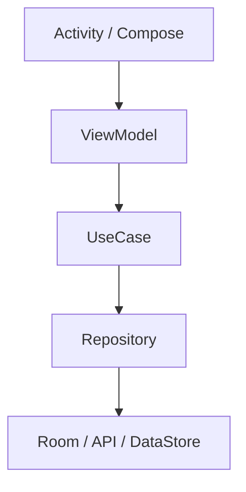

# 왜 현대 아키텍처로 바뀌었나?

상위 노트: [[android-modern-architecture-components]]

### 8-1. 이유 1: 생명주기가 너무 복잡하다

Activity와 Service는 OS 생명주기에 직접 묶여 있습니다.

* 화면 회전
* 다크 모드 변경
* 멀티 윈도우 크기 변경
* 프로세스 종료 후 복원
* 앱이 백그라운드로 이동
* 배터리 최적화로 작업 지연

이 모든 상황을 Activity나 Service 안에서 직접 처리하면 코드가 빠르게 복잡해집니다.

현대 구조는 생명주기 대응을 Jetpack 라이브러리에 나눠 맡깁니다.

| 문제                | 현대 해법                           |
|:------------------|:--------------------------------|
| 화면 회전 시 데이터 유지    | ViewModel                       |
| 화면이 보일 때만 Flow 구독 | `collectAsStateWithLifecycle()` |
| 앱이 꺼져도 작업 재시도     | WorkManager                     |
| DB 변경 자동 반영       | Room + Flow                     |
| 설정값 비동기 저장        | DataStore                       |

### 8-2. 이유 2: 테스트가 어려웠다

Activity/Service/Receiver/Provider에 비즈니스 로직이 들어가면 테스트가 무거워집니다. OS 컴포넌트를 띄워야 하고, Context와 생명주기까지 준비해야
하기 때문입니다.

현대 구조에서는 핵심 로직을 순수 Kotlin 클래스에 둡니다.



이렇게 하면 `UseCase`, `Repository`, `ViewModel` 대부분은 로컬 JVM 테스트로 검증할 수 있습니다.

### 8-3. 이유 3: 배터리와 개인정보 보호가 중요해졌다

초기 Android는 앱이 백그라운드에서 비교적 자유롭게 움직일 수 있었습니다. 하지만 앱 수가 많아지고, 위치/센서/네트워크 사용이 늘어나면서 OS는 점점 엄격해졌습니다.

현대 Android는 개발자에게 이렇게 요구합니다.

* 오래 실행되는 작업은 유저가 알아야 한다.
* 백그라운드 작업은 OS가 배터리 상태에 맞춰 조절할 수 있어야 한다.
* 민감한 데이터는 명시적 권한과 최소 공개 원칙을 따라야 한다.
* 앱 내부 상태 전달과 앱 간 공개 API를 구분해야 한다.

그래서 `Service`와 `BroadcastReceiver`를 남발하던 구조는 줄고, `WorkManager`, 권한 모델, Foreground Service, Flow 기반
상태 전달이 표준이 되었습니다.

### 8-4. 이유 4: 선언형 UI와 상태 중심 설계가 자리 잡았다

Compose에서는 화면을 직접 명령형으로 바꾸지 않습니다.

```kotlin
// 예전 View 방식의 느낌
progressBar.visibility = View.VISIBLE
titleTextView.text = product.name
```

대신 상태를 만들고, UI는 그 상태를 그립니다.

```kotlin
@Composable
fun ProductScreen(uiState: ProductUiState) {
    if (uiState.isLoading) {
        CircularProgressIndicator()
    } else {
        ProductList(products = uiState.products)
    }
}
```

이 구조에서는 `Flow`가 매우 자연스럽습니다. 데이터가 시간에 따라 흘러오고, Compose는 최신 상태를 다시 그리면 됩니다.

---
