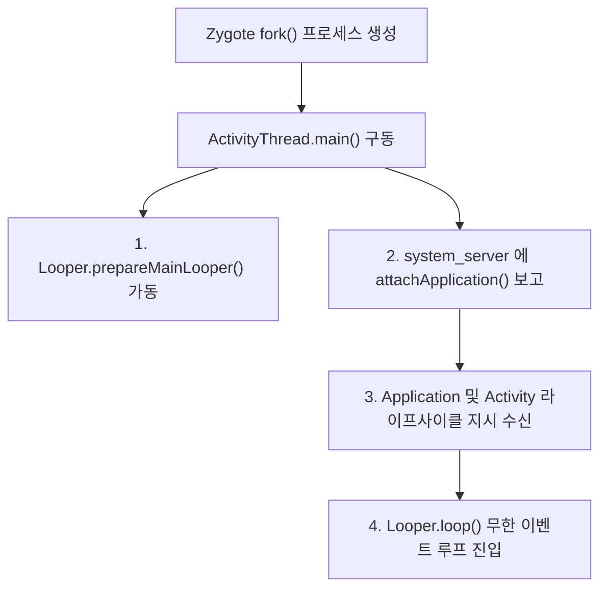

## ActivityThread (안드로이드 앱 메인 스레드 총괄 지휘자)

### 1. 개요 (Overview)

**`ActivityThread`** 는 Android 애플리케이션 프로세스 내부에서 가장 먼저 구동되는 **메인 스레드의 진입점(Main Entry Point)이자 앱 프로세스의 메인 총괄 관리 클래스**이다.

Java/Kotlin 프로그램의 `public static void main(String[] args)` 에 해당하는 `ActivityThread.main()` 메서드를 내장하고 있으며, 안드로이드 메인 이벤트 루프([Handler & Looper](../../data/async-flow/handler-looper-message-queue.md))를 가동하고 [system_server](../../../04_system_services/system-server.md) 와의 바인더 통신을 매개한다.

---

#### 초보자를 위한 쉽게 이해하는 비유

- **`ActivityThread` (방송국 생방송 현장 메인 총괄 PD)**:
  - 방송국 현장에서 카메라 조명(UI)을 켜고, 큐시트(이벤트 메시지)를 확인하며, 상부(system_server)의 지시를 받아 출연자(`Application`, `Activity`, `Service`)를 무대에 올리고 섭외 해제(Destroy)하는 **현장 메인 총괄 PD 스레드**.

---

### 2. ActivityThread 의 핵심 역할과 내부 구조

1. **`main()` 메서드 실행 및 이벤트 루프 가동**:
   - `Zygote` 가 프로세스를 복제(`fork`)하면 새 프로세스에서 `ActivityThread.main()` 이 호출된다.
   - 메인 스레드의 [Looper & MessageQueue](../../data/async-flow/handler-looper-message-queue.md) 가 준비되고 `Looper.loop()` 무한 루프가 시작되어 UI 이벤트를 처리한다.
2. **`ApplicationThread` 바인더 인터페이스 탑재**:
   - 내부 클래스인 `ApplicationThread` (IPC Binder Stub)를 통해 [system_server](../../../04_system_services/system-server.md) 의 명령(`bindApplication`, `scheduleLaunchActivity`, `scheduleStopService` 등)을 바인더 트랜잭션으로 수신한다.
3. **컴포넌트 라이프사이클 디스패치**:
   - 수신된 명령을 메시지 큐에 넣고, UI 메인 스레드에서 `Application.onCreate()`, `Activity.onCreate()`, `Service.onCreate()` 등을 실제로 호출한다.

---

### 3. 주의사항 및 안티패턴 (UI Thread Blocking)

- [ANR (Application Not Responding)](../../../01_system_internals/boot-and-runtime/system-server/anr-responsiveness.md) - ActivityThread 메인 스레드 응답성 계약 위반 예방 가이드
- **Context 참조 누수 주의**:
  - `ActivityThread` 가 관리하는 `Activity` 참조를 백그라운드 싱글톤에 넘기면 메모리 누수(Memory Leak)가 발생한다.

---

### 4. 연결 문서 (Related Links)

- [Handler & Looper & MessageQueue](../../data/async-flow/handler-looper-message-queue.md) - ActivityThread 가 가동하는 메인 이벤트 루프
- [system_server](../../../04_system_services/system-server.md) - ActivityThread 에 컴포넌트 생명주기를 지시하는 시스템 백본
- [Zygote 와 ART 런타임 심층 계약](../../../01_system_internals/boot-and-runtime/zygote-runtime/zygote-runtime.md) - ActivityThread 프로세스를 fork 해 주는 마스터 프로세스
