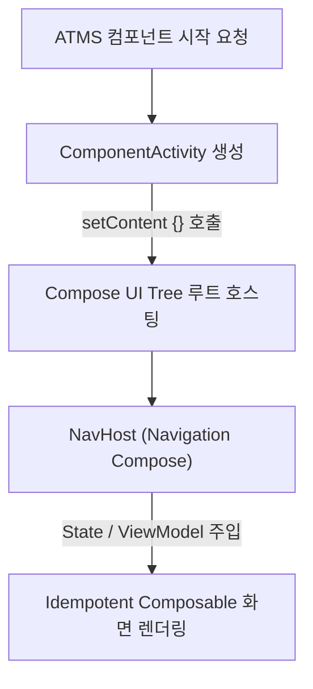

## Activity (안드로이드 액티비티 & Compose 현대 진입점)

### 1. 개요 (Overview)

**Activity (액티비티)** 는 사용자가 시각적으로 상호작용할 수 있는 UI 윈도우 화면을 제공하고, 시스템 이벤트([ATMS](../../../04_system_services/activity-manager-service.md))의 진입점 역할을 수행하는 **안드로이드 4 대 앱 컴포넌트의 핵심 엔트리 포인트**이다.

현대 안드로이드 아키텍처(Modern Android Development - MAD)에서는 전통적인 XML 기반의 다중 Activity 구조 대신, 단 하나의 `ComponentActivity` 위에 **Jetpack Compose 와 Navigation Compose 를 올리는 Single Activity Architecture (SAA)** 가 표준으로 정립되었다.

---

#### 초보자를 위한 쉽게 이해하는 비유

- **Activity (연극 무대 세트장이 갖춰진 건물 무대)**:
  - 관객(사용자)이 방문하는 액티비티라는 무대 건물 위에, 과거에는 여러 개의 독립된 세트장(Multi-Activity)을 매번 새로 지었다면, 현대 Compose 시대에는 **하나의 거대한 통합 스마트 무대 세트(`ComponentActivity`) 안에서 연극 장면(Composable 화면)만 유연하게 교체하는 현대식 스마트 극장**.



---

### 2. 현대 관점의 Activity 핵심 변경 및 설계 원칙

1. **Single Activity Architecture (SAA)**:
   - 앱 전체에서 단 하나(또는 기능별 최소한)의 `ComponentActivity`만 선언하고, 화면 이동은 Navigation Compose 가 담당하여 [ATMS](../../../04_system_services/activity-manager-service.md) 의 무거운 Activity 전환 오버헤드를 최소화한다.
2. **`setContent` 및 State/ViewModel 분리**:
   - Activity 내부에서 직접 View 레이아웃을 다루지 않고 `setContent {}` 블록으로 Compose 런타임에 호스팅하며, 상태관리는 [ViewModel](../../viewmodel.md) 및 [Compose SSOT](../../compose-ssot.md) 로 이관한다.
3. **Activity 수명주기(Lifecycle)와 Compose**:
   - `ON_START`, `ON_RESUME`, `ON_PAUSE`, `ON_STOP` 수명주기는 Compose 의 `DisposableEffect` / `LifecycleEventObserver` 또는 `repeatOnLifecycle` 과 조합되어 리소스 leak 을 예방한다.

---

### 3. 실전 코드 예시 (Jetpack Compose 현대 구현)

```kotlin
class MainActivity : ComponentActivity() {
    override fun onCreate(savedInstanceState: Bundle?) {
        super.onCreate(savedInstanceState)
        setContent {
            MyApplicationTheme {
                val navController = rememberNavController()
                NavHost(navController = navController, startDestination = "main") {
                    composable("main") { MainScreen() }
                }
            }
        }
    }
}
```

---

### 4. 연결 문서 (Related Links)

- [ATMS & AMS](../../../04_system_services/activity-manager-service.md) - Activity 백스택 및 수명주기 통제
- [Compose SSOT](../../compose-ssot.md) - ViewModel 기반 UDF 상태 관리
- [ViewModel](../../viewmodel.md) - Configuration Change 견디는 UI 상태 저장소
- [Composable Body Purity](../../jetpack-compose/runtime/compose-runtime-contracts/composable-body-purity.md) - Compose UI 작성 준칙
- [Low Memory Killer (LMK)](../../../01_system_internals/lmk-low-memory-killer.md) - Activity 프로세스 OOM 수거
