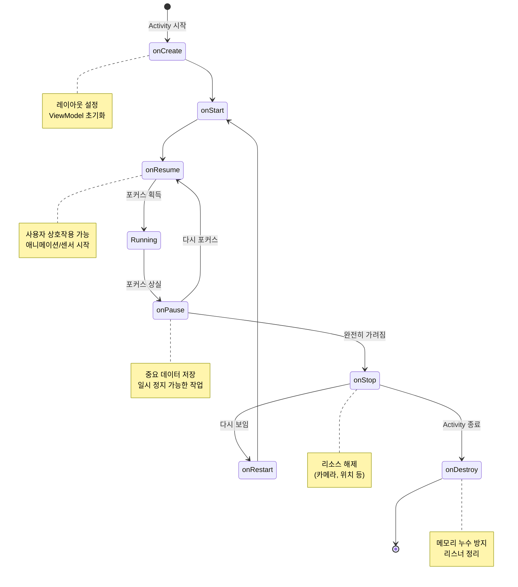

# 생명주기 콜백 순서

1. **onCreate()**: Activity 가 처음 만들어질 때. `setContentView()` 로 레이아웃을 설정하고, ViewModel 을 초기화한다.
2. **onStart()**: 화면에 보이기 시작. 아직 포커스는 없다.
3. **onResume()**: 포커스를 받아 사용자와 상호작용 가능. 애니메이션/센서를 시작하기 좋은 시점.
4. **onPause()**: 포커스를 잃음. 다른 Activity 가 위에 뜨거나 멀티윈도우 상태. 중요한 데이터를 저장한다.
5. **onStop()**: 완전히 가려짐. 무거운 리소스 (카메라, 위치 리스너) 를 해제한다.
6. **onDestroy()**: Activity 가 종료됨. 메모리 누수를 막기 위해 리스너를 정리한다.

