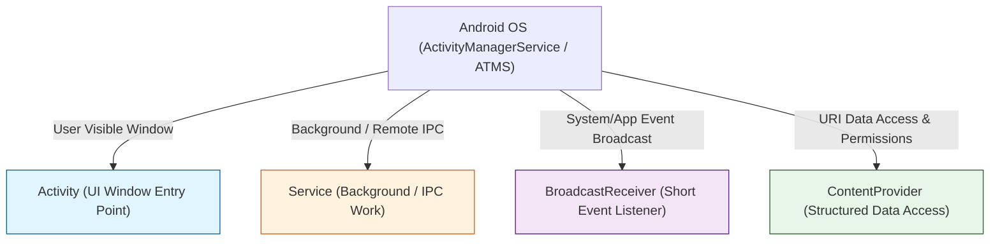

## Android 앱 컴포넌트는 OS가 호출하는 시스템 진입점 및 실행 경계다

안드로이드 애플리케이션 컴포넌트(**Activity, Service, BroadcastReceiver, ContentProvider**)는 내부 객체지향 클래스가 아니라, **안드로이드 OS(ActivityManagerService / ActivityTaskManagerService)가 앱 프로세스를 발견하고 인스턴스화하여 개입하는 시스템 진입점(System Entry Points) 및 프로세스 실행 우선순위 경계**다.

---

### 1. 개념 및 핵심 구조 (What)

4대 컴포넌트는 각자 명확히 지정된 시스템 인터랙션 사양을 보유한다.

1. **Activity**: 사용자가 직접 보고 상호작용하는 화면 포그라운드 UI 진입점.
2. **Service**: 화면 없이 백그라운드 작업을 실행하거나 바인더(Binder) IPC 인터페이스를 제공하는 진입점.
3. **BroadcastReceiver**: 시스템 비행기 모드, 부팅 완료, 푸시 수신 등 시스템/앱 간 이벤트를 수신하는 일회성 진입점.
4. **ContentProvider**: 권한 및 URI 격리 경계 위에서 파일이나 데이터베이스 테이블 구조를 외부에 게시하는 데이터 진입점.

---

### 2. 왜 컴포넌트 경계 서술이 중요한가? (Why)

- **프로세스 중요도(oom_adj / oom_score_adj) 신호**: OS 의 Low Memory Killer(LMK)는 현재 활성화된 컴포넌트의 종류에 따라 프로세스의 우선순위를 결정한다. Resumed Activity 를 가진 프로세스는 최고 우선순위(`FOREGROUND_APP`), Background Service 나 Receiver 는 중간, 아무 컴포넌트도 실행되지 않는 프로세스는 `CACHED_APP` 으로 처리되어 즉시 메모리 회수 대상이 된다.

---

### 3. 세부 하위 정본 계약 노드

- [App Component Contracts](./app-component-contracts/app-component-contracts.md)

---

### 4. 참고 및 공식 문서

- 상위 문서: [Android App Architecture](../android-app-architecture.md)
- 공식 가이드: [Application Fundamentals](https://developer.android.com/guide/components/fundamentals)

검증일: 2026-08-05. 4대 컴포넌트 OS 진입점 구조 검증 완료.
