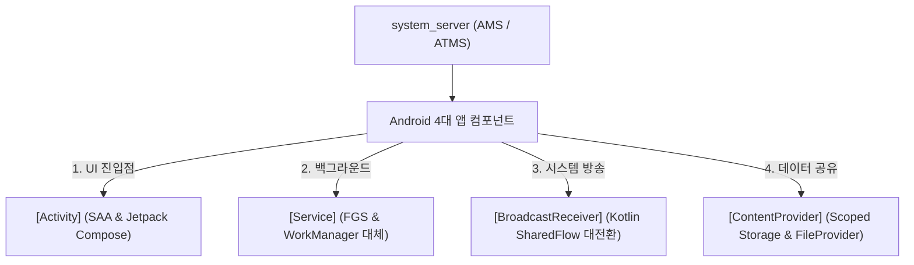

## Android 4 대 앱 컴포넌트 (Modern Android Architecture)

### 1. 개요 (Overview)

**Android 4 대 앱 컴포넌트**는 Android OS 기기에서 애플리케이션이 시스템 및 사용자와 상호작용하기 위해 제공하는 **4 가지 핵심 빌딩 블록([Activity](activity.md), [Service](service.md), [BroadcastReceiver](broadcast-receiver.md), [ContentProvider](content-provider.md))** 이다.

각 컴포넌트는 안드로이드 [system_server](../../../04_system_services/system-server.md) 내부의 [AMS / ATMS](../../../04_system_services/activity-manager-service.md) 에 의해 독립적으로 수명주기(Lifecycle)가 관리되며, [Intent](../../navigation/intents-and-deep-links/intent-manifest/pendingintent-is-delegated-future-intent-token.md) 와 [Binder IPC](../../../01_system_internals/binder-ipc.md) 를 매개체로 통신한다.

---

#### 4 대 컴포넌트 현대적 진화 및 원자 레퍼런스 노드

1. **[Activity (액티비티 & Compose 현대 진입점)](activity.md)**:
   - 사용자가 시각적으로 상호작용하는 UI 화면. 현대 관점에서는 Single Activity Architecture (SAA) 와 Jetpack Compose 가 표준이다.
2. **[Service (서비스 & 백그라운드 현대 관점)](service.md)**:
   - UI 없이 백그라운드 실행. 현대 관점에서는 단순 백그라운드가 완전 금지되었으며 Foreground Service 와 WorkManager 로 정당화 대체된다.
3. **[BroadcastReceiver (방송 수신기 & 이벤트 현대 관점)](broadcast-receiver.md)**:
   - OS 시스템 이벤트를 수신하는 수신기. 현대 관점에서는 암시적 리시버가 금지되고 앱 내부 전파는 Kotlin Flow 로 대전환되었다.
4. **[ContentProvider (데이터 제공자 & 파일 공유 관점)](content-provider.md)**:
   - 앱 간 데이터/파일 공유 창구. 현대 관점에서는 Room DB 가 로컬 DB 를 전담하고, 파일 공유는 Scoped Storage 의 FileProvider 로 정립되었다.

---

### 2. 연결 문서 (Related Links)

- [Activity](activity.md)
- [Service](service.md)
- [BroadcastReceiver](broadcast-receiver.md)
- [ContentProvider](content-provider.md)
- [AMS & ATMS](../../../04_system_services/activity-manager-service.md) - 4 대 컴포넌트 수명주기 및 프로세스 통제
