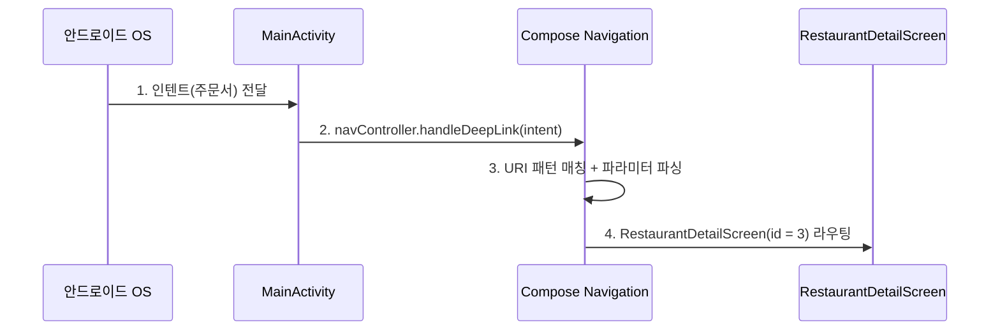

# Jetpack Compose 시대의 매니페스트 (Single Activity Architecture)

### 5-1. 구조의 변화

현대 Jetpack Compose의 대세는 **단 하나의 Activity만 두고**, 화면 전환을 모두 Compose 코드(Navigation 라이브러리)로 처리하는 **Single Activity Architecture (SAA)** 입니다.

```xml
<application ...>
    <activity android:name=".MainActivity" android:exported="true">
        <!-- 1. 런처 (앱 아이콘 진입) -->
        <intent-filter>
            <action android:name="android.intent.action.MAIN" />
            <category android:name="android.intent.category.LAUNCHER" />
        </intent-filter>

        <!-- 2. 딥 링크 (모든 웹 링크를 하나의 Activity에서 수신) -->
        <intent-filter android:autoVerify="true">
            <action android:name="android.intent.action.VIEW" />
            <category android:name="android.intent.category.DEFAULT" />
            <category android:name="android.intent.category.BROWSABLE" />
            <data android:scheme="https" android:host="example.com" />
            <data android:pathPrefix="/restaurants" />
            <data android:pathPrefix="/products" />
        </intent-filter>
    </activity>
### 5-3. 프로덕션 정밀 Profiling을 위한 `<profileable>` 태그 설정
Android Studio의 Profiler 및 Macrobenchmark를 통한 성능 분석 시, 디버그 빌드(`debuggable=true`)는 컴파일 최적화가 꺼져 있어 지표가 왜곡됩니다.

릴리즈 빌드 수준의 정밀한 성능/메모리 Profile 수치를 수집하려면 매니페스트 `<application>` 태그 내에 **`<profileable>`** 태그를 지정해야 합니다:

```xml
<application ...>
    <!-- Android Studio Profiler 및 Perfetto가 Release 빌드에서도 정밀 프로파일링을 수행하도록 허용 -->
    <profileable android:shell="true" />
    
    <activity android:name=".MainActivity" android:exported="true">
        ...
    </activity>
</application>
```

> [!TIP]
> **Profileable 설정의 장점**:
> 1. `debuggable=false` 상태(릴리즈용 R8 및 컴파일러 최적화 활성화)를 유지하면서도 Android Studio Profiler 및 Perfetto 툴링으로 메모리, 프레임, CPU 지표를 정밀 측정 가능합니다.
> 2. 일반 유저에게는 보안상 앱 내부 메모리 조작을 막으면서, 개발 쉘(`adb shell`) 접근만 프로파일링에 허용합니다.


### 5-2. 딥 링크 처리 흐름 (Compose 환경)



> [!IMPORTANT]
> 매니페스트는 그냥 **"통로"** 역할만 하고, 실제 화면 분기는 앱 내부의 Compose Navigation 영역에서 일어납니다.

---

## 6. 멀티 윈도우와 Activity 인스턴스

### 6-1. 안드로이드 태블릿도 iPad처럼 여러 창을 지원하나?

**네, 완벽하게 가능합니다.** Android Nougat(API 24)부터 멀티 윈도우를 지원하며, 화면 분할(Split Screen), 팝업 창(Freeform), 다중 인스턴스(Multi-instance)까지 지원합니다.

### 6-2. 멀티 윈도우를 위해 Activity를 여러 개 만들어야 할까?

**아닙니다.** 개발자가 `MainActivity2`, `MainActivity3`을 따로 만드는 게 아니라, 시스템이 `MainActivity`라는 설계도를 가지고 **여러 인스턴스를 독립적으로 찍어냅니다**.

이는 **SwiftUI의 `WindowGroup`이 여러 윈도우 인스턴스를 찍어내는 철학**과 본질적으로 매우 닮아있습니다.

```xml
<!-- 매니페스트에 딱 한 줄의 옵션만 필요 -->
<activity
    android:name=".MainActivity"
    android:launchMode="standard" />
```

새 창 띄우기 코드 예시:
```kotlin
val intent = Intent(context, MainActivity::class.java).apply {
    addFlags(Intent.FLAG_ACTIVITY_NEW_TASK or Intent.FLAG_ACTIVITY_LAUNCH_ADJACENT)
    data = Uri.parse("https://example.com/mail/45")
}
context.startActivity(intent)
```

---

## 7. 매니페스트의 특수 컴포넌트: Service

Jetpack Compose 시대에도 `AndroidManifest.xml`에 `<service>` 태그를 등록해야 하는 특수한 경우가 있습니다.

### 7-1. 일반 앱의 접근성 지원 vs. 접근성 서비스 (AccessibilityService)

| 구분 | 일반 앱의 접근성 지원 | 접근성 서비스 (코드랩 내용) |
|:---|:---|:---|
| **목적** | 시각 장애인 등이 **내 앱**을 편하게 쓰도록 돕기 | 스마트폰 **화면 전체**를 감시하고 타사 앱들을 제어 |
| **Compose 전환** | ⭕ `Modifier.semantics` 등으로 완벽 대체 | ❌ 여전히 `Service` + 매니페스트 필수 |

### 7-2. Compose에서의 접근성 지원 방법

```kotlin
@Composable
fun ShoppingCartButton(onClick: () -> Unit) {
    IconButton(
        onClick = onClick,
        modifier = Modifier.semantics {
            contentDescription = "장바구니에 담기 버튼"
        }
    ) {
        Icon(Icons.Default.ShoppingCart, contentDescription = null)
    }
}
```

### 7-3. 현재도 AccessibilityService가 필요한 특수한 앱들

* **물리 버튼 리매퍼**: 볼륨 버튼 길게 누르면 손전등 켜기
* **자동 클릭커 / 매크로 앱**: 화면의 특정 좌표를 자동으로 클릭
* **보이스피싱 방지 기능**: 원격 제어 앱 실행 감시

이런 앱들은 Compose의 권한 밖(OS 레벨)이므로, 매니페스트에 Service 등록이 반드시 필요합니다.

```xml
<service
    android:name=".GlobalActionBarService"
    android:permission="android.permission.BIND_ACCESSIBILITY_SERVICE"
    android:exported="true">
    <intent-filter>
        <action android:name="android.accessibilityservice.AccessibilityService" />
    </intent-filter>
    <meta-data
        android:name="android.accessibilityservice"
        android:resource="@xml/global_action_bar_service" />
</service>
```

> [!NOTE]
> 인텐트와 인텐트 필터의 기초 개념은 [[intent-and-deep-link]]를 참조하세요.
> Navigation 라이브러리의 딥 링크 처리 방식은 [[jetpack-navigation-3-guide]]를 참조하세요.
