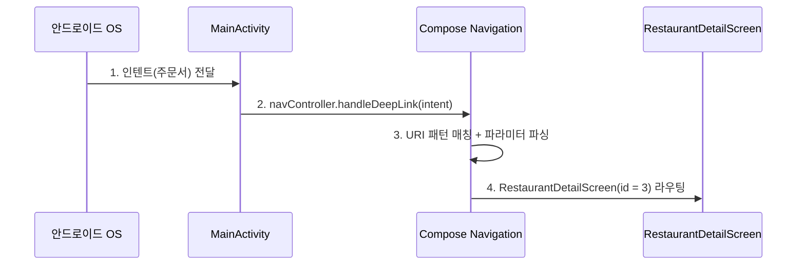

# Compose 환경의 딥 링크 처리 흐름

```mermaid
sequenceDiagram
    participant OS as 안드로이드 OS
    participant MA as MainActivity
    participant Nav as Compose Navigation
    participant Screen as RestaurantDetailScreen

    OS->>MA: 1. 인텐트(주문서) 전달
    MA->>Nav: 2. navController.handleDeepLink(intent)
    Nav->>Nav: 3. URI 패턴 매칭 + 파라미터 파싱
    Nav->>Screen: 4. RestaurantDetailScreen(id = 3) 라우팅
```

> [!IMPORTANT]
> 매니페스트는 그냥 **"통로"** 역할만 하고, 실제 화면 분기는 앱 내부의 Compose Navigation 영역에서 일어납니다.

---
