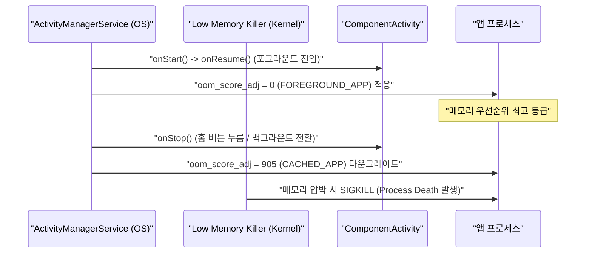

## Activity는 사용자에게 보이는 entry point이자 프로세스 우선순위 신호다

**Activity 는 안드로이드 사용자 UI 의 핵심 진입점(Entry Point)임과 동시에, OS 가 해당 앱 프로세스의 중요한 중요도 및 우선순위(Process Priority Score / `oom_adj`)를 판정하는 강력한 신호(Signal)**다.

---

### 1. 개념 및 핵심 명제 (What)

- **사용자 UI 진입점**:
  런처 아이콘, Deep Link, Push Notification 클릭, 외부 앱의 Intent 호출 등 모든 시각적 인터랙션은 Activity 를 통해 앱으로 인입된다. Compose Single Activity 구조를 적용하더라도 OS 관점에서 최외곽 창 경계는 여전히 `ComponentActivity` 다.
- **프로세스 메모리 회수 점수 (`oom_score_adj`) 결정자**:
  안드로이드 LMK(Low Memory Killer)는 Activity 의 현재 생명주기 상태에 따라 프로세스 회수 순위를 조정한다.
  - **Resumed / Visible Activity**: `FOREGROUND_APP` (`oom_score_adj = 0`) -> 절대 회수되지 않음.
  - **Stopped / Paused Activity**: `CACHED_APP` (`oom_score_adj >= 900`) -> 메모리 부족 시 우선 회수.

---

### 2. 왜 단순 화면 클래스로 보면 안 되는가? (Why)

- 회전(Configuration Change) 시 Activity 객체 자체가 파기되고 새로 인스턴스화되므로, 화면 내 데이터나 뷰 상태가 안전하게 이전되는 아키텍처 수명 분리(`ViewModel`, `SavedStateHandle`)가 필수적이기 때문이다.

---

### 3. 내부 메커니즘 (How)



---

### 4. 관측 가능 증거 및 진단 (Observability)

- **프로세스 우선순위 및 Resumed Activity 실시간 조회**:
  ```bash
  adb shell dumpsys activity activities | grep mResumedActivity
  adb shell dumpsys activity processes | grep oom
  ```

---

### 5. 관련 문서 및 참조

- 상위 문서: [App Component Contracts](./app-component-contracts.md)
- 관련 계약 문서:
  - [Activity lifecycle 콜백은 가시성과 상호작용 경계를 설명한다](./activity-lifecycle-callbacks-describe-visibility-and-interaction-boundaries.md)
- 공식 문서: [Activity Lifecycle Guide](https://developer.android.com/guide/components/activities/activity-lifecycle)

검증일: 2026-08-05. Activity oom_score_adj 및 진단 명령어 검증 완료.
