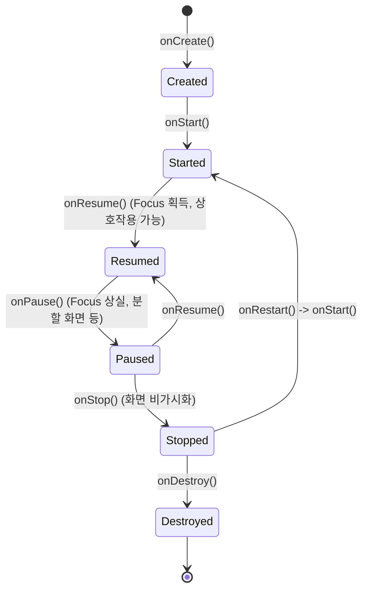

## Activity lifecycle 콜백은 가시성과 상호작용 경계를 설명한다

**Activity 의 6개 핵심 생명주기 콜백(`onCreate`, `onStart`, `onResume`, `onPause`, `onStop`, `onDestroy`)은 화면의 사용자 가시성(Visibility)과 인터랙션 가능 여부(Focus / Interaction)의 명확한 상태 경계를 정의**한다.

---

### 1. 개념 및 핵심 명제 (What)

- **시각적 가시성 경계 (Visibility Boundary: `onStart` / `onStop`)**:
  화면이 사용자 눈에 보이기 시작하는 시점과 완전히 가려지거나 홈으로 들어가는 시점을 나타낸다. (UI 센서 구독, 애니메이션 시작/정지 지점)
- **사용자 포커스 상호작용 경계 (Interaction Boundary: `onResume` / `onPause`)**:
  앱이 사용자 입력(터치, 키보드)을 직접 수신할 수 있는 포커스 획득 및 상실 시점을 정의한다. (카메라 프레임 캡처, 포커스 종속 작업 지점)

---

### 2. 내부 메커니즘 (How)



---

### 3. 현대 표준 리소스 할당 매핑 예시

```kotlin
class CameraActivity : ComponentActivity() {

    override fun onStart() {
        super.onStart()
        // 화면에 보이기 시작하면 UI 애니메이션 및 위치 업데이트 활성화
        LocationTracker.startVisibleUpdates()
    }

    override fun onResume() {
        super.onResume()
        // 포커스를 획득했을 때만 카메라 프레임 수신
        CameraEngine.connectCamera()
    }

    override fun onPause() {
        // 포커스 상실 시 카메라 프레임 즉시 정지
        CameraEngine.disconnectCamera()
        super.onPause()
    }

    override fun onStop() {
        // 화면이 가려지면 센서/위치 갱신 해제
        LocationTracker.stopVisibleUpdates()
        super.onStop()
    }
}
```

---

### 4. 관측 가능 증거 및 진단 (Observability)

- **Activity State 덤프 확인**:
  ```bash
  adb shell dumpsys activity activities | grep "mState"
  ```

---

### 5. 관련 문서 및 참조

- 상위 문서: [App Component Contracts](./app-component-contracts.md)
- 공식 문서: [Activity Lifecycle](https://developer.android.com/guide/components/activities/activity-lifecycle)

검증일: 2026-08-05. Activity Lifecycle 콜백 상태 분류 대조 완료.
