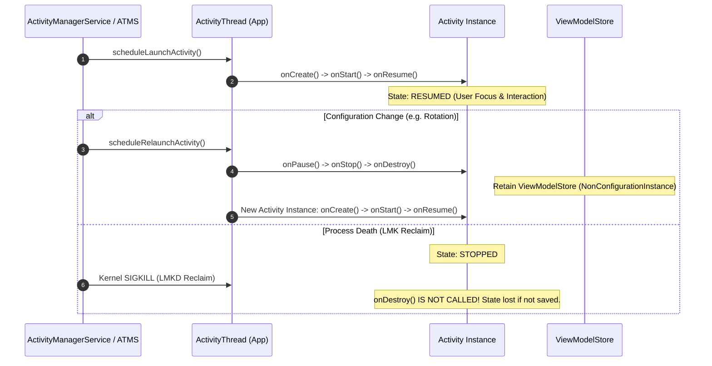

## Activity 콜백은 화면 인스턴스의 visibility 와 interaction 경계를 알린다

상위 문서: [App Component Contracts](./app-component-contracts.md)
배경 지식: [프로세스 생명주기](../../../../../../operating-systems/process-states-lifecycle.md)
Activity lifecycle 콜백은 화면 인스턴스가 생성, 표시, 포커스 획득, 포커스 상실, 정지, 파괴되는 경계를 알려준다. `onCreate`, `onStart`, `onResume`, `onPause`, `onStop`, `onDestroy` 는 UI 리소스 연결과 해제를 배치하는 기준이다.

### 내부 동작 메커니즘 (Internal State Transitions)

1. **State Machine & Lifecycle Events**:
   - `INITIALIZED` $\rightarrow$ `onCreate()` $\rightarrow$ `CREATED`
   - `CREATED` $\rightarrow$ `onStart()` $\rightarrow$ `STARTED` (화면 노출 시작, 사용자 입력을 받아들일 수는 없음)
   - `STARTED` $\rightarrow$ `onResume()` $\rightarrow$ `RESUMED` (Top Activity, 사용자 입력을 받는 Foreground 상태)
   - `RESUMED` $\rightarrow$ `onPause()` $\rightarrow$ `STARTED` (Focus 상실, 멀티 윈도우/투명 액티비티 노출 상태)
   - `STARTED` $\rightarrow$ `onStop()` $\rightarrow$ `CREATED` (화면 비노출, Background 전환)
   - `CREATED` $\rightarrow$ `onDestroy()` $\rightarrow$ `DESTROYED` (인스턴스 완전 파괴)
2. **Edge-Case Failure & Reclaim Branch**:
   - **Process Death (Low Memory Reclaim)**: `onStop()` 상태에서 시스템 메모리가 부족하면 커널 LMKD에 의해 프로세스가 즉시 사살될 수 있다. 이때 `onDestroy()`는 **호출되지 않는다**. 따라서 영속 데이터 저장을 `onDestroy()`에 의존하면 데이터 손실이 발생한다.
   - **Configuration Change**: 화면 회전 시 Activity 인스턴스가 파괴된 후 재배치되지만 `ViewModelStore`는 전달되어 인스턴스가 유지된다.



### 코드 예시 (Default LifecycleObserver Implementation)

```kotlin
import androidx.lifecycle.DefaultLifecycleObserver
import androidx.lifecycle.LifecycleOwner

class CameraPreviewLifecycleObserver(
    private val startCamera: () -> Unit,
    private val stopCamera: () -> Unit
) : DefaultLifecycleObserver {

    override fun onStart(owner: LifecycleOwner) {
        // 화면이 사용자에게 보이기 시작할 때 카메라 리소스 바인딩
        startCamera()
    }

    override fun onStop(owner: LifecycleOwner) {
        // 화면이 완전히 가려질 때 센서 및 자원 즉시 해제 (onPause보다 안전)
        stopCamera()
    }
}
```

### 관측 가능한 증거 (Observable Evidence)

`adb shell dumpsys activity` 및 logcat을 통해 Activity Lifecycle 및 Importance State를 직접 관측할 수 있다:

```bash
# 현재 Resumed 상태의 Activity 및 Stack 관측
adb shell dumpsys activity activities | grep -E "mResumedActivity|mFocusedWindow"

# 특정 패키지의 Lifecycle 및 Process Record 관측
adb shell dumpsys activity processes com.example.app | grep -E "procState|adj"

# Activity Lifecycle Logcat 수신
adb logcat -s ActivityTaskManager ActivityRecord
```

관련 노트: [설정 변경과 상태 분리](./configuration-change-recreates-activity-but-not-all-screen-state.md), [프로세스 종료 복구](./process-death-recovery-needs-saved-state-and-persistent-source-of-truth.md), [background work 정본](../../../../04_system_services/background-and-notifications/background-work-contracts/background-work-contracts.md).

공식 문서: [Activity lifecycle](https://developer.android.com/guide/components/activities/activity-lifecycle)
