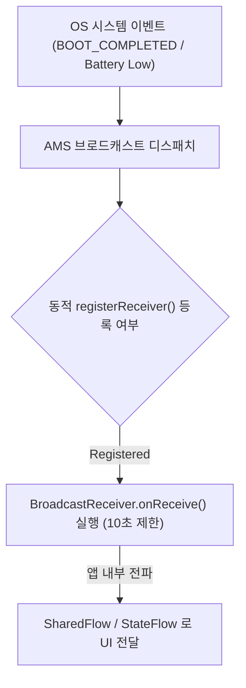

## BroadcastReceiver (안드로이드 방송 수신기 & 이벤트 현대 관점)

### 1. 개요 (Overview)

**BroadcastReceiver (브로드캐스트 리시버)** 는 OS 시스템 이벤트(배터리 부족, 비행기 모드, 부팅 완료 `BOOT_COMPLETED`)나 다른 앱의 전역 방송 메시지를 수신하여 비동기적으로 응답하기 위한 **안드로이드 4 대 앱 컴포넌트**이다.

현대 안드로이드 개발에서는 보안(Implicit Broadcast 낚시 방지)과 배터리 절감을 위해 **매니페스트 암시적 브로드캐스트 선언이 대부분 전면 금지**되었으며, 앱 내부 컴포넌트 간 이벤트 전달에는 `LocalBroadcastManager` 대신 **[Kotlin Coroutines](../../data/async-flow/coroutines/kotlin-coroutines.md) `SharedFlow` / `StateFlow`** 로 대전환되었다.

---

#### 초보자를 위한 쉽게 이해하는 비유

- **BroadcastReceiver (마을 재난 안내 확성기 수신기)**:
  - 마을 중앙 관제소(OS 시스템)에서 "비행기 모드 전환!", "배터리 5% 남아뜸!" 하고 확성기로 방송을 쏠 때, 옥상 수신기(`BroadcastReceiver`)가 이 신호를 잡아 비상 대응을 켜는 공용 수신기.

---

### 2. 현대 관점의 BroadcastReceiver 핵심 변경점

1. **암시적 브로드캐스트 매니페스트 선언 전면 제약 (Android 8.0+)**:
   - `AndroidManifest.xml` 에 시스템 이벤트 암시적 리시버를 불필요하게 등록해 두고 프로세스를 깨우는 행위가 전면 차단되었으며, 필요한 경우 보이는 화면 수명주기 내에서 `context.registerReceiver()` 동적 등록을 권장한다.
2. **`LocalBroadcastManager` Deprecated 및 Kotlin Flow 대전환**:
   - 동일 앱 내부 컴포넌트 간 비동기 이벤트 수신에는 낡은 `LocalBroadcastManager` 대신 [SharedFlow 및 StateFlow](../../data/async-flow/flow-state/stateflow-and-sharedflow.md) 를 사용하는 것이 현대 안드로이드 아키텍처의 표준이다.
3. **`onReceive()` 실행 타임아웃 (10 초)**:
   - `onReceive()` 는 메인 UI 스레드에서 10 초 이내에 짧게 끝나야 하며, 긴 작업이 필요한 경우 `goAsync()` 와 [WorkManager](../../../04_system_services/background-and-notifications/work-manager.md) 를 조합해야 ANR 을 예방할 수 있다.

---

### 3. 연결 문서 (Related Links)

- [StateFlow & SharedFlow](../../data/async-flow/flow-state/stateflow-and-sharedflow.md) - 현대 앱 내부 이벤트 전파 메커니즘 (SSOT)
- [AMS (ActivityManagerService)](../../../04_system_services/service-lookup/activity-manager-service.md) - 브로드캐스트 디스패처
- [ANR 약속](../../../01_system_internals/boot-and-runtime/system-server/anr-responsiveness.md) - onReceive 10 초 초과 시 ANR 발생
- [WorkManager 예약 작업](../../../04_system_services/background-and-notifications/work-manager.md) - 리시버 수신 후 장시간 작업 위임
