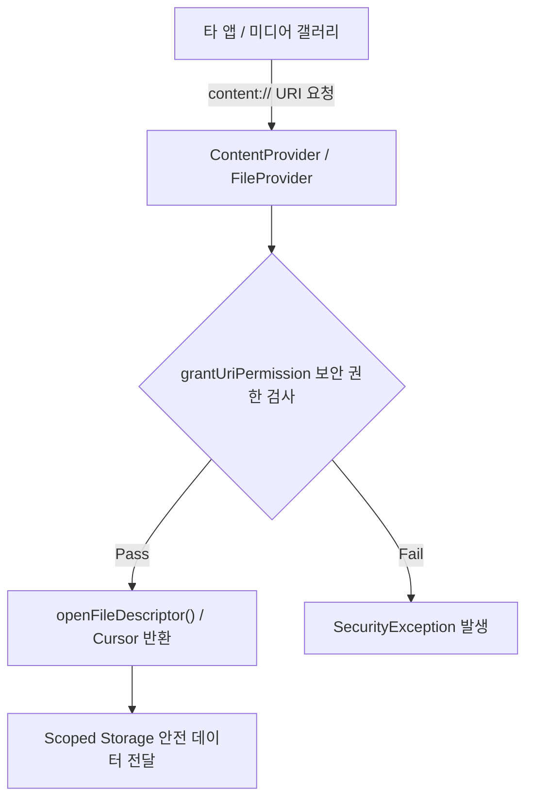

## ContentProvider (안드로이드 데이터 제공자 & 현대 파일 공유 관점)

### 1. 개요 (Overview)

**ContentProvider** 는 앱 자체의 데이터베이스나 샌드박스 내부 저장소 파일에 대한 접근 권한을 캡슐화하고, 다른 앱이나 프레임워크에게 보안 인터페이스(CRUD 및 URI) 형태로 제공하는 **안드로이드 4 대 앱 컴포넌트**이다.

현대 안드로이드 개발에서는 앱 자체 내부 데이터 저장소에 단순 `ContentProvider` 를 구축하는 대신 **Room DB 및 Jetpack DataStore** 가 표준화되었으며, 외부 앱 및 카메라/갤러리와의 안전한 임시 파일 공유에는 **`FileProvider` (Scoped Storage 보안 규격)** 로 용도가 명확히 고도화되었다.

---

#### 초보자를 위한 쉽게 이해하는 비유

- **ContentProvider (은행의 보안 대여 창구 및 대출 증명서 창구)**:
  - 창고 안의 금고(Room DB / 파일)를 타인이 직접 뒤지게 허용하지 않고, **보안 창구 규격(`content://` URI)** 을 통해서만 정해진 도장(Permission)을 받은 이에게 서류 한 장씩 안전하게 열람 및 복사해 주는 보안 공유 창구.

---

### 2. 현대 관점의 ContentProvider 핵심 설계 변화

1. **Scoped Storage 및 `FileProvider` 고도화 (Android 10+)**:
   - `file://` 경로를 직접 공유하는 방식은 완전 금지(`FileUriExposedException`)되었으며, 안심하게 보안 임시 권한을 부여하는 `content://` 기반 `FileProvider` 사용이 필수가 되었다.
2. **앱 내부 데이터베이스는 Room DB 및 DataStore 사용**:
   - 앱 내부의 로컬 데이터 persistence 에는 로컬 ContentProvider 를 만드는 무거운 방식 대신 **Jetpack Room DB 및 Preferences/Proto DataStore** 가 현대 표준이다.
3. **`ContentResolver` 및 SAF (Storage Access Framework) 연동**:
   - 미디어 스토어(MediaStore) 사진/동영상 선택 시 SAF 의 `ActivityResultContracts.PickVisualMedia` 와 연동하여 샌드박스 보안을 수호한다.

---

### 3. 연결 문서 (Related Links)

- [CE vs DE Secure Storage](../../../05_security_privacy/secure-storage/ce-vs-de-storage.md) - 안드로이드 기기 파일 암호화 스토리지
- [AMS (ActivityManagerService)](../../../04_system_services/activity-manager-service.md) - ContentProvider 발행 및 Binder IPC 매개체
- [AppOps & Permissions](../../../05_security_privacy/appops-and-permissions.md) - URI 권한 부여 및 런타임 권한 제어
