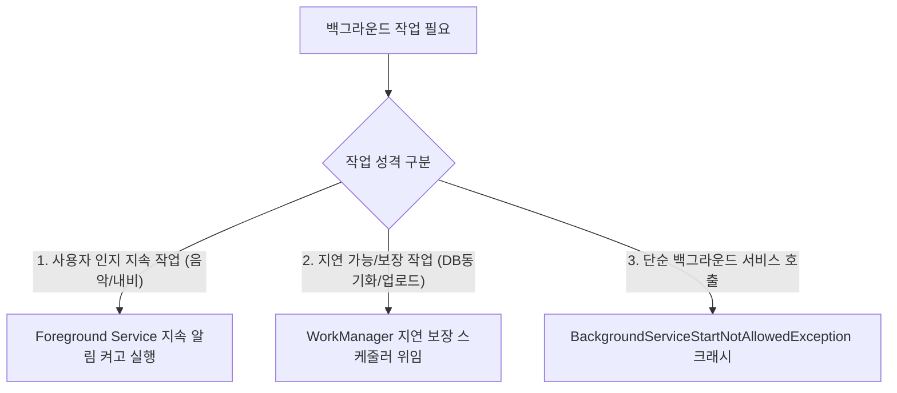

## Service (안드로이드 서비스 & 백그라운드 현대 관점)

### 1. 개요 (Overview)

**Service (서비스)** 는 사용자 인터페이스(UI)를 제공하지 않고, 화면 뒤 백그라운드에서 오래 걸리는 작업(음악 재생, 파일 다운로드, 네트워크 수신)을 수행하기 위한 **안드로이드 4 대 앱 컴포넌트**이다.

현대 안드로이드 OS 가 발전함에 따라, 무분별한 백그라운드 실행으로 인한 배터리와 메모리 고갈을 막기 위해 **단순 백그라운드 서비스는 완전 엄금**되었으며, 현대 안드로이드 개발에서는 **[Foreground Service](../../../04_system_services/background-and-notifications/background-work-contracts/foreground-service-contract.md)** 와 **[WorkManager](../../../04_system_services/background-and-notifications/background-work-contracts/work-manager-contract.md)** 로 명확히 대체 분리되었다.

---

#### 초보자를 위한 쉽게 이해하는 비유

- **Service (보이지 않는 주방 안의 조리사)**:
  - 홀(Activity UI)에는 보이지 않지만 주방 안(백그라운드)에서 요리를 계속 만드는 조리사. 현대에는 손님에게 지속 알림 깃발([Foreground Service](../../../04_system_services/background-and-notifications/background-work-contracts/foreground-service-contract.md))을 꽂고 일하거나, 예약형 자동 요리 기계([WorkManager](../../../04_system_services/background-and-notifications/background-work-contracts/work-manager-contract.md))에게 일을 넘겨야만 요리가 허용됨.

---

### 2. 현대 관점의 Service 3 대 변화 및 대체 수단

1. **백그라운드 시작 제한 (Android 8.0+ ~ 12+)**:
   - 앱이 백그라운드 상태일 때 일반 `startService()` 를 호출하면 즉시 예외가 발생한다.
2. **Foreground Service 정당화**:
   - 반드시 사용자 눈에 보이는 지속 알림(Notification)과 연동되고, Android 14+ FGS Type 선언 요건을 충족할 때만 `startForegroundService()` 가 허용된다.
3. **[WorkManager](../../../04_system_services/background-and-notifications/background-work-contracts/work-manager-contract.md) 대체**:
   - 앱 프로세스가 죽어도 유지되어야 하는 지연 가능(Deferrable) 보장 작업은 Service 가 아닌 `WorkManager` 로 처리하는 것이 현대 아키텍처의 필수가 되었다.

---

### 3. 연결 문서 (Related Links)

- [Foreground Service 계약](../../../04_system_services/background-and-notifications/background-work-contracts/foreground-service-contract.md) - 지속 알림 기반 FGS 런타임 규약
- [WorkManager 예약 작업](../../../04_system_services/background-and-notifications/background-work-contracts/work-manager-contract.md) - 백그라운드 작업 현대 대체 수단
- [AMS (ActivityManagerService)](../../../04_system_services/activity-manager-service.md) - 서비스 생명주기 및 프로세스 관제
- [JobScheduler](../../../04_system_services/job-scheduler.md) - OS 수준 시스템 백그라운드 스케줄러
