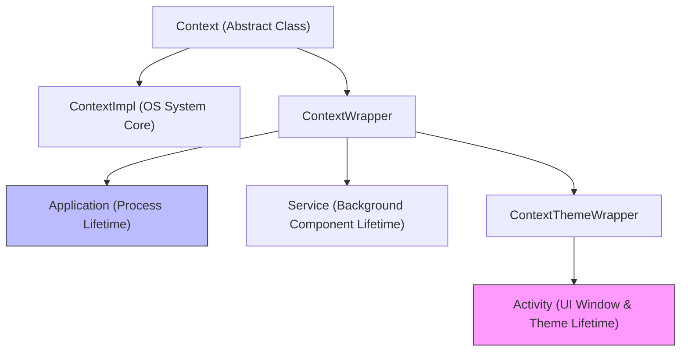

## Android Context Boundaries

안드로이드 애플리케이션 개발에서 **`Context`는 의존성 주입 도구나 단순 유틸리티가 아닌, OS 환경(System Server, Resources, Window Manager, PackageManager)에 접근하는 핵심 엔티티 및 권한/수명 경계(Capability & Lifetime Boundary)**다. `Context` 의 종류(Application, Activity, Service, Receiver, Provider, LocalContext)에 따라 접근 가능한 기능과 유효 수명이 엄격하게 구분되며, 잘못된 `Context` 선택은 메모리 누수(Context Leak), UI 테마 깨짐, 또는 `BadTokenException` 과 같은 런처 크래시를 유발한다.

---

### 1. 개념 및 핵심 구조 (What)

`Context` 는 추상 클래스로, 실제 구현체는 `ContextImpl` 과 이를 감싸는 `ContextWrapper` 계통이다. 안드로이드 컴포넌트는 수명과 제공 능력에 따라 세 가지 범주로 분류된다.

- **Application Context**: 프로세스 생성 시점부터 사멸 시점까지 유효한 단일 인스턴스. 데이터베이스(Room), DataStore, 네트워크 통신 등 프로세스 단위 싱글톤 영역에 사용된다.
- **Activity Context**: 특정 UI 화면(Activity)의 Window 및 Theme 정보를 보유한다. Dialog 생성, Layout Inflation, Component Launch 등 visual hierarchy 작업에 필수적이다.
- **LocalContext (`LocalContext.current`)**: Jetpack Compose Composition 범위 내에서 현재 노드가 속한 Android Context 를 참조하는 매커니즘이다.

---

### 2. 왜 Context 경계 구분이 필요한가? (Why)

1. **Window Token 및 UI Theme 정확성**:
   `Dialog` 또는 `PopupWindow` 는 OS WindowManager 에 자신을 등록하기 위해 유효한 Window Token 을 필요로 한다. Application Context 로 Dialog 를 띄우면 Window Token 이 존재하지 않아 `WindowManager.BadTokenException` 이 발생한다.
2. **메모리 누수 방지 (Memory Leak Prevention)**:
   Activity 가 화면 회전(Configuration Change)으로 Destroy 될 때, 싱글톤 객체나 ViewModel 이 해당 Activity Context 참조를 들고 있으면 GC(Garbage Collector)가 이를 회수하지 못해 메모리 누수가 발생한다.

---

### 3. Context 유형별 사양 및 허용 작업 대조 (How)

| 작업 / 기능 | Application Context | Activity Context | Service Context | LocalContext (Compose) |
| :--- | :---: | :---: | :---: | :---: |
| **Show Dialog / Alert** | ❌ (BadTokenException) | ✅ | ❌ | ✅ (Activity 래핑 확인 필요) |
| **Start Activity** | ⚠️ (`FLAG_ACTIVITY_NEW_TASK` 필요) | ✅ | ⚠️ (`FLAG_ACTIVITY_NEW_TASK` 필요) | ✅ |
| **Inflate Layout (Themed)** | ❌ (기본 시스템 테마 적용) | ✅ (Activity 테마 적용) | ❌ | ✅ |
| **Get System Service (DB/Location)** | ✅ | ✅ | ✅ | ✅ |
| **Process-scoped DI (Hilt)** | ✅ (`@ApplicationContext`) | ❌ | ❌ | ❌ |

---

### 4. 핵심 세부 하위 계약 노트

Context 아키텍처는 아래의 세부 계약 노드를 통해 구체화된다.

- [Context 기본 경계](./context-contracts/context-is-android-environment-capability-not-dependency-container.md)
- [Application Context 경계](./context-contracts/application-context-fits-process-lifetime-work-not-themed-ui.md)
- [Activity Context 경계](./context-contracts/activity-context-carries-window-theme-and-short-lifetime.md)
- [컴포넌트 Context 경계](./context-contracts/component-context-lifetime-follows-service-receiver-provider-boundary.md)
- [LocalContext 경계](./context-contracts/localcontext-is-composition-scoped-android-context-not-flutter-buildcontext.md)
- [ViewModel/Repository Context 경계](./context-contracts/viewmodel-and-repository-should-not-retain-ui-context.md)
- [Context leak 경계](./context-contracts/context-leaks-happen-when-reference-outlives-component-lifetime.md)

---

### 5. 관측 가능 증거 및 진단 (Observability)

- **LeakCanary 진단**: LeakCanary 가 Destroy 된 Activity 의 GC Root 참조 체인(Singleton, ViewModel, Listener)을 검출하는지 모니터링.
- **BadTokenException 검출**: Logcat 에서 `android.view.WindowManager$BadTokenException: Unable to add window -- token null is not valid` 예외 스택 확인.

---

### 6. 참고 및 공식 문서

- 상위 문서: [Android 앱 아키텍처 정본](../android-app-architecture.md)
- 공식 문서: [Context Reference](https://developer.android.com/reference/android/content/Context), [CompositionLocal](https://developer.android.com/develop/ui/compose/compositionlocal)

검증일: 2026-08-05. Context 계층 및 WindowToken 예외 매커니즘 확인 완료.
