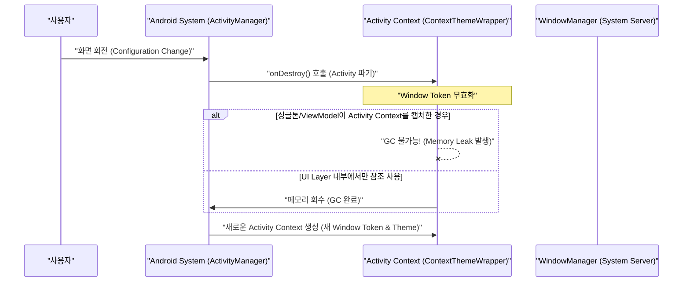

## Activity Context는 window와 theme를 가지지만 수명이 짧다

**Activity Context**는 단순한 안드로이드 API 접근 핸들이 아니다. 현재 화면 인스턴스에 대한 **Window Token, Theme/Style 속성, Configuration(화면 방향/크기), 그리고 Lifecycle 경계**를 직접 소유하는 UI 전용 Context 다. Dialog 생성, Layout Inflation, UI 인텐트 시작 등 시각적 렌더링에 필수적이지만, 화면 회전이나 사용자의 화면 이탈 시 파기되는 **짧은 수명 계약(Short Lifetime Contract)**을 갖는다.

---

### 1. 개념 및 핵심 명제 (What)

- **Window Token 및 UI 렌더링 소유권**: Activity Context 는 OS WindowManager 와 연결된 고유 Window Token 을 갖고 있어 Dialog, PopupWindow, AlertDialog 등의 UI 윈도우 창을 디스플레이 레이어에 성공적으로 바인딩할 수 있다.
- **ContextThemeWrapper 상속 계통**: Activity 는 `ContextThemeWrapper` 를 상속하므로 `R.style.Theme_App` 과 같은 커스텀 테마 속성을 해석하여 View 나 Compose MaterialTheme 에 동적으로 반영한다.
- **화면 구성 변경(Configuration Change)에 종속적 수명**: 화면 회전, 다크 모드 전환, Multi-Window 상태 변경 시 기존 Activity 인스턴스와 함께 Activity Context 는 사멸(Destroy)된다.

---

### 2. 왜 필요한가? (Why)

1. **시각적 일과성 및 테마 정확성**: UI 컴포넌트(Button, Dialog, Snackbar)가 시스템 디스플레이에 노출될 때 지정된 앱 테마 색상과 창 메트릭(Window Metrics)을 올바르게 적용하기 위해서다.
2. **독자적 UI Lifecycle 경계 제공**: Activity 인스턴스의 파기 시점에 해당 화면에 속했던 dialog, animation, local view 들이 함께 cleanup 될 수 있는 결정론적 경계를 확보하기 위함이다.

---

### 3. 내부 메커니즘 (How)



- **LeakCanary 모니터링**: 싱글톤, static 객체, 코루틴 scope, 레포지토리가 Activity Context 참조를 들고 있으면 Destroy 된 Activity 가 heap 에 남게 된다.
- **Hilt DI 바운더리**: Activity Context 의 의존성 주입은 오직 `@ActivityScoped` 또는 `@ActivityContext` 로 지정하여 Activity 컴포넌트 수명 내에서만 상주하도록 보장해야 한다.

---

### 4. 현대 표준 구현 코드 예시 (Hilt DI & Activity Context)

```kotlin
// Hilt 사용 시 Activity Context와 Application Context의 주입 경계 구별
@Module
@InstallIn(ActivityComponent::class)
object ActivityUiModule {

    @Provides
    @ActivityScoped
    fun provideDialogHelper(
        @ActivityContext context: Context // Activity 수명에 묶인 UI 전용 Context 주입
    ): CustomDialogHelper {
        return CustomDialogHelper(context)
    }
}

// UI 렌더링 전용 도구 (Activity Context 필수)
class CustomDialogHelper(private val context: Context) {
    fun showConfirmationDialog(title: String, onConfirm: () -> Unit) {
        // Application Context 사용 시 WindowManager.BadTokenException 발생
        AlertDialog.Builder(context)
            .setTitle(title)
            .setPositiveButton("확인") { _, _ -> onConfirm() }
            .show()
    }
}
```

---

### 5. 관측 가능 증거 및 진단 (Observability)

- **LeakCanary 를 통한 Leak 리포트 관측**:
  화면 회전을 수회 반복한 후 LeakCanary 가 발행하는 `ActivityLeak` 분석 리포트에서 `retained duration > 5s` 인 Activity 인스턴스 확인.
- **Application Context 잘못 사용 시 BadTokenException 로그**:
  `android.view.WindowManager$BadTokenException: Unable to add window -- token null is not valid; is your activity running?`

---

### 6. 관련 문서 및 참조

- 상위 문서: [Android Context Boundaries](../android-context-boundaries.md)
- 관련 계약 문서:
  - [Application Context는 프로세스 수명 작업에 맞고 themed UI에는 맞지 않는다](./application-context-fits-process-lifetime-work-not-themed-ui.md)
  - [ViewModel과 Repository는 UI Context를 보관하지 않는다](./viewmodel-and-repository-should-not-retain-ui-context.md)
  - [Context leak은 참조가 컴포넌트 수명보다 오래 살 때 발생한다](./context-leaks-happen-when-reference-outlives-component-lifetime.md)
- 공식 문서: [Context Reference](https://developer.android.com/reference/android/content/Context)

검증일: 2026-08-05. Activity Context 수명 및 Hilt 의존성 검증 완료.
