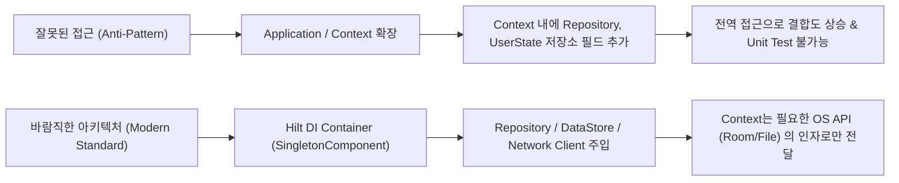

## Context는 안드로이드 환경 역량이지 의존성 주입 용기가 아니다

`Context` 는 개발자가 원하는 아무 객체나 담아 두고 전달하는 **의존성 주입 컨테이너(Dependency Injection Container / Service Locator)**가 아니다. `Context` 의 본질은 안드로이드 OS 가 제공하는 **시스템 서버 인터페이스(System Server Gateway), 리소스 로더(Resource Loader), 컴포넌트 런칭 역량(Environment Capability)**이다.

---

### 1. 개념 및 핵심 명제 (What)

- **OS 시스템 역량 게이트웨이 (System Capability Gateway)**:
  `getSystemService()`, `openFileInput()`, `registerReceiver()`, `checkSelfPermission()` 등 `Context` 가 제공하는 메서드는 앱 프로세스가 안드로이드 OS 커널 및 System Server 서비스와 통신할 수 있는 관문이다.
- **DI 컨테이너와의 차이점**:
  `Context` 는 임의 서비스 객체를 주입하고 등록하는 Service Locator 가 아니다. DI 컨테이너 역할은 **Hilt, Dagger, Koin** 과 같은 전용 프레임워크가 담당해야 한다.

---

### 2. 왜 이 개념적 정립이 필요한가? (Why)

1. **Service Locator 안티패턴 방지**:
   `Application` 클래스나 `Context` 를 확장하여 전역 데이터 변환기, 헬퍼 클래스, 리포지토리 인스턴스를 필드로 주입하고 `context.app.myRepository` 와 같이 전역 객체 저장소로 오용하는 설계를 방지한다.
2. **테스트 가동성(Testability) 확보**:
   순수 비즈니스 로직 단위 테스트(Unit Test) 작성 시 `Context` 의존성이 결합되어 있으면 Robolectric 이나 가짜 mockContext 가 강제되어 테스트 속도가 저하된다.

---

### 3. 내부 메커니즘 (How)



---

### 4. 현대 표준 코드 예시 (Context 와 DI 의 책무 분리)

```kotlin
// 안티패턴: Context를 데이터 주입 컨테이너로 오용하는 방식 (금지)
class BadApplication : Application() {
    val userRepository = UserRepository() // Context를 DI 저장소로 만듦 (Anti-Pattern)
}

// 현대 표준: Hilt를 이용해 의존성을 주입하고 Context는 OS 역량으로만 사용
@Singleton
class UserRepository @Inject constructor(
    @ApplicationContext private val context: Context, // File IO/Database 접근 역량으로만 사용
    private val apiService: UserApiService
) {
    fun getCachedData(): String {
        return context.filesDir.resolve("cache.txt").readText()
    }
}
```

---

### 5. 관측 가능 증거 및 진단 (Observability)

- **단위 테스트 가독성 진단**:
  도메인/비즈니스 로직 테스트 코드가 Android `Context` mock 인스턴스 없이 순수 JVM `junit` 테스트로 100ms 이내에 실행되는지 검증.

---

### 6. 관련 문서 및 참조

- 상위 문서: [Android Context Boundaries](../android-context-boundaries.md)
- 관련 계약 문서:
  - [ViewModel과 Repository는 UI Context를 보관하지 않는다](./viewmodel-and-repository-should-not-retain-ui-context.md)
  - [Application Context는 프로세스 수명 작업에 맞고 themed UI에는 맞지 않는다](./application-context-fits-process-lifetime-work-not-themed-ui.md)
- 공식 문서: [Context Reference](https://developer.android.com/reference/android/content/Context)

검증일: 2026-08-05. Context 개념 정립 및 Service Locator 안티패턴 검증 완료.
