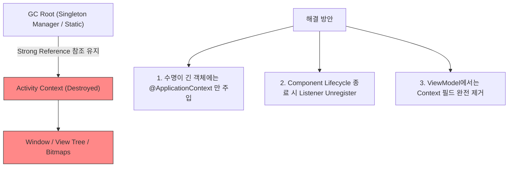

## Context leak은 참조가 컴포넌트 수명보다 오래 살 때 발생한다

**`Context Leak` (메모리 누수)**의 근본 원인은 단순한 안드로이드 API 호출 실패가 아니라, **상대적으로 수명이 짧은 컴포넌트 Context(예: Activity Context) 참조가 수명이 더 긴 객체(예: Singleton, Static Variable, [viewmodel](../../../viewmodel.md), Background Coroutine Scope)에 의해 캡처되어 지속적으로 참조되는 수명 불일치(Lifetime Mismatch)**에 있다.

---

### 1. 개념 및 핵심 명제 (What)

- **GC Root 도달 가능성 (GC Root Reachability)**:
  Activity 가 Destroy 되더라도, 앱 프로세스의 GC Root(Static 필드, Singleton 인스턴스, 정지되지 않은 백그라운드 Thread/Coroutine)에서 해당 Activity Context 로 이르는 참조 체인이 살아있으면 가비지 컬렉터가 Activity 메모리를 회수할 수 없다.
- **대량 메모리 누수 위험**:
  Activity Context Leak 은 단순 텍스트 몇 바이트가 아니라 Activity 가 소유하던 View Hierarchy, Bitmap 그래픽 캐시, Window 자원 전체를 메모리에 고립시키므로 단 몇 회의 화면 회전만으로도 OOM(OutOfMemoryError)을 발생시킨다.

---

### 2. 주요 Context Leak 발생 패턴 (Why)

1. **싱글톤 객체 내부 Activity Context 필드 저장**:
   앱 구동 동안 살아있는 싱글톤 리포지토리나 매니저 클래스에 `@ActivityContext` 나 Activity 참조를 직접 전달하여 보관할 때.
2. **ViewModel / Listener / Callback 해제 누락**:
   Activity 가 `onStart()` 에서 싱글톤 이벤트 버스에 리스너로 자신을 등록하고 `onStop()` / `onDestroy()` 에서 해제하지 않을 때.
3. **정지되지 않은 Coroutine Scope 캡처**:
   `GlobalScope` 나 Singleton Scope 코루틴 블록 내부에서 Activity Context 나 View 참조를 잡고 장시간 비동기 작업을 수행할 때.

---

### 3. 내부 메커니즘 및 회피 전략 (How)



---

### 4. 현대 표준 방지 코드 예시 (LeakCanary & Hilt)

```kotlin
// 누수 유발 코드 (Anti-Pattern)
@Singleton
class NetworkMonitor @Inject constructor() {
    private var listenerContext: Context? = null

    fun register(context: Context) {
        // Activity Context가 싱글톤에 누수됨!
        this.listenerContext = context 
    }
}

// 바르게 수정된 코드
@Singleton
class NetworkMonitor @Inject constructor(
    @ApplicationContext private val context: Context // 프로세스 안전 수명 주입
) {
    fun startMonitoring() {
        val connectivityManager = context.getSystemService(ConnectivityManager::class.java)
        // 안전하게 시스템 서비스 활용
    }
}
```

---

### 5. 관측 가능 증거 및 진단 (Observability)

- **LeakCanary 자동 검출 관찰**:
  LeakCanary 가 앱 백그라운드 진입 시 힙 스냅샷을 분석하여 다음과 같이 리포트 발행:
  `HEAP ANALYSIS RESULT: 1 LEAKING OBJECTS (MainActivity has leaked)`
  `GC ROOT: static com.example.SingletonManager.context`
  `REFERENCES: com.example.MainActivity`
- **Android Studio Memory Profiler**:
  Heap Dump 후 Activity 클래스 검색 -> Leaked 인스턴스 수 및 `Depth / Native Size` 관측.

---

### 6. 관련 문서 및 참조

- 상위 문서: [Android Context Boundaries](../android-context-boundaries.md)
- 관련 계약 문서:
  - [Activity Context는 window와 theme를 가지지만 수명이 짧다](./activity-context-carries-window-theme-and-short-lifetime.md)
  - [ViewModel과 Repository는 UI Context를 보관하지 않는다](./viewmodel-and-repository-should-not-retain-ui-context.md)
- 공식 문서: [LeakCanary Guide](https://square.github.io/leakcanary/)

검증일: 2026-08-05. LeakCanary GC Root 분석 및 참조 수명 미스매치 메커니즘 확인 완료.
