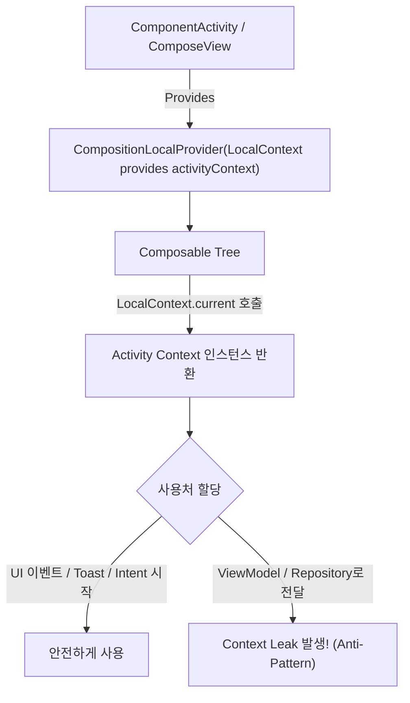

## LocalContext는 Composition에서 읽는 Android Context이지 Flutter BuildContext가 아니다

Jetpack Compose 에서 사용하는 **`LocalContext.current` 는 CompositionLocal 메커니즘을 통해 현재 컴포저블 트리가 렌더링되고 있는 안드로이드 `Context` (보통 Activity Context)를 조회하는 안드로이드 환경 핸들**이다. 이는 타 프레임워크(Flutter 등)의 `BuildContext` 와 이름이 유사하여 혼동되기 쉬우나, 소유 모델 및 시스템 동작 메커니즘이 완전히 다르다.

---

### 1. 개념 및 핵심 명제 (What)

- **Android Platform Context 의 CompositionLocal 래퍼**:
  `LocalContext.current` 가 반환하는 객체는 새롭게 창조된 Compose 전용 객체가 아니며, Compose 가 구동 중인 안드로이드 컴포넌트(`ComponentActivity` 등)의 실제 `Context` 인스턴스다.
- **Flutter BuildContext 와의 차이점**:
  - **Flutter `BuildContext`**: Widget 트리 내에서 해당 위젯의 위치(Element Node)를 가리키는 서브트리 식별자이자 테마/상태 조회용 렌더링 핸들이다.
  - **Android `LocalContext`**: 리소스 수신(`context.getString()`), 인텐트 시작(`context.startActivity()`), 안드로이드 시스템 서비스 조회 등 OS 커널 능력에 접근하는 플랫폼 엔티티다.

---

### 2. 왜 이 개념적 차이를 명확히 해야 하는가? (Why)

1. **비동기 람다 및 [viewmodel](../../../viewmodel.md) 캡처로 인한 누수 방지**:
   `LocalContext.current` 로 얻은 Activity Context 인스턴스를 ViewModel 람다나 이벤트 처리용 백그라운드 콜백에 임의로 캡처하여 저장하면 컴포저블이 화면에서 해제된 후에도 Activity 참조가 유실되지 않아 Context Leak 이 일어난다.
2. **Compose 의 명시적 상태 흐름 보존**:
   컴포저블 내부에서 `LocalContext.current` 를 이용해 비즈니스 로직이나 DB 조회를 직접 호출하는 것은 Compose 의 단방향 데이터 흐름(UDF) 및 UI-Logic 분리 원칙을 훼손한다.

---

### 3. 내부 메커니즘 (How)



---

### 4. 현대 표준 코드 예시 (Compose LocalContext 의 올바른 활용)

```kotlin
@Composable
fun UserProfileScreen(
    viewModel: UserProfileViewModel = hiltViewModel()
) {
    // 1. Composition 범위 내에서만 LocalContext 안전하게 읽기
    val context = LocalContext.current

    val uiState by viewModel.uiState.collectAsStateWithLifecycle()

    Column(modifier = Modifier.fillMaxSize().padding(16.dp)) {
        Text(text = uiState.userName)

        Button(onClick = {
            // 2. UI 최외곽 이벤트 핸들러(Toast, Intent)에만 좁게 활용
            Toast.makeText(context, "프로필이 공유되었습니다.", Toast.LENGTH_SHORT).show()
        }) {
            Text("공유하기")
        }
    }
}
```

---

### 5. 관측 가능 증거 및 진단 (Observability)

- **LocalContext 캡처 시 Memory Profiler 관측**:
  컴포저블 내 람다가 `LocalContext.current` 를 캡처하여 외부 싱글톤 상태로 넘길 때, Compose [recomposition](../../../jetpack-compose/runtime/recomposition.md) 및 화면 이동 후에도 Activity 인스턴스가 힙에 보존되는 현상 확인.

---

### 6. 관련 문서 및 참조

- 상위 문서: [Android Context Boundaries](../android-context-boundaries.md)
- 관련 계약 문서:
  - [Context 기본 경계](./context-is-android-environment-capability-not-dependency-container.md)
  - [ViewModel과 Repository는 UI Context를 보관하지 않는다](./viewmodel-and-repository-should-not-retain-ui-context.md)
- 공식 문서: [CompositionLocal in Compose](https://developer.android.com/develop/ui/compose/compositionlocal)

검증일: 2026-08-05. LocalContext 동작 메커니즘 및 Flutter BuildContext 차이점 검증 완료.
