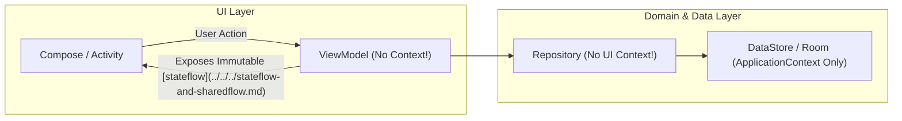

## ViewModel과 Repository는 UI Context를 보관하지 않는다

안드로이드 권장 앱 아키텍처(Guide to App Architecture)에서 **`ViewModel` 은 화면 상태(UI State)와 비즈니스 로직을 조율하는 오너(Owner)이고, `Repository` 는 데이터의 단일 출처([single source of truth](../../../single-source-of-truth.md))를 다루는 계층이다. 두 계층 모두 Activity, Fragment, View 등 UI 수명과 연동된 UI Context 참조를 필드로 보관해서는 안 된다.**

---

### 1. 개념 및 핵심 명제 (What)

- **수명 주기 미스매치 (Lifecycle Mismatch)**:
  `ViewModel` 은 화면 회전(Configuration Change) 시에도 사멸하지 않고 이전 인스턴스가 유지된다. 반면 Activity(UI Context)는 회전 즉시 Destroy 되고 새로운 인스턴스가 생성된다. ViewModel 이 이전 Activity Context 를 참조로 갖고 있으면 메모리 누수가 결정론적으로 일어난다.
- **관심사 분리 (Separation of Concerns)**:
  Data Layer(Repository)와 Domain Layer 는 플랫폼 View UI 의존성으로부터 독립적이어야만 순수 JVM 환경에서 빠른 단위 테스트(Unit Testing)가 가능하다.

---

### 2. 왜 UI Context 보관을 엄격히 금지하는가? (Why)

1. **메모리 누수 원천 차단**:
   Activity 가 회전할 때마다 수 메가바이트의 뷰 트리가 메모리에 누적되어 OOM 이 발생한다.
2. **AndroidViewModel 사용 억제**:
   `AndroidViewModel` 은 `Application` 인스턴스를 들고 있어 메모리 누수는 피할 수 있지만, 문자열 리소스 로딩이나 Android System API 의존성을 ViewModel 내부로 가져오게 만들어 테스트 가능성을 저하시킨다. 문자열 포맷팅 등은 ViewModel 이 Resource ID 나 데이터 모델만 노출하고 UI 컴포저블/View 레이어에서 처리하도록 한다.

---

### 3. 내부 메커니즘 및 올바른 아키텍처 구조 (How)



---

### 4. 현대 표준 코드 예시 (Context 의존성 없는 ViewModel)

```kotlin
// 바람직하지 못한 구현 (Anti-Pattern: ViewModel이 Context 보관)
class BadViewModel(private val context: Context) : ViewModel() {
    fun getFormattedDate(): String {
        return DateFormatter.format(context, Date()) // Context 보관 금지!
    }
}

// 현대 안드로이드 표준 구현 (Clean Architecture & Hilt)
@HiltViewModel
class GoodViewModel @Inject constructor(
    private val userRepository: UserRepository // 순수 데이터 및 도메인 의존성만 주입
) : ViewModel() {

    private val _uiState = MutableStateFlow<UserUiState>(UserUiState.Loading)
    val uiState: StateFlow<UserUiState> = _uiState.asStateFlow()

    fun loadUser() {
        viewModelScope.launch {
            val user = userRepository.getUser()
            // Resource ID나 순수 Data 객체만 UI로 전달
            _uiState.value = UserUiState.Success(
                userName = user.name,
                titleResId = R.string.welcome_user
            )
        }
    }
}
```

---

### 5. 관측 가능 증거 및 진단 (Observability)

- **Activity 회전 후 Memory Profiler 힙 분석**:
  화면 10회 회전 후 Dump Heap 실행 -> `MainActivity` 인스턴스 개수가 정확히 1개(현재 활성 뷰)인지 확인. 2개 이상일 경우 ViewModel/Repository 의 참조 검출.
- **LeakCanary 가발행하는 ViewModel retained 참조 스택 확인**.

---

### 6. 관련 문서 및 참조

- 상위 문서: [Android Context Boundaries](../android-context-boundaries.md)
- 관련 계약 문서:
  - [ViewModel 수명과 프로세스 데스 계약](../../state-management/viewmodel/viewmodel-survives-configuration-change-not-process-death.md)
  - [ViewModel은 UI controller나 context를 보관하지 않는다](../../state-management/viewmodel/viewmodel-does-not-retain-ui-controller-or-context.md)
- 공식 문서: [Guide to App Architecture](https://developer.android.com/topic/architecture)

검증일: 2026-08-05. ViewModel 수명 주기 및 Clean Architecture Context 격리 검증 완료.
