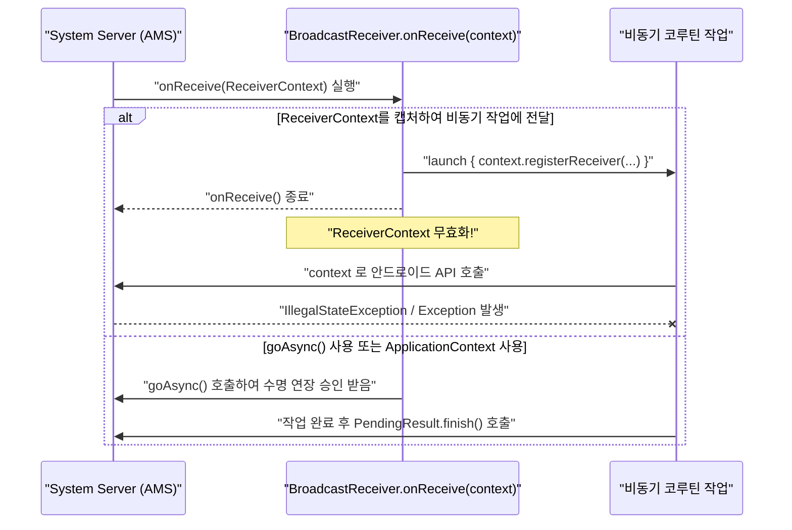

## 컴포넌트 Context의 수명은 Service, Receiver, Provider 경계를 따른다

안드로이드 주요 앱 컴포넌트인 **`Service`, `BroadcastReceiver`, `ContentProvider` 도 각각 독립된 `Context` 인스턴스 또는 접근 핸들을 수신**한다. 그러나 이들의 수명과 제공 역량은 Activity 나 Application Context 와 완전히 다르며, 해당 컴포넌트의 OS 실행 생명주기 경계(Lifecycle Boundary)를 철저히 따른다.

---

### 1. 개념 및 핵심 명제 (What)

1. **Service Context (`android.app.Service`)**:
   `ContextWrapper` 를 상속받는 독자적 Context 다. 백그라운드/포그라운드 서비스의 시작 및 종료(`stopSelf`) 수명에 바인딩된다. UI 테마나 Window Token 은 없지만 서비스 자원을 제어할 수 있다.
2. **BroadcastReceiver Context (`onReceive(context, intent)`)**:
   `onReceive` 콜백 인자로 전달되는 Context 는 **브로드캐스트 실행 구간(기본 10초 내외) 동안만 유효한 극단적인 일회성 핸들**이다. 이 Context 참조를 캡처하여 비동기 코루틴이나 백그라운드 콜백에 저장하면 안 된다.
3. **ContentProvider Context (`getContext()`)**:
   Provider 가 OS 에 의해 초기화되는 시점에 앱의 Application Context 를 얻어 반환한다.

---

### 2. 왜 컴포넌트별 경계를 지켜야 하는가? (Why)

- **Receiver Context 캡처로 인한 비동기 크래시 예방**: `onReceive` 가 완료된 후 수신된 Receiver Context 로 `bindService()` 나 등록/해제 작업을 시도하면 OS 는 이미 수명 주기가 끝난 리시버 상태로 판단하여 예외를 발생시킨다.
- **Service 내 UI 인프라 차단**: Service 도 Context 이지만 UI 창을 띄울 수 없다. Android 10+ 보안 강화로 Service 에서 Activity 직접 실행(`startActivity`) 제한 정책이 적용된다.

---

### 3. 내부 메커니즘 (How)



---

### 4. 현대 표준 코드 예시 (Receiver 비동기 처리 및 Service Context)

```kotlin
class SafeBroadcastReceiver : BroadcastReceiver() {

    override fun onReceive(context: Context, intent: Intent) {
        // onReceive의 context는 짧은 수명이므로 오래 걸리는 비동기 작업 시 goAsync() 사용
        val pendingResult = goAsync()
        
        // 데이터 저장소/비동기 작업에는 안전한 ApplicationContext 사용
        val appContext = context.applicationContext

        CoroutineScope(Dispatchers.IO).launch {
            try {
                // 비동기 데이터 백업 작업 수행
                DataRepository.syncData(appContext)
            } finally {
                // OS에 브로드캐스트 처리 완료 알림
                pendingResult.finish()
            }
        }
    }
}
```

---

### 5. 관측 가능 증거 및 진단 (Observability)

- **Receiver Context 파기 후 호출 시 로그 예외**:
  `java.lang.IllegalArgumentException: Receiver not registered` 또는 `BroadcastAlreadyFinishedException`
- **Service 에서 Intent 없이 Activity 실행 시 제약 로그**:
  `android.util.AndroidRuntimeException: Calling startActivity() from outside of an Activity context requires the FLAG_ACTIVITY_NEW_TASK flag.`

---

### 6. 관련 문서 및 참조

- 상위 문서: [Android Context Boundaries](../android-context-boundaries.md)
- 관련 계약 문서:
  - [BroadcastReceiver는 단명 이벤트 진입점이다](../../app-components/app-component/broadcastreceiver-is-short-lived-event-entry-point-not-background-worker.md)
  - [Service는 백그라운드/원격 작업 진입점이다](../../app-components/app-component/service-is-background-or-remote-work-entry-point-not-general-task-runner.md)
- 공식 문서: [BroadcastReceiver API Reference](https://developer.android.com/reference/android/content/BroadcastReceiver)

검증일: 2026-08-05. BroadcastReceiver goAsync 및 Service Context 경계 검증 완료.
