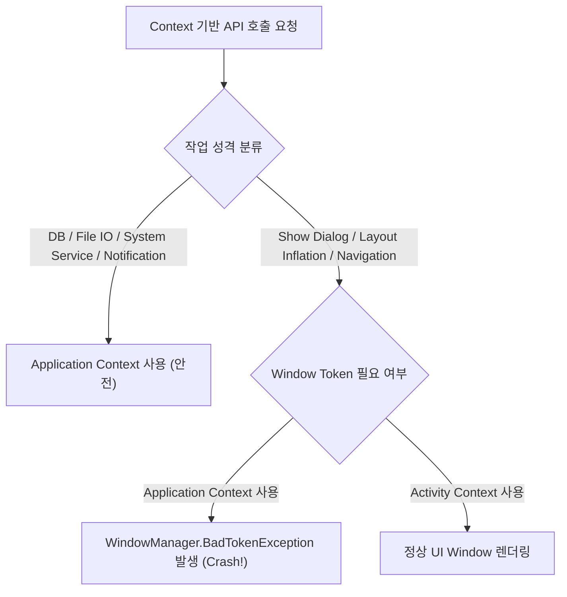

## Application Context는 프로세스 수명 작업에 맞고 themed UI에는 맞지 않는다

**Application Context**는 앱 프로세스의 수명(Process Lifetime) 전체에 연결된 단일 글로벌 Context 인스턴스다. 프로세스가 구동되어 OS 메모리에서 파기될 때까지 항상 안전하게 접근 가능하므로 싱글톤, 데이터베이스(Room), DataStore, 네트워크 서비스 등 **프로세스 수명 작업에 최적**이다. 그러나 **Window Token 이 없고 UI 테마 정보(Theme)를 보유하지 않으므로, Dialog 표시나 Themed Layout Inflation 등 UI 작업에 사용해서는 안 된다.**

---

### 1. 개념 및 핵심 명제 (What)

- **프로세스 단위 단일 수명 (Process-scoped Single Lifetime)**:
  `getApplicationContext()` 로 획득하는 인스턴스는 앱 프로세스가 생성될 때 OS 가 인스턴스화하는 `Application` 클래스 객체다. 어떤 백그라운드 객체가 이 참조를 영구 보관하더라도 메모리 누수가 발생하지 않는다.
- **Window Token 의 부재**:
  Application Context 는 디스플레이의 특정한 UI Window 나 Activity 레이어에 바인딩되어 있지 않다. 따라서 `WindowManager` 를 통한 윈도우 팝업이나 Dialog 생성이 불가능하다.

---

### 2. 왜 구분해야 하는가? (Why)

1. **안전한 백그라운드 싱글톤 주입**:
   Room Database, Retrofit Client, WorkManager 등 프로세스 상주 객체에 Activity Context 가 잘못 인입되어 전체 화면이 메모리에 갇히는 문제를 방지한다.
2. **오용 시 Runtime Crash 방지**:
   "Application Context 가 메모리 누수가 없어 안전하다"는 오해로 Dialog 나 UI Layout 에 사용할 경우 `BadTokenException` 으로 앱이 즉시 강제 종료된다.

---

### 3. 내부 메커니즘 (How)



- **Hilt 의존성 주입**:
  글로벌 레포지토리나 싱글톤 서비스에는 `@ApplicationContext` 구분을 사용하여 명시적으로 프로세스 수명 Context 만 주입되도록 강제한다.

---

### 4. 현대 표준 코드 예시 (Hilt & DataStore Singleton)

```kotlin
// Hilt Singleton Component에 Application Context 주입
@Module
@InstallIn(SingletonComponent::class)
object StorageModule {

    @Provides
    @Singleton
    fun provideUserPreferencesDataStore(
        @ApplicationContext context: Context // 프로세스 전체 수명의 안전한 Context 주입
    ): DataStore<Preferences> {
        return PreferenceDataStoreFactory.create(
            produceFile = { context.preferencesDataStoreFile("user_prefs") }
        )
    }
}
```

---

### 5. 관측 가능 증거 및 진단 (Observability)

- **Application Context 로 Dialog 호출 시 발생하는 Crash 분석**:
  Logcat 스택 트레이스: `android.view.WindowManager$BadTokenException: Unable to add window -- token null is not valid; is your activity running?`
- **Activity 회전 시에도 GC 정상 수행 관찰**:
  Memory Profiler 스냅샷 비교 시 싱글톤이 Application Context 만 인퍼런스하고 있는 경우, Activity 파기 후 Heap 에서 Activity 수 0 으로 정상 감소 확인.

---

### 6. 관련 문서 및 참조

- 상위 문서: [Android Context Boundaries](context.md)
- 관련 계약 문서:
  - [Activity Context는 window와 theme를 가지지만 수명이 짧다](activity-context-lifetime.md)
  - [ViewModel과 Repository는 UI Context를 보관하지 않는다](viewmodel-repository-context-isolation.md)
- 공식 문서: [Application Class API Reference](https://developer.android.com/reference/android/app/Application)

검증일: 2026-08-05. Application Context 프로세스 수명 및 Hilt singleton 주입 검증 완료.
