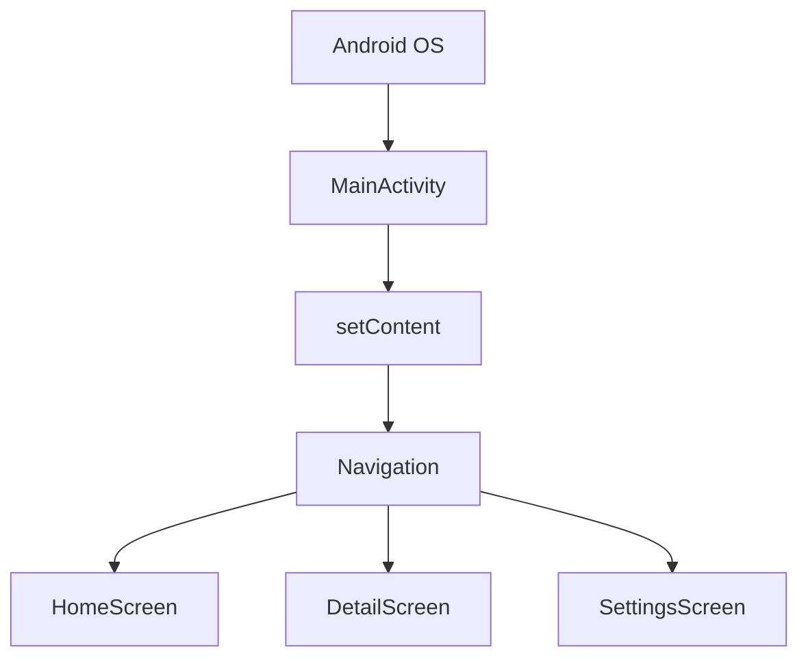

# 현대 구조: Single Activity Architecture

Jetpack Compose 시대의 일반적인 구조는 **Activity를 하나만 두고**, 실제 화면 전환은 Compose Navigation이 담당하는 방식입니다.



`MainActivity`는 이제 "화면 하나"라기보다 **앱 전체 Compose UI를 올리는 대문**입니다.

```kotlin
class MainActivity : ComponentActivity() {
    override fun onCreate(savedInstanceState: Bundle?) {
        super.onCreate(savedInstanceState)

        setContent {
            MyBenefitTheme {
                AppNavigation()
            }
        }
    }
}
```
