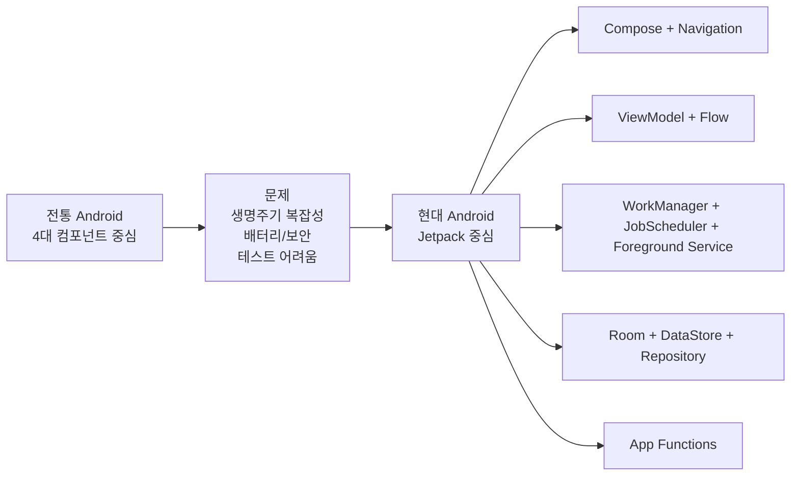

# 전체 흐름 요약

상위 노트: [android-modern-architecture-components](01_inbox/mobile/android/02_app_framework/architecture/jetpack-architecture/android-modern-architecture-components.md)

핵심은 다음과 같습니다.

* 4대 컴포넌트는 안드로이드 OS가 앱을 깨우는 공식 진입점이다.
* 과거에는 이 컴포넌트 안에 화면, 상태, 데이터, 백그라운드 작업이 많이 섞였다.
* 현대에는 4대 컴포넌트를 OS 경계로 얇게 유지하고, 앱 내부 로직은 Jetpack 아키텍처로 분리한다.
* `Flow`는 앱 내부 상태와 이벤트를 시간의 흐름으로 표현한다. 앱 간 데이터 전달 API가 아니다.
* `WorkManager`는 OS가 안전하게 실행할 수 있는 백그라운드 보장 작업을 맡는다.
* `JobScheduler`는 Android 프레임워크의 낮은 수준 작업 예약 API이며, 일반 앱에서는 WorkManager가 더 편한 진입점인 경우가 많다.
* `Foreground Service`는 음악 재생처럼 유저가 인지하는 즉시 실행/장기 실행 작업에 쓴다.
* `App Functions`는 시스템/AI agent가 앱 기능을 검색하고 실행해야 하는 현대적 외부 기능 경계다.
* `Service`, `BroadcastReceiver`, `ContentProvider`는 여전히 필요하지만, 사용 범위가 더 명확하고 좁아졌다.

> [!NOTE]
> 매니페스트에 4대 컴포넌트를 등록하는 방식은 [android-manifest](01_inbox/mobile/android/02_app_framework/architecture/app-components/android-manifest.md)를 참조하세요.
> Context의 종류와 수명 차이는 [android-context](01_inbox/mobile/android/02_app_framework/architecture/context-and-modularity/android-context.md)를 참조하세요.
> Coroutine, Flow, StateFlow의 기본 개념과 실전 패턴은 [kotlin-coroutines-flow-stateflow](01_inbox/mobile/android/02_app_framework/data/async-flow/kotlin-coroutines-flow-stateflow.md)를 참조하세요.
> ViewModel의 화면 상태 소유, user action 처리, Reducer 분리 기준은 [viewmodel-ui-state-reducer](01_inbox/mobile/android/02_app_framework/architecture/jetpack-architecture/viewmodel-ui-state-reducer.md)를 참조하세요.
> 인텐트와 외부 진입 흐름은 [intent-and-deep-link](01_inbox/mobile/android/02_app_framework/navigation/intents-and-deep-links/intent-and-deep-link.md)를 참조하세요.
> Compose Navigation의 화면 전환 구조는 [jetpack-navigation-3-guide](01_inbox/mobile/android/02_app_framework/navigation/navigation3/jetpack-navigation-3-guide.md)를 참조하세요.
> 백그라운드 작업 선택 기준은 Android Developers의 [Background tasks overview](https://developer.android.com/develop/background-work/background-tasks), [Task scheduling](https://developer.android.com/develop/background-work/background-tasks/persistent), [Foreground services overview](https://developer.android.com/develop/background-work/services/foreground-services)를 함께 보면 좋습니다.
> App Functions API는 [android.app.appfunctions](https://developer.android.com/reference/android/app/appfunctions/package-summary)와 [androidx.appfunctions](https://developer.android.com/reference/androidx/appfunctions/package-summary)를 참조하세요.
