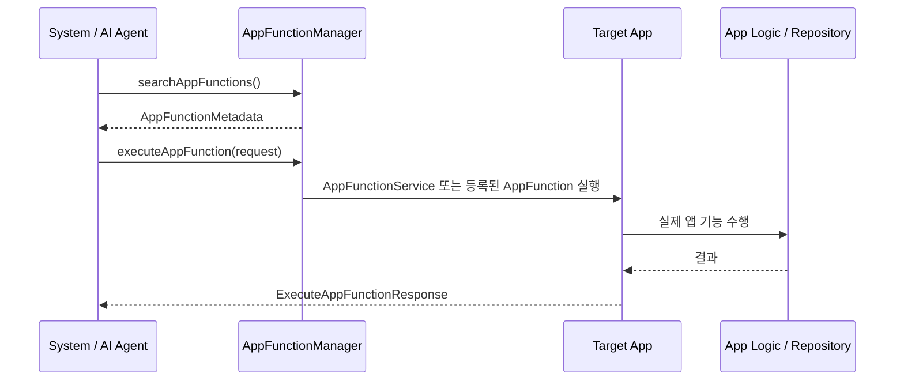

# App Functions란?

`App Functions`는 앱 안의 특정 기능을 **시스템이나 신뢰된 agent가 발견하고 실행할 수 있도록 공개하는 API**입니다.

예를 들어 agent가 다음과 같은 기능을 앱을 열지 않고도 호출할 수 있게 만드는 방향입니다.

* 노트 앱의 `createNote`
* 음악 앱의 `playSong`
* 캘린더 앱의 `createEvent`
* 음식 주문 앱의 `orderAgain`

> [!IMPORTANT]
> App Functions는 전통적인 4대 컴포넌트 중 하나는 아닙니다. 하지만 현대 Android에서는 `Intent`, `ContentProvider`,
`FileProvider`와 함께 **앱 밖에서 내 앱 기능에 접근하는 공식 경계**로 봐야 합니다.
