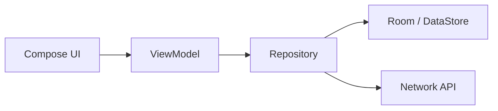

# 현대 앱에서 사용 빈도가 낮아진 이유

일반적인 앱은 더 이상 자기 내부 데이터를 다른 앱에 직접 공개하지 않습니다.

현대 앱 데이터 흐름은 보통 아래처럼 닫힌 구조입니다.

내 앱 안에서만 쓰는 데이터라면 ContentProvider를 만들 필요가 없습니다. `Flow`는 이 내부 데이터를 화면과 ViewModel에 흘려보내는 도구이고,
ContentProvider는 앱 밖으로 공개 API를 여는 도구입니다.

대신:

* 관계형 로컬 DB → `Room`
* 키-값 설정값 → `DataStore`
* 화면 자동 갱신 → `Flow`
* 서버 데이터 동기화 → `Repository + WorkManager`
* 파일 공유 → `FileProvider`
