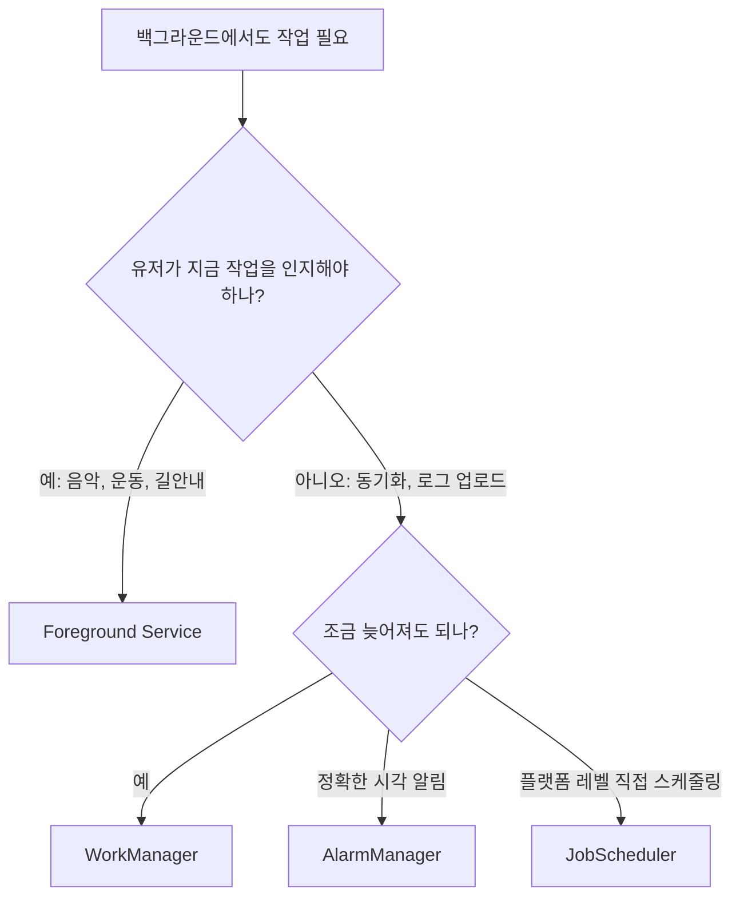

# Background Service라는 말이 헷갈리는 이유

예전 Android 문서나 오래된 코드에서는 "background service"라는 표현을 자주 볼 수 있습니다. 보통 **화면이 없는 Service를 백그라운드에서 계속 돌린다
**는 뜻으로 쓰였습니다.

하지만 현대 Android에서는 이 표현을 조심해서 봐야 합니다.

| 표현                 | 현대적으로 해석해야 하는 의미                                                                   |
|:-------------------|:-----------------------------------------------------------------------------------|
| Background Service | 앱이 화면에 보이지 않는 동안 몰래 오래 실행되는 일반 Service. Android 8.0 이후 강하게 제한됨                     |
| Foreground Service | 유저가 인지할 수 있는 알림을 띄우고 즉시 계속 실행되는 Service                                            |
| Background work    | 앱 화면 밖에서도 끝나야 하는 작업 전체. WorkManager, JobScheduler, Foreground Service 등을 포함하는 넓은 말 |

음악 재생, 운동 기록, 내비게이션처럼 유저가 명확히 인지하고 있고 **지금 당장 계속 돌아야 하는 작업**은 일반 background service가 아니라 *
*Foreground Service**가 맞습니다.

> [!IMPORTANT]
> "앱이 백그라운드에 있어도 계속 돌아야 한다"는 말만으로 Service를 고르면 안 됩니다. **계속 실행되어야 하는 실시간 사용자 인지 작업**인지, **언젠가 완료되면 되는
보장 작업**인지 먼저 나눠야 합니다.
