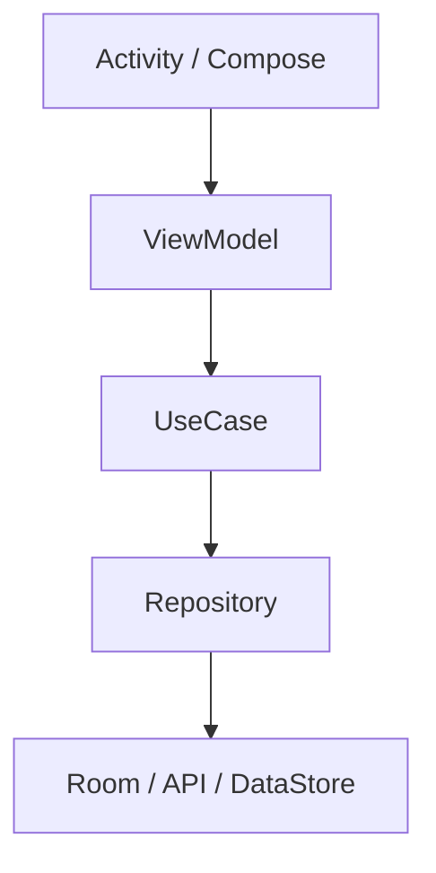

# 이유 2: 테스트가 어려웠다

Activity/Service/Receiver/Provider에 비즈니스 로직이 들어가면 테스트가 무거워집니다. OS 컴포넌트를 띄워야 하고, Context와 생명주기까지 준비해야
하기 때문입니다.

현대 구조에서는 핵심 로직을 순수 Kotlin 클래스에 둡니다.

이렇게 하면 `UseCase`, `Repository`, `ViewModel` 대부분은 로컬 JVM 테스트로 검증할 수 있습니다.
