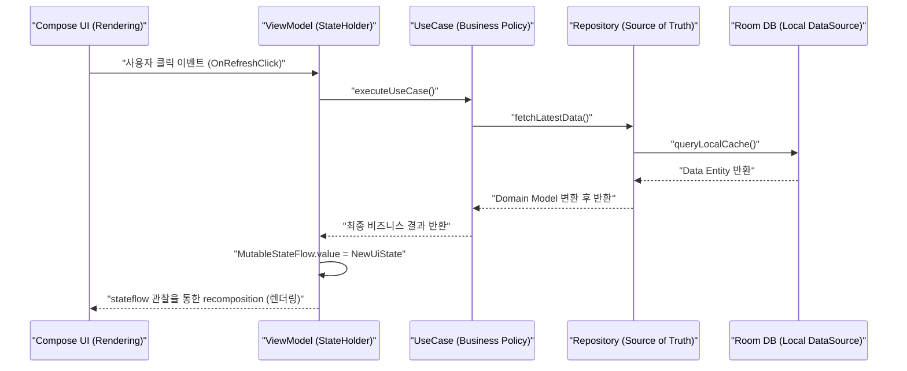

## UI, domain, data layer는 rendering, policy, source of truth를 분리한다

안드로이드 권장 레이어드 아키텍처(Layered Architecture)의 핵심 원칙은 **UI Layer 는 선언적 렌더링(Rendering)만 담당하고, Domain Layer 는 비즈니스 정책(Policy/Rules)을 관장하며, Data Layer 는 데이터의 단일 출처([single source of truth](../../../compose-ssot.md))를 보장**하여 관심사를 완벽히 분리하는 것이다.

---

### 1. 개념 및 핵심 명제 (What)

1. **UI Layer (Rendering & State Interaction)**:
   Jetpack Compose UI 및 StateHolder([viewmodel](../../../viewmodel.md))로 구성된다. UI State 를 화면에 렌더링하고, 사용자의 인터랙션 이벤트를 인텐트/액션으로 변환하여 하위 레이어로 전달한다.
2. **Domain Layer (Optional Policy & pure Kotlin Logic)**:
   UseCase 단위로 작성되며 복잡한 비즈니스 규칙(예: 할인율 계산, 복수 리포지토리 데이터 조합)을 캡슐화한다. Android SDK 에 독립적인 순수 Kotlin 모듈이다.
3. **Data Layer (Single Source of Truth & Data Operations)**:
   Repository 및 DataSource 로 구성된다. DB, Network, DataStore 간의 데이터 일관성을 유지하며 외부 데이터를 앱 도메인 모델로 변환(Mapping)한다.

---

### 2. 왜 이 분리가 절대적으로 필요한가? (Why)

- **독립적인 테스트 용이성 (Testability)**:
  UI 의 변경(Compose 스타일링 수정)이 Data Layer 코드를 훼손하지 않으며, Server API 변경이 UI Rendering 로직을 깨뜨리지 않는다. Domain 및 Data Layer 는 순수 JVM 테스트가 가능하다.

---

### 3. 내부 데이터 및 제어 흐름 (How)

---

### 4. 관측 가능 증거 및 진단 (Observability)

- **레이어 격리 컴파일 검증**:
  Data Layer 모듈이나 Domain Layer 모듈에서 `import androidx.compose.*` 또는 `import android.widget.*` 과 같은 UI 참조 시도 시 컴파일 에러 발생 여부 검증.

---

### 5. 관련 문서 및 참조

- 상위 문서: [Architecture Contracts](./architecture.md)
- 관련 계약 문서:
  - [Android 앱 아키텍처 정본](../../android-app-architecture.md)
  - [ViewModel과 Repository는 UI Context를 보관하지 않는다](../../context-and-modularity/context/viewmodel-and-repository-should-not-retain-ui-context.md)
- 공식 문서: [UI Layer Guide](https://developer.android.com/topic/architecture/ui-layer), [Data Layer Guide](https://developer.android.com/topic/architecture/data-layer)

검증일: 2026-08-05. Layered Architecture 책임 분리 가이드 검증 완료.
