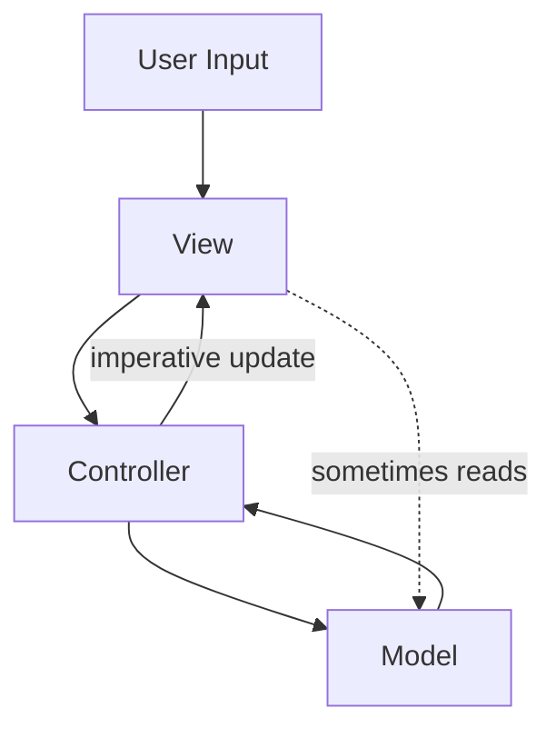
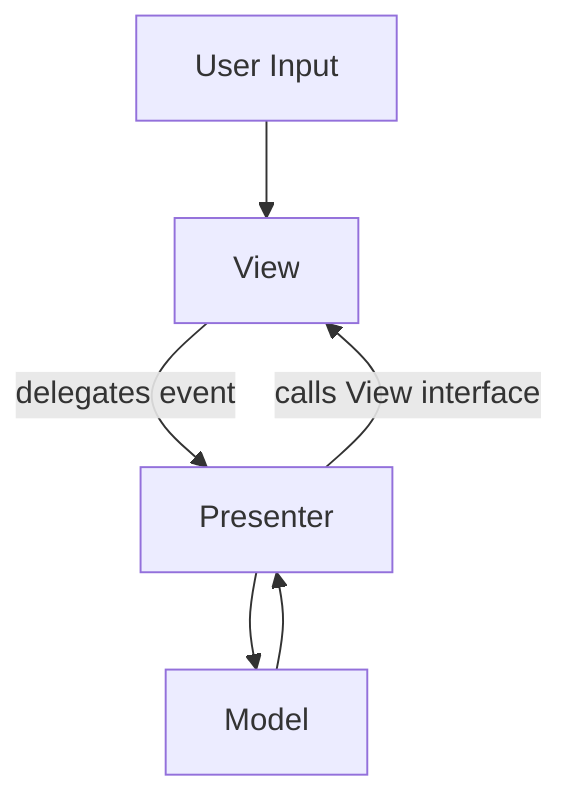
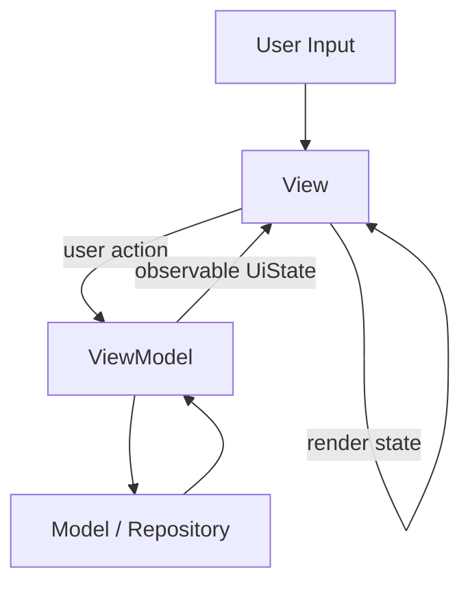
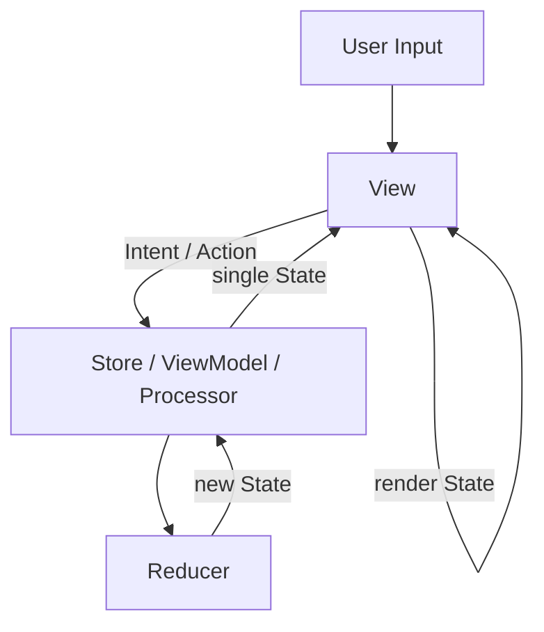

# MVC, MVP, MVVM, MVI에서 진짜 달라진 것

상위 노트: [[viewmodel-ui-state-reducer]]

아래 질문은 아키텍처를 공부하다 보면 자연스럽게 나옵니다.

```text
MVC의 Controller, MVI의 Intent, MVVM의 ViewModel은 이름만 바뀐 것 아닌가?
```

문제의식은 맞습니다. 하지만 정확히는 이렇게 고쳐야 합니다.

```text
Controller, Presenter, ViewModel, Bloc, Store는 비교할 수 있다.
하지만 MVI의 Intent는 Controller나 ViewModel과 같은 위치가 아니다.
Intent는 중재자가 아니라 사용자 입력/행동을 표현한 값이다.
```

즉, `MVC의 C`, `MVP의 P`, `MVVM의 VM`, `Bloc`, `Store`는 모두 "사용자 입력을 받아 화면 상태를 만들거나 Model과 연결하는 중간 객체"라는
공통점을 가집니다. 그러나 `MVI의 I(Intent)`는 그 중간 객체 자체가 아니라 중간 객체에 들어가는 입력값입니다.

더 정확한 비교는 다음과 같습니다.

| 패턴   | 입력/행동           | 중재자/상태 생산자                                 | 화면이 읽는 것                            |
|:-----|:----------------|:-------------------------------------------|:------------------------------------|
| MVC  | user event      | Controller                                 | View 직접 변경 또는 Model                 |
| MVP  | user event      | Presenter                                  | View interface 호출                   |
| MVVM | user action     | ViewModel                                  | Observable state / binding property |
| MVI  | Intent / Action | Store, Reducer, Processor, Bloc, 또는 MVI 스타일 ViewModel | 단일 State                            |

Data flow로 보면 차이가 더 선명합니다.

MVC:



MVC에서는 Controller가 입력을 받아 Model을 바꾸고, View를 직접 갱신하는 흐름이 자연스럽습니다. 구현에 따라 View가 Model을 직접 관찰하거나 읽는 변형도
많아서 흐름이 느슨하고 양방향처럼 보이기 쉽습니다.

MVP:



MVP에서는 Presenter가 View interface를 알고 `showLoading()`, `showError()` 같은 명령형 메서드를 호출합니다. View는
interface 뒤에 숨길 수 있어서 테스트는 쉬워지지만, Presenter가 여전히 View를 직접 명령합니다.

MVVM:



MVVM에서는 ViewModel이 View method를 직접 호출하지 않습니다. ViewModel은 observable state를 노출하고, View는 그 state를
binding하거나 collect해서 다시 그립니다.

MVI:



MVI에서는 입력도 `Intent`/`Action` 값으로 모델링하고, 화면도 하나의 `State` 값으로 최대한 결정하려고 합니다. 핵심은 `Intent`가 Controller가
아니라 Store/ViewModel/Processor에 들어가는 입력값이라는 점입니다.

그래서 "이름만 바뀐 것 아니냐"는 질문에 대한 답은 반쯤은 맞고, 반쯤은 틀립니다.

맞는 부분:

- 중간에서 입력을 받고 data/model layer와 연결하는 객체는 계속 존재합니다.
- MVC의 Controller, MVP의 Presenter, MVVM의 ViewModel, Flutter Bloc, Redux Store는 역할상 비교할 수 있습니다.
- 실무 코드에서는 이 객체들이 API 호출, 검증, 상태 갱신을 맡는 경우가 많습니다.

틀린 부분:

- MVI의 Intent는 중재자가 아닙니다. Intent는 사용자의 행동을 표현한 값입니다.
- 패턴의 차이는 객체 이름보다 데이터 흐름과 상태 표현 방식에서 생깁니다.
- 현대 선언형 UI에서는 View를 직접 조작하는지, State를 만들어 View가 그리게 하는지가 큰 차이를 만듭니다.

MVC에서는 Controller가 View를 직접 바꾸는 코드가 자연스러웠습니다.

```text
controller.login()
 -> model.login()
 -> view.showLoading()
 -> view.showSuccess()
```

MVP에서는 Presenter가 View interface를 호출했습니다.

```text
presenter.login()
 -> view.showLoading()
 -> model.login()
 -> view.showError()
```

MVVM에서는 ViewModel이 View를 직접 조작하지 않고 observable state를 노출합니다.

```text
View
 -> user action
ViewModel
 -> UiState
View
 -> render(UiState)
```

MVI에서는 이 흐름을 더 엄격하게 만듭니다.

```text
Intent / Action
 -> Reducer / Store / Processor
 -> State
 -> Render
```

여기서 핵심은 "중재자가 사라졌다"가 아닙니다. 중재자는 계속 있습니다. 바뀐 것은 화면을 바꾸는 방식입니다.

```text
MVC/MVP:
어떤 View 메서드를 호출해서 화면을 바꿀까?

MVVM:
어떤 UiState를 노출해서 화면이 다시 그리게 할까?

MVI:
어떤 Action이 어떤 규칙으로 State를 바꾸게 할까?
```

즉, 관심사가 명령형 View 조작에서 상태 중심 렌더링으로 이동했습니다.

```text
Command-driven UI
 -> State-driven UI
```

이 변화가 React, Flutter, SwiftUI, Jetpack Compose 같은 선언형 UI와 잘 맞습니다. 현대 UI는 대부분 아래 모델을 따릅니다.

```text
State
 -> Render
```

마지막으로, `MVC -> MVI -> MVVM`처럼 직선적으로 진화했다고 보지는 않는 편이 좋습니다. 이 패턴들은 서로를 순서대로 대체한 후속 버전이라기보다, 각기 다른 시대와
플랫폼에서 나온 설계 철학입니다.

- MVC는 객체지향 GUI와 웹 프레임워크 맥락에서 널리 쓰였습니다.
- MVP는 Android 초기처럼 View를 interface로 분리하고 테스트하기 위해 많이 쓰였습니다.
- MVVM은 WPF의 data binding 맥락에서 강해졌고, Android에서는 ViewModel/StateFlow/Compose와 결합해 화면 상태 holder로 쓰입니다.
- MVI는 Elm, Redux 같은 함수형/단방향 데이터 흐름의 영향을 받아 Intent/Action, Reducer, 단일 State를 강조합니다.

따라서 이 문서에서는 아키텍처 이름보다 아래 질문을 더 중요하게 봅니다.

```text
화면 상태의 source of truth는 어디인가?
사용자 입력은 어떤 값/함수로 표현되는가?
상태 변화 규칙은 어디에 모여 있는가?
View를 직접 조작하는가, State를 렌더링하는가?
```

---
