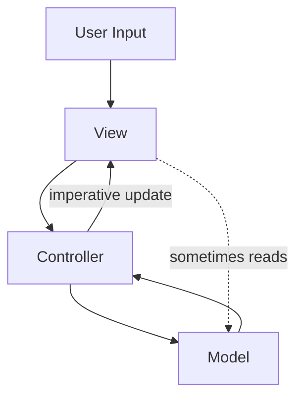

# MVC data flow

MVC:

```mermaid
flowchart TD
    User[User Input] --> View[View]
    View --> Controller[Controller]
    Controller --> Model[Model]
    Model --> Controller
    Controller -->|imperative update| View
    View -.->|sometimes reads| Model
```

MVC에서는 Controller가 입력을 받아 Model을 바꾸고, View를 직접 갱신하는 흐름이 자연스럽습니다. 구현에 따라 View가 Model을 직접 관찰하거나 읽는 변형도
많아서 흐름이 느슨하고 양방향처럼 보이기 쉽습니다.
