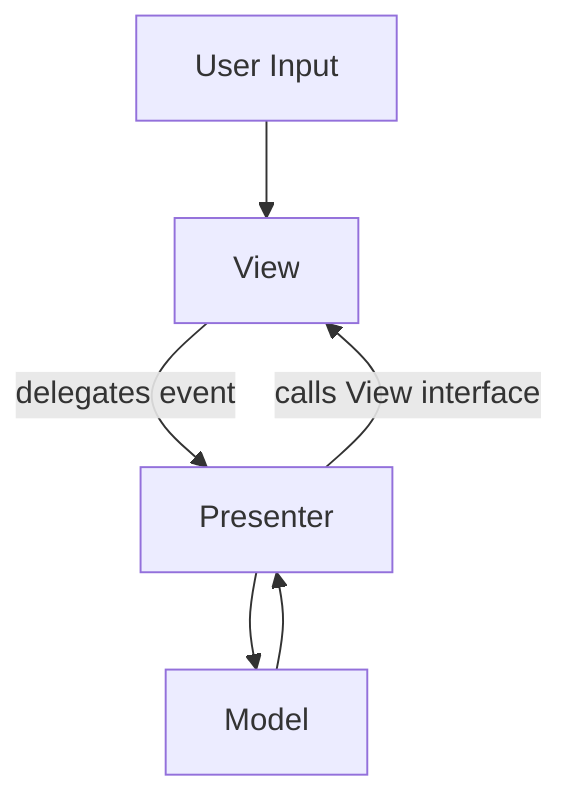

# MVP data flow

MVP:

```mermaid
flowchart TD
    User[User Input] --> View[View]
    View -->|delegates event| Presenter[Presenter]
    Presenter --> Model[Model]
    Model --> Presenter
    Presenter -->|calls View interface| View
```

MVP에서는 Presenter가 View interface를 알고 `showLoading()`, `showError()` 같은 명령형 메서드를 호출합니다. View는
interface 뒤에 숨길 수 있어서 테스트는 쉬워지지만, Presenter가 여전히 View를 직접 명령합니다.
