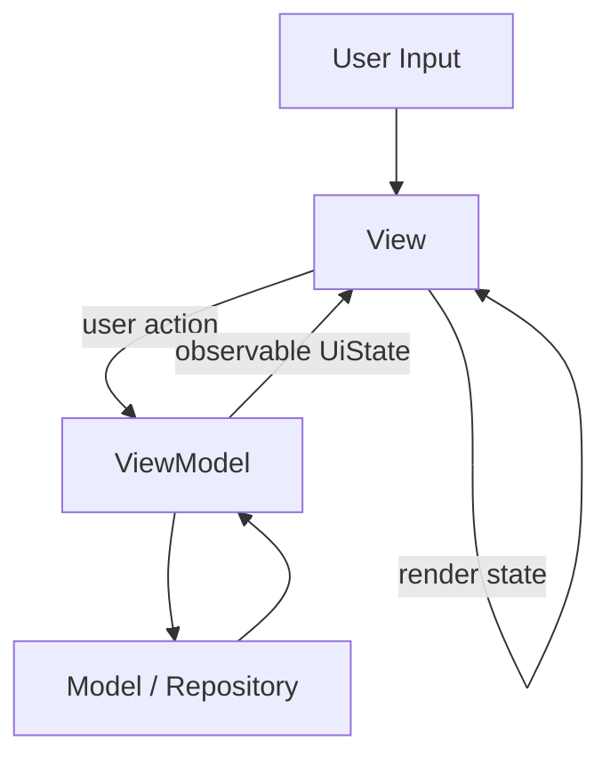

# MVVM data flow

MVVM:

```mermaid
flowchart TD
    User[User Input] --> View[View]
    View -->|user action| ViewModel[ViewModel]
    ViewModel --> Model[Model / Repository]
    Model --> ViewModel
    ViewModel -->|observable UiState| View
    View -->|render state| View
```

MVVM에서는 ViewModel이 View method를 직접 호출하지 않습니다. ViewModel은 observable state를 노출하고, View는 그 state를
binding하거나 collect해서 다시 그립니다.
