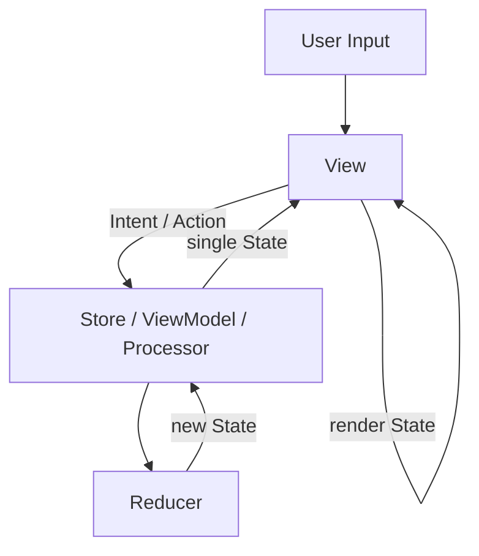

# MVI data flow

MVI:

```mermaid
flowchart TD
    User[User Input] --> View[View]
    View -->|Intent / Action| Store[Store / ViewModel / Processor]
    Store --> Reducer[Reducer]
    Reducer -->|new State| Store
    Store -->|single State| View
    View -->|render State| View
```

MVI에서는 입력도 `Intent`/`Action` 값으로 모델링하고, 화면도 하나의 `State` 값으로 최대한 결정하려고 합니다. 핵심은 `Intent`가 Controller가
아니라 Store/ViewModel/Processor에 들어가는 입력값이라는 점입니다.
