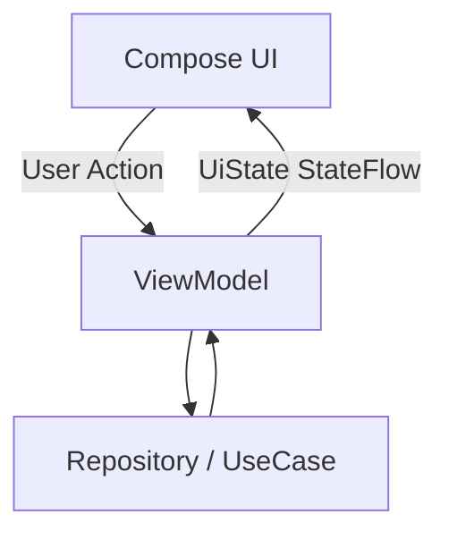

# ViewModel은 화면 단위 State Holder다

상위 노트: [viewmodel-ui-state-reducer](01_inbox/mobile/android/02_app_framework/architecture/jetpack-architecture/viewmodel-ui-state-reducer.md)

Android 공식 아키텍처에서 `ViewModel`은 화면이나 navigation destination 단위의 **state holder**입니다. 화면이 그릴 `UiState`
를 만들고, 화면에서 올라온 user action 중 화면 정책이나 비즈니스 처리가 필요한 일을 담당합니다.

ViewModel이 맡기 좋은 책임:

- 화면에 공개할 `UiState` 만들기
- `StateFlow`로 최신 화면 상태 노출하기
- user action 중 API 호출, 저장, 검증, 조회 같은 작업 처리하기
- `viewModelScope`에서 coroutine 실행하기
- `SavedStateHandle` 또는 navigation route 인자로 화면 복원에 필요한 id 읽기
- Repository/UseCase 호출 결과를 UI가 그릴 상태로 변환하기
- `Result<T>` 및 `runCatching`을 활용하여 예외(Exception)를 안전하게 `UiState.Error` 상태로 전환하기

ViewModel이 맡지 않는 편이 좋은 책임:

- `Activity`, `Fragment`, `Context`를 장기 보관하기
- `SnackbarHostState`, `NavController`, `FocusRequester` 같은 UI 객체 직접 들고 있기
- Composable을 호출하거나 화면을 직접 그리기
- Android view/window API를 직접 조작하기
- 모든 도메인 규칙을 화면 클래스 안에 몰아넣기

단, Compose state-based text field의 `TextFieldState`는 일반적인 immutable `UiState`와 성격이 다릅니다. `TextFieldState`는
Composable이나 widget이 아니라 Compose Snapshot 기반의 text input state holder이며, 최신 Compose text field 문서는 이를 ViewModel에서
소유할 수 있다고 설명합니다. 이 경우 ViewModel은 immutable `String` 상태 대신 specialized mutable state holder로 입력 상태를 관리합니다.

ViewModel은 "화면과 데이터 계층 사이의 모든 것을 다 하는 클래스"가 아닙니다. 화면 상태를 소유하되, 실제 데이터 출처는 Repository가 숨기고, 재사용 가능한
도메인 규칙은 domain model이나 UseCase로 내려야 합니다.

---
