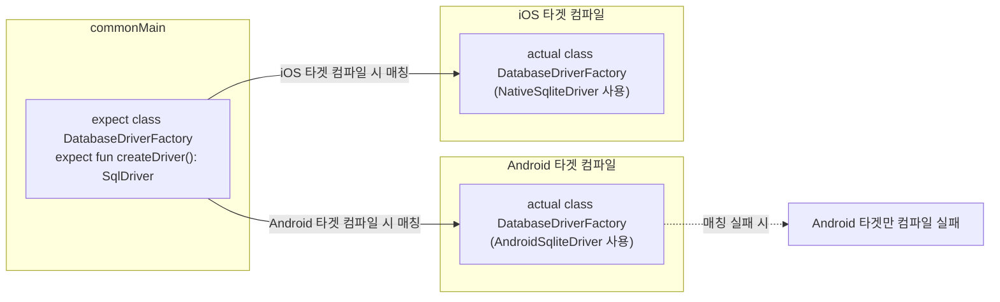

## expect/actual 은 공통 코드가 플랫폼별 구현을 요구하는 컴파일 타임 계약이다

[Kotlin Multiplatform은 비즈니스 로직과 데이터 레이어를 공유하고 UI는 기본적으로 플랫폼별로 유지한다](./kmp-shares-business-logic-and-data-layer-while-ui-stays-native-by-default.md)에서 `commonMain` 은 플랫폼 전용 API 를 직접 쓸 수 없다고 했다. 그런데 데이터베이스 드라이버를 열거나 현재 플랫폼 이름을 얻는 것처럼, 공통 로직이 플랫폼마다 다른 구현이 실제로 필요한 지점은 분명히 있다. `expect`/`actual` 은 이 지점을 "공통 코드에 선언만 두고, 각 플랫폼이 구현을 채워 넣어야 한다"는 컴파일 타임 계약으로 만든다.

### 내부 동작 메커니즘

- **`expect` 는 선언만 하고 구현을 갖지 않는다.** 공식 문서는 절차를 이렇게 규정한다 — "In the common source set, declare a standard Kotlin construct... Mark this construct with the `expect` keyword. This is your expected declaration. These declarations can be used in the common code, but shouldn't include any implementation. Instead, the platform-specific code provides this implementation." 즉 `expect fun buildIdentity(): Identity` 처럼 함수 시그니처만 `commonMain` 에 두고, 본문(`{ ... }`)을 쓸 수 없다.
- **`actual` 은 같은 패키지에서 실제 구현을 제공한다.** 공식 문서는 "In each platform-specific source set, declare the same construct in the same package and mark it with the `actual` keyword. This is your actual declaration, which typically contains an implementation using platform-specific libraries"라고 설명한다. `androidMain` 에서는 Android SDK 를, `iosMain` 에서는 iOS/Foundation API 를 써서 같은 시그니처를 구현한다.
- **매칭은 타겟별 컴파일 시점에 컴파일러가 강제한다.** 공식 문서는 검증 규칙을 명시한다 — "During compilation for a specific target, the compiler tries to match each actual declaration it finds with the corresponding expected declaration in the common code. The compiler ensures that: Every expected declaration in the common source set has a matching actual declaration in every platform-specific source set. Expected declarations don't contain any implementation. Every actual declaration shares the same package as the corresponding expected declaration." 이 매칭은 프로젝트 전체를 한 번에 검사하는 것이 아니라 "특정 타겟을 위한 컴파일" 단위로 이뤄진다 — 즉 `androidMain` 에 `actual` 구현이 빠져 있으면 Android 타겟 컴파일만 실패하고, 다른 타겟은 영향받지 않는다.
- **공통 코드는 실제 구현을 몰라도 호출할 수 있다.** 공식 문서는 "Every use of the expected declaration in the common code calls the correct actual declaration in the resulting platform code"라고 설명한다. `commonMain` 의 `Repository` 는 `expect class DatabaseDriverFactory` 를 호출만 하면 되고, 그 뒤에 `androidMain` 의 SQLite 드라이버가 붙는지 `iosMain` 의 다른 구현이 붙는지는 몰라도 된다 — 이것이 Android 전용 앱의 [DI 계약](../../dependency-injection/di-contracts/di-contracts.md)이 인터페이스 뒤에 구현체를 숨기는 것과 비슷한 역할을 하되, DI 는 런타임 그래프 구성이고 `expect`/`actual` 은 컴파일 타임에 타겟별로 고정된다는 점이 다르다.



### 코드 예시

```kotlin
// commonMain/kotlin/DatabaseDriverFactory.kt
expect class DatabaseDriverFactory {
    fun createDriver(): SqlDriver
}

// commonMain 은 구현을 모른 채 그대로 호출한다.
class BenefitRepository(driverFactory: DatabaseDriverFactory) {
    private val db = BenefitDatabase(driverFactory.createDriver())
}
```

```kotlin
// androidMain/kotlin/DatabaseDriverFactory.android.kt
actual class DatabaseDriverFactory(private val context: Context) {
    actual fun createDriver(): SqlDriver =
        AndroidSqliteDriver(BenefitDatabase.Schema, context, "benefit.db")
}
```

```kotlin
// iosMain/kotlin/DatabaseDriverFactory.ios.kt
actual class DatabaseDriverFactory {
    actual fun createDriver(): SqlDriver =
        NativeSqliteDriver(BenefitDatabase.Schema, "benefit.db")
}
```

### 관측 가능한 증거

- `androidMain` 에서 `actual class DatabaseDriverFactory` 구현을 통째로 지우고 `commonMain` 만 그대로 두면, iOS 타겟 컴파일은 그대로 성공하고 Android 타겟 컴파일만 "expected declaration has no actual declaration" 계열 오류로 실패한다. 이는 매칭 검증이 프로젝트 전역이 아니라 타겟별로 개별 수행된다는 것을 직접 보여준다.
- `expect fun` 본문에 실제 코드(`{ return 1 }` 등)를 쓰면 "Expected declarations don't contain any implementation" 규칙 위반으로 컴파일 자체가 거부된다 — `expect` 가 선언과 구현을 분리하는 계약임을 컴파일러 수준에서 확인할 수 있다.
- `actual` 구현을 `expect` 와 다른 패키지에 선언하면("Every actual declaration shares the same package as the corresponding expected declaration" 규칙 위반) 컴파일러가 매칭 대상을 찾지 못해 같은 방식으로 실패한다. 패키지 이름을 `expect` 선언과 동일하게 맞추는 순간 다시 컴파일된다.

상위 지도: [Multiplatform Contracts](./multiplatform-contracts.md)

관련 노트: [Kotlin Multiplatform은 비즈니스 로직과 데이터 레이어를 공유하고 UI는 기본적으로 플랫폼별로 유지한다](./kmp-shares-business-logic-and-data-layer-while-ui-stays-native-by-default.md), [Context는 Android 환경 능력이지 의존성 컨테이너가 아니다](../context-and-modularity/context-contracts/context-is-android-environment-capability-not-dependency-container.md)

공식 문서: [Expected and actual declarations](https://kotlinlang.org/docs/multiplatform/multiplatform-expect-actual.html)

검증일: 2026-08-05. `expect`/`actual` 선언 규칙, 컴파일러의 타겟별 매칭 검증 규칙("Every expected declaration... has a matching actual declaration in every platform-specific source set", "Every actual declaration shares the same package...")은 이번 세션의 WebFetch 로 kotlinlang.org 공식 문서 원문을 직접 대조했다. 컴파일러가 실제로 출력하는 오류 메시지 문구는 Kotlin 버전에 따라 달라질 수 있어 이 노트에서는 정확한 오류 문자열을 인용하지 않았다.
