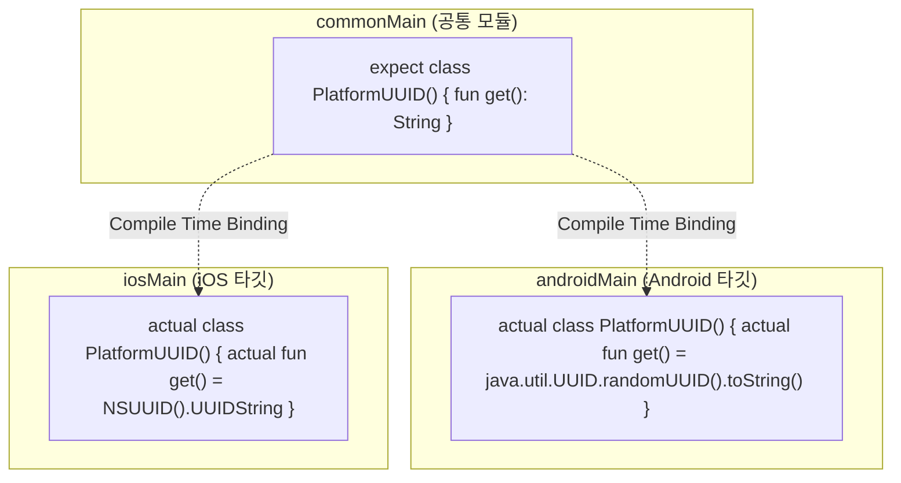

## expect/actual은 공통 코드가 플랫폼별 구현을 요구하는 컴파일 타임 계약이다

Kotlin Multiplatform (KMP)에서 **`expect` / `actual` 바인딩 메커니즘은 공통 모듈(`commonMain`)이 선언한 API 사양을 각 플랫폼 모듈(`androidMain`, `iosMain`)이 반드시 구현하도록 컴파일 타임에 강제하는 언어적 아키텍처 계약(Compile-time Language Contract)**이다.

---

### 1. 개념 및 핵심 명제 (What)

- **`expect` 선언 (`commonMain`)**:
  공통 코드 영역에서 플랫폼 특정 기능(예: 디바이스 고유 UUID 획득, 파일 경로 조회, 암호화)의 클래스, 함수, 또는 인터페이스 형태를 선언한다.
- **`actual` 구현 (`androidMain`, `iosMain`)**:
  각 타깃 플랫폼 소스 세트에서 `expect` 선언과 완벽하게 일치하는 클래스/함수 패키지 구조와 서명을 가져 구현을 제공한다.
- **인터페이스 DI 와의 차이점**:
  인터페이스 주입은 런타임에 다형성으로 주입되는 반면, `expect`/`actual` 은 **컴파일 타임 바인딩**이므로 추가적인 런타임 인디렉션(Indirection) 오버헤드가 없다.

---

### 2. 왜 expect/actual 메커니즘이 필요한가? (Why)

1. **컴파일 타임 안전성 (Compile-Time Safety)**:
   특정 플랫폼(iOS 등)에서 `actual` 구현을 누락하면 빌드 타임 컴파일러 오류가 발생하여 런타임 `UnimplementedError` 를 완벽히 예방한다.
2. **플랫폼 고유 API 직접 접근**:
   `androidMain` 에서는 Android SDK API 를, `iosMain` 에서는 iOS Foundation / CoreCrypto API 를 다이렉트로 호스팅하여 공통 모듈로 연결할 수 있다.

---

### 3. 내부 메커니즘 (How)



---

### 4. 현대 표준 코드 예시 (KMP expect / actual)

```kotlin
// commonMain/kotlin/com/example/Platform.kt
expect class PlatformNotifier() {
    fun sendLocalNotification(title: String, message: String)
}

// androidMain/kotlin/com/example/Platform.kt
actual class PlatformNotifier(private val context: Context) {
    actual fun sendLocalNotification(title: String, message: String) {
        val builder = NotificationCompat.Builder(context, "CHANNEL_ID")
            .setContentTitle(title)
            .setContentText(message)
            .setSmallIcon(R.drawable.ic_notification)
        NotificationManagerCompat.from(context).notify(1001, builder.build())
    }
}
```

---

### 5. 관측 가능 증거 및 진단 (Observability)

- **컴파일 미구현 오류 확인**:
  `iosMain` 에서 `actual` 선언 누락 시 KMP 빌드 타임 오류 출력:
  `e: Target Kotlin/Native target iosX64 failed to compile: Expected class PlatformNotifier has no actual declaration in module`

---

### 6. 관련 문서 및 참조

- 상위 문서: [Multiplatform Contracts](./multiplatform-contracts.md)
- 관련 계약 문서:
  - [KMP는 비즈니스 로직과 데이터 레이어를 공유한다](./kmp-shares-business-logic-and-data-layer-while-ui-stays-native-by-default.md)
- 공식 문서: [Kotlin Multiplatform Expect and Actual](https://kotlinlang.org/docs/multiplatform-expect-actual.html)

검증일: 2026-08-05. KMP expect/actual 컴파일 타임 바인딩 동작 확인 완료.
