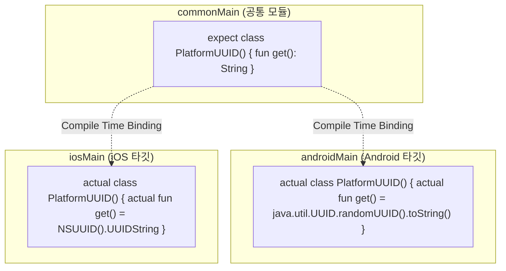

## expect/actual은 공통 코드가 플랫폼별 구현을 요구하는 컴파일 타임 계약이다

Kotlin Multiplatform (KMP)에서 **`expect` / `actual` 바인딩 메커니즘은 공통 모듈(`commonMain`)이 선언한 API 사양을 각 플랫폼 모듈(`androidMain`, `iosMain`)이 반드시 구현하도록 컴파일 타임에 강제하는 언어적 아키텍처 계약(Compile-time Language Contract)**이다.

---

### 1. 개념 및 핵심 명제 (What)

- **`expect` 선언 (`commonMain`)**:
  공통 코드 영역에서 플랫폼 특정 기능(예: 디바이스 고유 UUID 획득, 파일 경로 조회, 암호화)의 클래스, 함수, 또는 인터페이스 형태를 선언한다.
- **`actual` 구현 (`androidMain`, `iosMain`)**:
  각 타깃 플랫폼 소스 세트에서 `expect` 선언에 대응하는 패키지·이름·서명의 구현을 제공한다.
- **인터페이스 DI 와의 차이점**:
  인터페이스 주입은 런타임에 구현체를 조립하는 반면, `expect`/`actual`의 대응 관계는 **컴파일 타임**에 결정된다. 이것만으로 실제 호출 비용이나 전체 성능이 보장되는 것은 아니므로, 성능보다 API 경계와 조립 책임을 기준으로 선택한다.

---

### 2. 왜 expect/actual 메커니즘이 필요한가? (Why)

1. **컴파일 타임 안전성 (Compile-Time Safety)**:
   특정 타깃에서 대응하는 `actual` 선언이 없거나 선언의 패키지·이름·매개변수·반환 타입 등 계약이 맞지 않으면 컴파일 오류가 발생한다. 다만 이것이 구현 내부의 `TODO()`나 런타임 실패까지 막아 주는 것은 아니다.
2. **플랫폼 고유 API 직접 접근**:
   `androidMain`에서는 Android SDK API를, `iosMain`에서는 iOS Foundation 같은 플랫폼 API를 사용해 공통 선언의 구현을 제공할 수 있다.

---

### 3. 내부 메커니즘 (How)



---

### 4. 현대 표준 코드 예시 (KMP expect / actual)

```kotlin
// commonMain/kotlin/com/example/Platform.kt
package com.example

expect fun randomUuid(): String

// androidMain/kotlin/com/example/Platform.kt
package com.example

actual fun randomUuid(): String = java.util.UUID.randomUUID().toString()

// iosMain/kotlin/com/example/Platform.kt
package com.example

import platform.Foundation.NSUUID

actual fun randomUuid(): String = NSUUID().UUIDString
```

`expect`와 `actual`의 서명은 타깃별로 대응해야 한다. 예를 들어 `expect class PlatformNotifier()`에 대해 Android `actual` 생성자에만 `Context` 매개변수를 추가하면 동일한 계약이 아니므로 컴파일되지 않는다. `Context`나 네트워크 클라이언트처럼 플랫폼에서 조립해야 하는 의존성이 필요하면, 공통 코드에는 일반 인터페이스를 두고 Android composition root에서 구현체를 생성·주입하는 방식이 보통 더 명확하다. `expect`/`actual`은 플랫폼 타입 자체를 공통 API로 노출해야 할 때 선택적으로 사용한다.

---

### 5. 관측 가능 증거 및 진단 (Observability)

- **컴파일 미구현 오류 확인**:
  타깃 소스 세트에서 `actual` 선언을 제거하거나 서명을 다르게 만든 뒤 해당 타깃 컴파일 태스크를 실행한다. 정확한 진단 문자열은 Kotlin 버전에 따라 달라질 수 있지만, 대응하는 actual 선언이 없다는 컴파일 오류로 빌드가 실패해야 한다.

---

### 6. 관련 문서 및 참조

- 상위 문서: [Multiplatform Contracts](./multiplatform-contracts.md)
- 관련 계약 문서:
  - [KMP는 공유 로직과 플랫폼 UI 또는 공유 UI를 선택할 수 있다](./kmp-can-share-logic-with-native-ui-or-share-ui-with-compose-multiplatform.md)
- 공식 문서: [Kotlin Multiplatform Expect and Actual](https://kotlinlang.org/docs/multiplatform-expect-actual.html)

검증일: 2026-08-06. Kotlin 공식 expect/actual 규칙과 인터페이스·factory 대안을 대조하고, 모든 타깃에서 동일한 서명으로 컴파일 가능한 예제로 교체했다.
