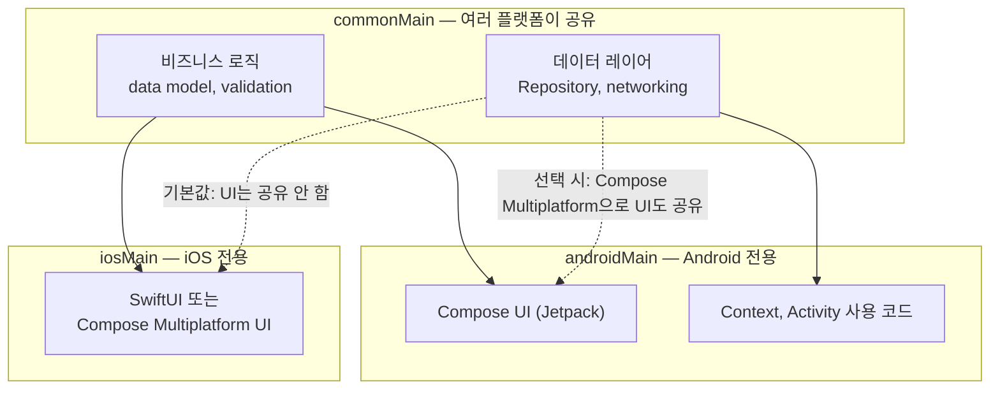

## Kotlin Multiplatform 은 비즈니스 로직과 데이터 레이어를 공유하고 UI 는 기본적으로 플랫폼별로 유지한다

[Android 앱 아키텍처](../android-app-architecture.md)는 UI, ViewModel, Repository 가 모두 하나의 플랫폼(Android) 안에서 동작한다고 전제한다. Kotlin Multiplatform(KMP)은 이 전제를 깨고 "어떤 코드를 여러 플랫폼이 공유하고 어떤 코드를 플랫폼별로 남길지"를 프로젝트 구조 자체로 결정하는 계약이다. 공식 문서는 이 경계를 명확히 나눈다 — "Kotlin Multiplatform is the core technology that lets you share code – such as business logic, data models, networking, and more – across multiple platforms... It focuses on code reuse without replacing the native UI unless you want it to." 즉 기본값은 "로직은 공유, UI 는 네이티브 유지"이고, UI 공유는 별도로 켜는 옵션이다.

### 내부 동작 메커니즘

- **공유 경계는 source set 구조로 강제된다.** KMP 프로젝트는 `commonMain`(모든 타겟이 공유하는 코드)과 `androidMain`/`iosMain` 같은 platform-specific source set 으로 나뉜다. 공식 문서는 "Common code can't use platform-specific APIs, since it's compiled to every declared target"이라고 설명하고, 예시로 "`java.io.File` is part of the JDK, so it can't be used in commonMain"이라고 명시한다. 즉 `commonMain` 에 `Context`, `Activity`, JDK `File` 처럼 특정 플랫폼에서만 존재하는 타입을 직접 참조하면 컴파일이 되지 않는다 — 이것이 "무엇을 공유할 수 있는지"를 결정하는 첫 번째 경계다.
- **UI 공유는 선택 사항이지 기본값이 아니다.** 공식 소개 페이지는 세 가지 공유 범위를 제시한다: (1) "Use Kotlin with Compose Multiplatform to share up to 100% of your app code – including UI", (2) "Write your app's data handling and business logic once with Kotlin Multiplatform while keeping the UI fully native – perfect when UX precision is key and platform fidelity matters", (3) "Start by sharing an isolated, core part of your business logic – like calculations, validation rules, or authentication workflows". 순수 Android 전용 앱은 이 선택지 자체가 없지만, KMP 를 도입하는 순간 "로직만 공유"와 "UI 까지 공유" 중 하나를 프로젝트마다 명시적으로 정해야 한다.
- **Compose Multiplatform 은 KMP 위에 얹는 별도 계층이다.** 공식 문서는 관계를 이렇게 정리한다 — "Compose Multiplatform is an optional UI framework built on top of Kotlin Multiplatform. It allows you to share your user interface across platforms using a modern, declarative approach similar to Jetpack Compose on Android." Android 전용 앱의 [Jetpack Architecture](../jetpack-architecture/android-jetpack-architecture-map.md) 는 Compose 를 Android UI 렌더링 계층으로만 다루지만, KMP+Compose Multiplatform 조합에서는 같은 Compose 코드가 iOS/desktop/web 렌더링까지 책임질 수 있다 — 이 노트가 다루는 "경계"는 이 선택을 하느냐 마느냐이지, Compose 문법 자체가 아니다.
- **Android 전용 개념(Context 등)은 commonMain 에서 살아남지 못한다.** [Context는 Android 환경 능력이지 의존성 컨테이너가 아니다](../context-and-modularity/context-contracts/context-is-android-environment-capability-not-dependency-container.md)에서 다루는 `Context` 는 `commonMain` 에서 직접 쓸 수 없는 대표적인 플랫폼 전용 API 다. KMP 로 데이터 레이어를 공유하려면 `Context` 가 필요한 부분(파일 경로, 데이터베이스 드라이버 오픈 등)을 `expect`/`actual` 뒤로 옮겨야 한다 — 그 메커니즘은 [expect/actual은 공통 코드가 플랫폼별 구현을 요구하는 컴파일 타임 계약이다](./expect-actual-is-compile-time-contract-for-platform-specific-implementation.md)에서 다룬다.



### 코드 예시

```kotlin
// build.gradle.kts — 공유 경계는 target/source set 선언 자체로 드러난다
kotlin {
    androidTarget()
    iosX64()
    iosArm64()
    iosSimulatorArm64()

    sourceSets {
        commonMain.dependencies {
            // 여러 타겟이 함께 컴파일하는 코드만 여기 둘 수 있다.
            implementation("org.jetbrains.kotlinx:kotlinx-coroutines-core:1.9.0")
        }
        androidMain.dependencies {
            // Android SDK, Context 를 전제하는 코드는 여기로 격리한다.
            implementation("androidx.core:core-ktx:1.13.1")
        }
    }
}
```

```kotlin
// commonMain — 비즈니스 로직/데이터 레이어는 공유 대상
class BenefitRepository(private val api: BenefitApi, private val db: BenefitDatabase) {
    suspend fun claimBenefit(id: String): Result<Benefit> =
        runCatching { api.claim(id) }.onSuccess { db.upsert(it) }
}
// commonMain 에는 android.content.Context 를 import 하는 줄이 존재할 수 없다.
// androidMain/iosMain — UI는 기본적으로 플랫폼별 구현으로 남는다
// androidMain: @Composable fun BenefitScreen(...) { /* Jetpack Compose */ }
// iosMain(SwiftUI 쪽): struct BenefitScreen: View { ... }
```

### 관측 가능한 증거

- `commonMain` 소스셋 파일에 `import android.content.Context` 를 추가하면 Android 타겟만이 아니라 프로젝트 전체 컴파일이 `Unresolved reference: android` 류의 오류로 즉시 실패한다. 이는 "무엇을 공유할 수 있는지"가 코드 리뷰 규칙이 아니라 컴파일러 강제 규칙이라는 증거다.
- `build.gradle.kts` 의 `kotlin { }` 블록을 열어 어떤 타겟(`androidTarget()`, `iosX64()`, `jvm()` 등)이 선언돼 있는지 보면, 그 프로젝트가 "로직만 공유"인지 "Compose Multiplatform 으로 UI 까지 공유"인지 의존성 목록(`compose.ui`, `compose.material3` 등 공통 의존성 포함 여부)만으로 구분할 수 있다.
- Android 전용 앱 저장소에서는 `ViewModel`, `Repository` 가 같은 모듈에 섞여 있어도 문제되지 않지만, KMP 프로젝트에서 같은 클래스를 `commonMain` 으로 옮기려 시도하면 `Context` 나 `android.*` 참조가 남아 있는 지점에서 컴파일 에러가 나 "이 코드가 실제로 플랫폼 독립적이지 않았다"는 사실이 드러난다.

상위 지도: [Multiplatform Contracts](./multiplatform-contracts.md)

관련 노트: [expect/actual은 공통 코드가 플랫폼별 구현을 요구하는 컴파일 타임 계약이다](./expect-actual-is-compile-time-contract-for-platform-specific-implementation.md), [Context는 Android 환경 능력이지 의존성 컨테이너가 아니다](../context-and-modularity/context-contracts/context-is-android-environment-capability-not-dependency-container.md), [Jetpack Architecture는 필수 stack이 아니라 책임 분리 지도다](../jetpack-architecture/architecture-contracts/jetpack-architecture-is-recommended-responsibility-map-not-mandatory-stack.md)

공식 문서: [Kotlin Multiplatform](https://kotlinlang.org/multiplatform/), [Get started with Kotlin Multiplatform](https://kotlinlang.org/docs/multiplatform/multiplatform-discover-project.html)

검증일: 2026-08-05. "code reuse without replacing the native UI unless you want it to", 세 가지 공유 범위 옵션, Compose Multiplatform 을 "optional UI framework built on top of Kotlin Multiplatform"로 규정하는 서술, `commonMain` 이 `java.io.File` 같은 플랫폼 전용 API 를 쓸 수 없다는 규칙은 이번 세션의 WebFetch 로 kotlinlang.org 공식 문서 원문을 직접 대조했다. Kotlin Multiplatform 은 Android 플랫폼 API 가 아니라 JetBrains 가 배포하는 서드파티 기술이므로 Android 버전 종속 사실은 아니다.
