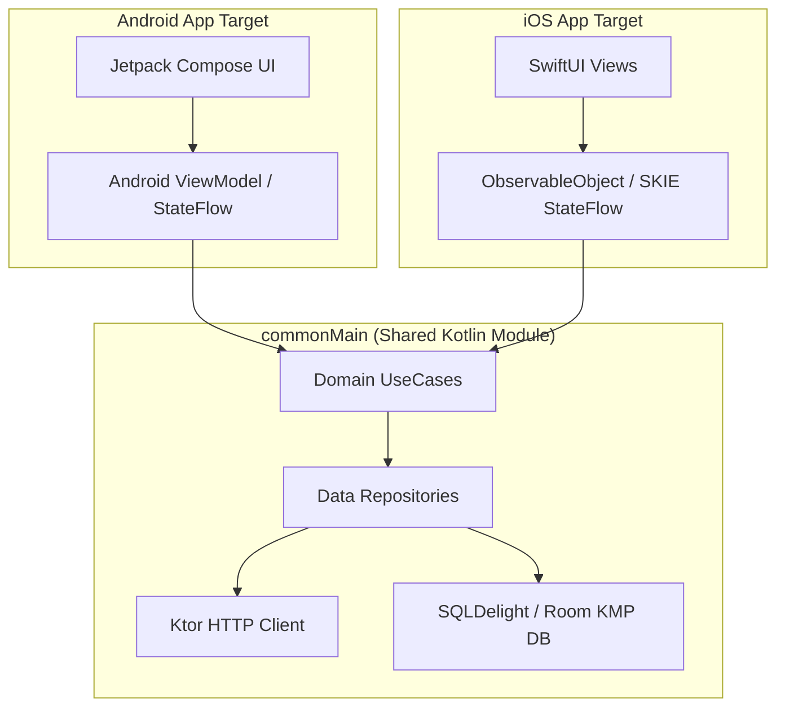

## Kotlin Multiplatform은 비즈니스 로직과 데이터 레이어를 공유하고 UI는 기본적으로 플랫폼별로 유지한다

**Kotlin Multiplatform (KMP) 아키텍처의 기본 접근법은 코어 비즈니스 로직(Domain UseCases), 네트워킹(Ktor), 데이터베이스(SQLDelight), 영속성 모델(DataStore)을 포함하는 Domain & Data Layer 를 `commonMain` 공통 코드로 작성하여 공유하고, UI Layer 는 각 플랫폼의 네이티브 도구(Android: Jetpack Compose, iOS: SwiftUI)로 유지하는 모델**이다. (필요 시 Compose Multiplatform 으로 UI 까지 확장 가능)

---

### 1. 개념 및 핵심 명제 (What)

- **비즈니스 & 데이터 공유 중심 (Shared Core Architecture)**:
  네트워크 API 응답 파싱, 복잡한 계산 알고리즘, 로컬 캐싱 전략, 상태 관리 리포지토리를 플랫폼별로 두 번 작성하는 낭비를 없앤다.
- **네이티브 UI UX 최적화**:
  Android 는 Jetpack Compose 의 안드로이드 네이티브 렌더링을, iOS 는 SwiftUI 의 iOS 전용 UX 뷰 컨트롤러 스택을 적용함으로써 각 타깃 사용자 경험을 100% 네이티브 품질로 보장한다.

---

### 2. 왜 비즈니스 로직 중심 공유인가? (Why)

1. **플랫폼 파편화로 인한 비즈니스 로직 불일치 방지**: 동일한 규칙(예: 금융 앱의 이자율 계산, 검증 로직)이 iOS 와 Android 에서 다르게 작동하는 버그를 근본적으로 차단한다.
2. **네이티브 성능과 접근성(Accessibility) 보존**: 크로스플랫폼 UI 엔진이 가진 렌더링 인디렉션 패널티 없이 각 플랫폼 고유의 UX 컴포넌트를 직접 활용한다.

---

### 3. 내부 메커니즘 (How)



---

### 4. 현대 표준 코드 예시 (KMP Shared Repository & Coroutine Flow)

```kotlin
// commonMain/kotlin/com/example/data/UserRepository.kt
class UserRepository(
    private val api: KtorUserApi,
    private val database: UserDatabase
) {
    fun observeUser(id: String): Flow<UserDomainModel> {
        return database.userQueries.selectById(id)
            .asFlow()
            .mapToOne()
            .map { sqlEntity -> sqlEntity.toDomainModel() }
    }
}
```

---

### 5. 관측 가능 증거 및 진단 (Observability)

- **공통 모듈 아티팩트 빌드 확인**:
  `./gradlew :shared:assembleXcframework` 실행 시 iOS framework 및 Android AAR 아티팩트가 에러 없이 동시 생성되는지 확인.

---

### 6. 관련 문서 및 참조

- 상위 문서: [Multiplatform Contracts](./multiplatform-contracts.md)
- 관련 계약 문서:
  - [Android 앱 아키텍처 정본](../android-app-architecture.md)
  - [expect/actual은 컴파일 타임 계약이다](./expect-actual-is-compile-time-contract-for-platform-specific-implementation.md)
- 공식 문서: [Kotlin Multiplatform Overview](https://kotlinlang.org/docs/multiplatform.html)

검증일: 2026-08-05. KMP 로직 공유 및 네이티브 UI 결합 모델 검증 완료.
