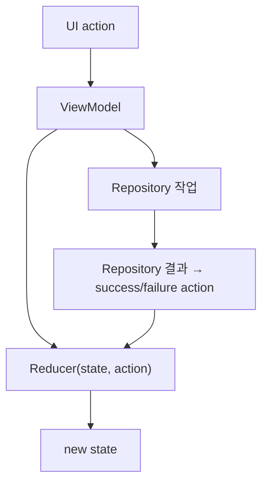

## Reducer 는 이전 상태와 Action 만 받아 새 상태를 계산한다

상위 문서: [Android Reducer](./reducer.md)

### 핵심 주장

Reducer 의 계약은 `oldState + action -> newState` 다.

Reducer 는 상태를 소유하거나 외부 작업을 시작하지 않고, 주어진 입력만으로 다음 상태를 계산한다.

```kotlin
class SignUpReducer {
    fun reduce(
        state: SignUpUiState,
        action: SignUpAction,
    ): SignUpUiState = when (action) {
        is SignUpAction.EmailChanged -> state.copy(
            email = action.value,
            canSubmit = action.value.isNotBlank() && state.password.isNotBlank(),
        )
        SignUpAction.SubmitStarted -> state.copy(isSubmitting = true)
        SignUpAction.SubmitFailed -> state.copy(isSubmitting = false)
    }
}
```

같은 상태와 같은 action 은 언제 호출해도 같은 결과를 내야 한다.

현재 시각, 랜덤값, 네트워크 응답처럼 입력에 포함되지 않은 외부 상태를 읽으면 이 계약이 깨진다.

ViewModel 은 action 을 dispatch 하고, Repository 결과를 다시 action 으로 바꾸는 조정자다.



Reducer 를 별도 클래스로 만들지 않고 ViewModel 의 작은 `update` 블록으로 유지해도 계약은 같다.

핵심은 이름이 아니라 상태 계산과 외부 작업을 분리하는 것이다.

### Reducer 의 입력과 출력

Action 은 사용자의 행동뿐 아니라 비동기 작업 결과도 표현할 수 있다.

`SubmitStarted`, `SubmitSucceeded`, `SubmitFailed` 는 각각 상태 전이를 명시하는 입력이다.

Reducer 가 결과를 직접 기다리지 않고, 결과를 전달받은 뒤 새 상태를 계산한다는 점이 중요하다.

Reducer 는 보통 상태를 mutate 하지 않고 `copy` 또는 새 sealed object 를 반환한다.

같은 old state 와 action 을 여러 번 실행해도 같은 new state 가 나와야 한다.

### 테스트 관점

각 action 별로 대표적인 이전 상태와 기대 상태를 표로 만들면 전이 규칙의 누락을 찾기 쉽다.

Repository fake 나 `runTest` 없이도 Reducer 의 핵심 동작을 검증할 수 있어야 한다.
