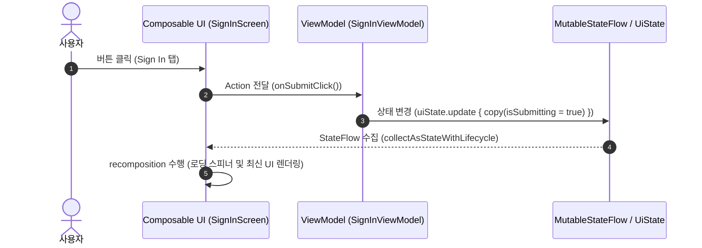

## UI 는 상태를 아래로 받고 사용자 행동을 위로 전달한다 (단방향 데이터 흐름: UDF)

Jetpack Compose 및 현대 안드로이드 아키텍처의 UI 레이어 디자인은 **단방향 데이터 흐름 (Unidirectional Data Flow: UDF)** 패턴을 핵심 축으로 갖는다. UI 컴포넌트는 자신이 표시할 상태(State)를 상위 소유자([viewmodel](viewmodel.md) 등)로부터 아래 방향으로 받아 렌더링하고, 사용자의 모든 입력을 행동(Action/Event)이라는 형태로 상위 소유자에게 위로 전달한다.

---

### 1. 개념 및 핵심 명제 (What)

- **단방향 데이터 흐름 (Unidirectional Data Flow / UDF)**: 데이터와 이벤트가 단 하나의 명확한 루프 방향으로만 순환하도록 제약하는 아키텍처 패턴이다.
  - **State Down (상태 하향 전달)**: ViewModel 이 소유한 불변 상태 객체(`UiState`)가 Compose UI 트리 아래 방향으로 흐르며 화면을 그린다.
  - **Events / Actions Up (행동 상향 전달)**: 버튼 클릭, 텍스트 입력 등의 사용자 인터랙션이 콜백 함수나 `UiAction` 객체를 통해 ViewModel 위 방향으로 올라간다.
- **상태 분리 (Decoupling UI and State)**: UI 컴포넌트(`Composable` 함수)는 데이터를 어떻게 계산하고 비즈니스 로직을 처리하는지 전혀 알지 못하며, 전달받은 `UiState` 데이터 구조체를 선언적으로 그리기만 한다.

---

### 2. 왜 UDF 패턴이 필요한가? (Why)

1. **상태 불일치 및 경쟁 상태(Race Condition) 방지**: 과거 View 시스템이나 양방향 바인딩 방식에서는 Activity, Fragment, Custom View, ViewModel 이 저마다 상태를 따로 소유하며 직접 수정해 상태 파편화와 버그가 빈번했다. UDF 는 **단일 진실 공급원([single source of truth](../../jetpack-compose/runtime/compose-ssot.md): SSOT)** 을 둠으로써 상태 불일치를 근본적으로 차단한다.
2. **UI 테스트 및 예측 가능성 향상**: UI 컴포넌트가 불변 `UiState` 만 받아 렌더링하므로, 특정 상태값만 주입하면 화면이 어떻게 그려질지 100% 동기적으로 예측하고 가상 UI 테스트(Screenshot Test, Compose UI Test)를 쉽게 작성할 수 있다.
3. **화면 회전 및 프로세스 재시작(Process Death) 대응**: ViewModel 이 독립적으로 보존하는 `StateFlow` 로부터 상태를 수신하므로, 화면이 회전되거나 재구성되어도 UI 컴포넌트는 오직 최신 상태를 받아 복원만 하면 된다.

---

### 3. 내부 메커니즘 및 동동 구조 (How)



1. **상태 관찰의 생명주기 안전성 (`collectAsStateWithLifecycle`)**:
   - UI 는 단순히 `StateFlow.collectAsState()` 를 쓰는 것이 아니라, `androidx.lifecycle.compose` 패키지의 `collectAsStateWithLifecycle()` API 를 사용한다.
   - 이는 화면이 백그라운드(`STARTED` 미만)로 내려갔을 때 코루틴 수집을 자동으로 중단하여 불필요한 백그라운드 CPU 및 메모리 소모를 방지한다.
2. **캡슐화 및 [불변성](../../../../../computer-science/immutability.md) 유지**:
   - ViewModel 내부에서는 가변 `MutableStateFlow<SignInUiState>` 를 유지하지만, 외부 UI 에는 읽기 전용 `StateFlow<SignInUiState>` 로 캡슐화하여 노출한다.
   - UI 는 절대로 `uiState.value = ...` 와 같이 직접 상태를 Mutation 할 수 없다.

---

### 4. 올바른 패턴 코드 예시

```kotlin
// 1. 불변 상태 정의 (Single Source of Truth)
data class SignInUiState(
    val email: String = "",
    val isSubmitting: Boolean = false,
    val errorMessage: String? = null
)

// 2. ViewModel: 상태 소유 및 액션 처리
class SignInViewModel : ViewModel() {
    private val _uiState = MutableStateFlow(SignInUiState())
    val uiState: StateFlow<SignInUiState> = _uiState.asStateFlow()

    fun onEmailChanged(newEmail: String) {
        _uiState.update { it.copy(email = newEmail, errorMessage = null) }
    }

    fun onSubmitClick() {
        viewModelScope.launch {
            _uiState.update { it.copy(isSubmitting = true) }
            // 비즈니스 로직 / Repository 연동 수행...
        }
    }
}

// 3. Stateful Composable (Route / Container): ViewModel 과 연결
@Composable
fun SignInRoute(viewModel: SignInViewModel = hiltViewModel()) {
    // 생명주기 안전한 StateFlow 수집
    val state by viewModel.uiState.collectAsStateWithLifecycle()

    SignInContent(
        uiState = state,
        onEmailChanged = viewModel::onEmailChanged,
        onSubmitClick = viewModel::onSubmitClick
    )
}

// 4. Stateless Composable (Content): 오직 렌더링과 이벤트 전파만 담당
@Composable
fun SignInContent(
    uiState: SignInUiState,
    onEmailChanged: (String) -> Unit,
    onSubmitClick: () -> Unit
) {
    Column(modifier = Modifier.padding(16.dp)) {
        OutlinedTextField(
            value = uiState.email,
            onValueChange = onEmailChanged,
            label = { Text("이메일") }
        )
        Button(
            onClick = onSubmitClick,
            enabled = !uiState.isSubmitting
        ) {
            if (uiState.isSubmitting) {
                CircularProgressIndicator(modifier = Modifier.size(16.dp))
            } else {
                Text("로그인")
            }
        }
    }
}
```

---

### 5. 관련 문서 및 참조

상위 문서: [Android UI State](./ui-state.md)

관련 계약 문서:
- [UI 상태의 소유자는 수명주기, 변경 빈도, 공유 범위에 따라 결정된다](state-owner-selection.md)
- [화면 상태는 불변이며 명시적 전이로 변경된다](immutable-screen-state.md)
- [SavedStateHandle은 프로세스 종료 후 복구할 수 있는 작은 상태를 보관한다](savedstatehandle-state-restoration.md)

공식 가이드: [Architecture: UI Layer - Unidirectional Data Flow](https://developer.android.com/topic/architecture/ui-layer#udf)

검증일: 2026-08-05. 안드로이드 공식 아키텍처 UI Layer 가이드의 UDF 패턴 및 `collectAsStateWithLifecycle` API 기준 검증 반영 완료.

