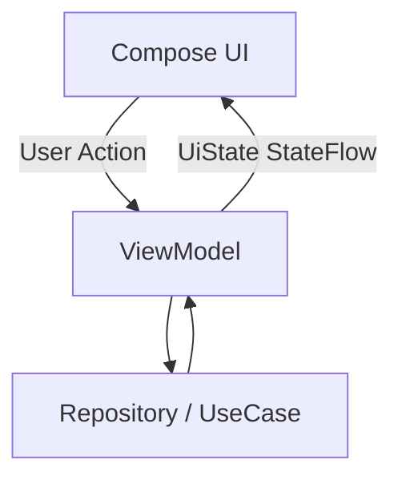
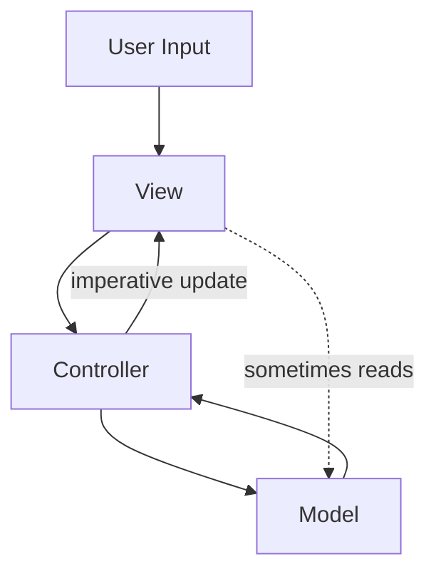
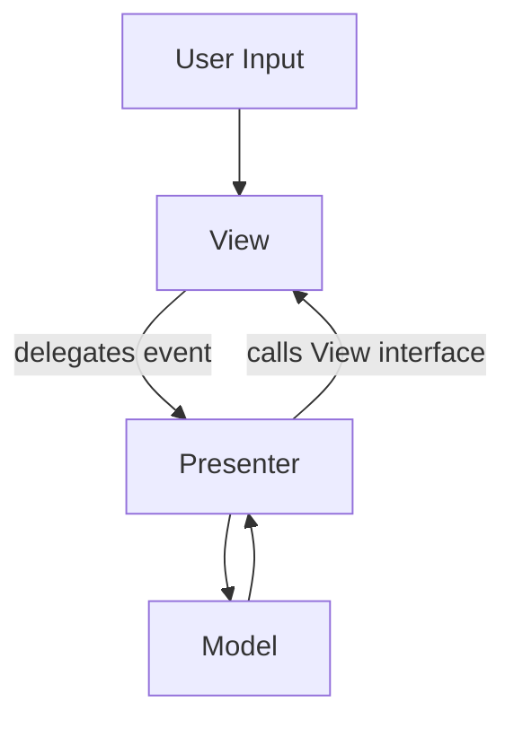
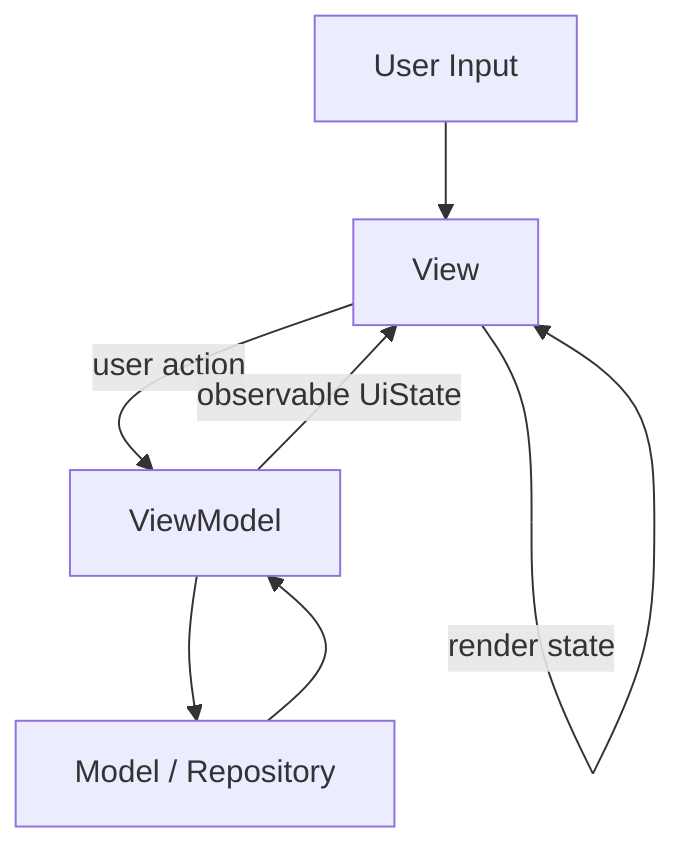
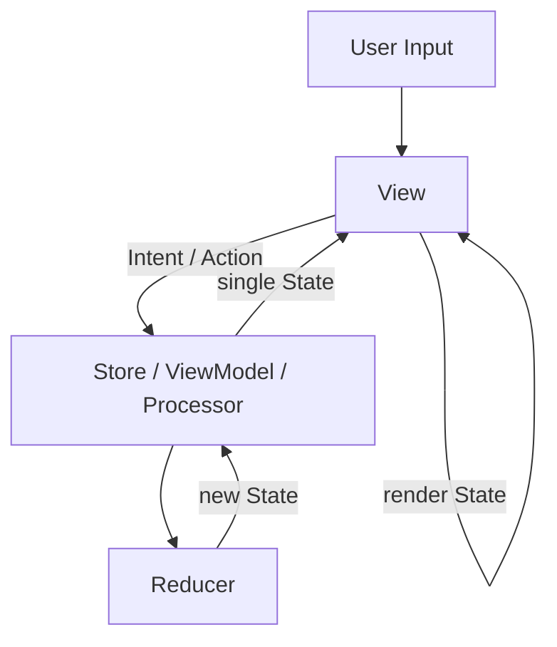

# ViewModel, UI State, Reducer 가이드

이 문서는 Compose 화면에서 `ViewModel`이 무엇을 책임지고, `UiState`, user action, 일회성 이벤트를 어떻게 나누며, 화면 상태 전이가 복잡해졌을
때 Reducer를 언제 도입할지 정리합니다.

핵심은 다음입니다.

```text
UI는 상태를 읽는다.
UI는 사용자 행동을 ViewModel에 전달한다.
ViewModel은 화면 단위 상태를 만들고 외부 작업을 조율한다.
같은 화면에 보이는 상태라도 수명과 소유자가 다르면 분리할 수 있다.
상태 계산이 커질 때만 Reducer로 순수 상태 전이를 분리한다.
```

관련 공식 문서:

- [ViewModel overview](https://developer.android.com/topic/libraries/architecture/viewmodel)
- [UI layer](https://developer.android.com/topic/architecture/ui-layer)
- [State holders and UI state](https://developer.android.com/topic/architecture/ui-layer/stateholders)
- [UI events](https://developer.android.com/topic/architecture/ui-layer/events)
- [State and Jetpack Compose](https://developer.android.com/develop/ui/compose/state)

---

## 1. ViewModel은 화면 단위 State Holder다

Android 공식 아키텍처에서 `ViewModel`은 화면이나 navigation destination 단위의 **state holder**입니다. 화면이 그릴 `UiState`
를 만들고, 화면에서 올라온 user action 중 화면 정책이나 비즈니스 처리가 필요한 일을 담당합니다.



ViewModel이 맡기 좋은 책임:

- 화면에 공개할 `UiState` 만들기
- `StateFlow`로 최신 화면 상태 노출하기
- user action 중 API 호출, 저장, 검증, 조회 같은 작업 처리하기
- `viewModelScope`에서 coroutine 실행하기
- `SavedStateHandle` 또는 navigation route 인자로 화면 복원에 필요한 id 읽기
- Repository/UseCase 호출 결과를 UI가 그릴 상태로 변환하기
- `Result<T>` 및 `runCatching`을 활용하여 예외(Exception)를 안전하게 `UiState.Error` 상태로 전환하기

ViewModel이 맡지 않는 편이 좋은 책임:

- `Activity`, `Fragment`, `Context`를 장기 보관하기
- `SnackbarHostState`, `NavController`, `FocusRequester` 같은 UI 객체 직접 들고 있기
- Composable을 호출하거나 화면을 직접 그리기
- Android view/window API를 직접 조작하기
- 모든 도메인 규칙을 화면 클래스 안에 몰아넣기

단, Compose state-based text field의 `TextFieldState`는 일반적인 immutable `UiState`와 성격이 다릅니다. `TextFieldState`는
Composable이나 widget이 아니라 Compose Snapshot 기반의 text input state holder이며, 최신 Compose text field 문서는 이를 ViewModel에서
소유할 수 있다고 설명합니다. 이 경우 ViewModel은 immutable `String` 상태 대신 specialized mutable state holder로 입력 상태를 관리합니다.

ViewModel은 "화면과 데이터 계층 사이의 모든 것을 다 하는 클래스"가 아닙니다. 화면 상태를 소유하되, 실제 데이터 출처는 Repository가 숨기고, 재사용 가능한
도메인 규칙은 domain model이나 UseCase로 내려야 합니다.

---

## 2. ViewModel이라는 이름이 헷갈리는 이유

아래 문장은 이해를 돕기 위한 일부러 강한 표현입니다.

```text
Android ViewModel은 "View가 쓰는 immutable model"이 아니다.
Android ViewModel은 "수명주기를 아는 UI state container"다.
```

`ViewModel`이라는 이름만 보면 `UserUiModel`, `SignInUiState` 같은 immutable data class가 떠오를 수 있습니다. 하지만
Android의 `ViewModel` 클래스는 그런 객체가 아닙니다.

Android `ViewModel`은 보통 아래처럼 생겼습니다.

```kotlin
class LoginViewModel : ViewModel() {
    private val _uiState = MutableStateFlow(LoginUiState())
    val uiState: StateFlow<LoginUiState> = _uiState.asStateFlow()

    fun onLoginClick() {
        viewModelScope.launch {
            // repository 호출
            // state 갱신
        }
    }
}
```

즉, Android ViewModel은 immutable model이 아니라 mutable state holder입니다. 더 정확히는 mutable state를 내부에 숨기고,
외부에는 읽기 전용 observable state를 공개하는 화면 단위 상태 컨테이너입니다.

역사적으로 MVVM의 ViewModel은 WPF/Silverlight 계열에서 `Property`와 `Command`를 노출하고 View가 binding하는 대상에 가까웠습니다.

```text
View
 <-> Binding
ViewModel
 - Property
 - Command
```

Android의 `ViewModel` 클래스는 MVVM 패턴 전체를 강제하기 위해 만들어진 타입이라기보다, configuration change 후에도 화면 관련 상태와 작업을
유지하기 위한 Jetpack 구성요소입니다. Compose, StateFlow, Coroutine이 붙으면서 오늘날에는 다음 역할을 함께 맡는 경우가 많아졌습니다.

- UI state holder
- user action handler
- `viewModelScope` owner
- Repository/UseCase 호출 조율자
- 화면 상태의 source of truth

따라서 이 문서에서 `ViewModel`이라고 할 때는 "View의 immutable model"이 아니라 **Android 플랫폼이 제공하는 lifecycle-aware
screen state holder**를 의미합니다.

---

## 3. Flutter Bloc은 ViewModel인가

이 질문도 강하게 표현하면 이렇게 정리할 수 있습니다.

```text
Flutter Bloc은 Android ViewModel과 비교할 수 있다.
하지만 패턴 기준으로는 MVVM보다 MVI/Redux 계열에 더 가깝다.
```

Flutter Bloc은 보통 아래 흐름을 가집니다.

```text
View
 -> add(Event)
Bloc
 -> emit(State)
View
```

Android ViewModel은 보통 아래 흐름을 가집니다.

```text
Compose UI
 -> ViewModel function
ViewModel
 -> StateFlow<UiState>
Compose UI
```

역할만 보면 둘 다 View와 data/domain layer 사이에서 user action을 받고 UI state를 만들어 View에 노출합니다. 그래서 실무 대화에서
"Android에서는 ViewModel이 하던 일을 Flutter에서는 Bloc이 한다"고 느낄 수 있습니다.

하지만 이것을 "Bloc은 MVVM의 ViewModel이다"라고 정리하면 부정확합니다. Bloc은 `Event -> Bloc -> State -> View` 흐름을 명시적으로
강제하므로, 패턴 기준으로는 MVVM보다 **MVI/Redux 계열의 state container/event processor**에 더 가깝습니다. Flutter 자체가 MVI라는 뜻은
아닙니다. Flutter는 선언형 UI 프레임워크이고, Bloc을 선택했을 때 그 상태 관리 구조가 MVI/Redux 쪽에 가까운 것입니다.

하지만 차이도 분명합니다.

| 관점        | Flutter Bloc                         | Android ViewModel                    |
|:----------|:-------------------------------------|:-------------------------------------|
| 기본 성격     | event-driven state machine/store     | lifecycle-aware screen state holder  |
| 입력        | `Event`                              | 함수 호출 또는 `UiAction`                  |
| 출력        | `State` stream                       | `StateFlow<UiState>` 등               |
| async 위치  | Bloc 내부가 일반적                         | ViewModel 내부가 일반적                    |
| lifecycle | Flutter widget tree/BlocProvider가 관리 | Android Lifecycle/ViewModelStore가 관리 |
| 상태 전이 강제성 | `Event -> State` 구조가 강함              | 함수, Flow, update 등으로 더 느슨함           |

그래서 문서에서 비교할 때는 이렇게 말하는 편이 가장 덜 헷갈립니다.

```text
Flutter Bloc은 Android ViewModel과 동일한 것은 아니다.
Bloc은 패턴 기준으로 MVI/Redux 계열에 가깝다.
Android ViewModel은 MVVM/MVI 중 하나를 강제하지 않는 lifecycle-aware screen state holder다.
```

이 관점으로 보면 이름에 덜 끌려갑니다. 중요한 것은 클래스 이름이 아니라, 그 객체가 화면 상태의 source of truth인지, user action을 받는지, 외부 작업
결과를 UI state로 바꾸는지입니다.

---

## 4. MVC, MVP, MVVM, MVI에서 진짜 달라진 것

아래 질문은 아키텍처를 공부하다 보면 자연스럽게 나옵니다.

```text
MVC의 Controller, MVI의 Intent, MVVM의 ViewModel은 이름만 바뀐 것 아닌가?
```

문제의식은 맞습니다. 하지만 정확히는 이렇게 고쳐야 합니다.

```text
Controller, Presenter, ViewModel, Bloc, Store는 비교할 수 있다.
하지만 MVI의 Intent는 Controller나 ViewModel과 같은 위치가 아니다.
Intent는 중재자가 아니라 사용자 입력/행동을 표현한 값이다.
```

즉, `MVC의 C`, `MVP의 P`, `MVVM의 VM`, `Bloc`, `Store`는 모두 "사용자 입력을 받아 화면 상태를 만들거나 Model과 연결하는 중간 객체"라는
공통점을 가집니다. 그러나 `MVI의 I(Intent)`는 그 중간 객체 자체가 아니라 중간 객체에 들어가는 입력값입니다.

더 정확한 비교는 다음과 같습니다.

| 패턴   | 입력/행동           | 중재자/상태 생산자                                 | 화면이 읽는 것                            |
|:-----|:----------------|:-------------------------------------------|:------------------------------------|
| MVC  | user event      | Controller                                 | View 직접 변경 또는 Model                 |
| MVP  | user event      | Presenter                                  | View interface 호출                   |
| MVVM | user action     | ViewModel                                  | Observable state / binding property |
| MVI  | Intent / Action | Store, Reducer, Processor, Bloc, 또는 MVI 스타일 ViewModel | 단일 State                            |

Data flow로 보면 차이가 더 선명합니다.

MVC:



MVC에서는 Controller가 입력을 받아 Model을 바꾸고, View를 직접 갱신하는 흐름이 자연스럽습니다. 구현에 따라 View가 Model을 직접 관찰하거나 읽는 변형도
많아서 흐름이 느슨하고 양방향처럼 보이기 쉽습니다.

MVP:



MVP에서는 Presenter가 View interface를 알고 `showLoading()`, `showError()` 같은 명령형 메서드를 호출합니다. View는
interface 뒤에 숨길 수 있어서 테스트는 쉬워지지만, Presenter가 여전히 View를 직접 명령합니다.

MVVM:



MVVM에서는 ViewModel이 View method를 직접 호출하지 않습니다. ViewModel은 observable state를 노출하고, View는 그 state를
binding하거나 collect해서 다시 그립니다.

MVI:



MVI에서는 입력도 `Intent`/`Action` 값으로 모델링하고, 화면도 하나의 `State` 값으로 최대한 결정하려고 합니다. 핵심은 `Intent`가 Controller가
아니라 Store/ViewModel/Processor에 들어가는 입력값이라는 점입니다.

그래서 "이름만 바뀐 것 아니냐"는 질문에 대한 답은 반쯤은 맞고, 반쯤은 틀립니다.

맞는 부분:

- 중간에서 입력을 받고 data/model layer와 연결하는 객체는 계속 존재합니다.
- MVC의 Controller, MVP의 Presenter, MVVM의 ViewModel, Flutter Bloc, Redux Store는 역할상 비교할 수 있습니다.
- 실무 코드에서는 이 객체들이 API 호출, 검증, 상태 갱신을 맡는 경우가 많습니다.

틀린 부분:

- MVI의 Intent는 중재자가 아닙니다. Intent는 사용자의 행동을 표현한 값입니다.
- 패턴의 차이는 객체 이름보다 데이터 흐름과 상태 표현 방식에서 생깁니다.
- 현대 선언형 UI에서는 View를 직접 조작하는지, State를 만들어 View가 그리게 하는지가 큰 차이를 만듭니다.

MVC에서는 Controller가 View를 직접 바꾸는 코드가 자연스러웠습니다.

```text
controller.login()
 -> model.login()
 -> view.showLoading()
 -> view.showSuccess()
```

MVP에서는 Presenter가 View interface를 호출했습니다.

```text
presenter.login()
 -> view.showLoading()
 -> model.login()
 -> view.showError()
```

MVVM에서는 ViewModel이 View를 직접 조작하지 않고 observable state를 노출합니다.

```text
View
 -> user action
ViewModel
 -> UiState
View
 -> render(UiState)
```

MVI에서는 이 흐름을 더 엄격하게 만듭니다.

```text
Intent / Action
 -> Reducer / Store / Processor
 -> State
 -> Render
```

여기서 핵심은 "중재자가 사라졌다"가 아닙니다. 중재자는 계속 있습니다. 바뀐 것은 화면을 바꾸는 방식입니다.

```text
MVC/MVP:
어떤 View 메서드를 호출해서 화면을 바꿀까?

MVVM:
어떤 UiState를 노출해서 화면이 다시 그리게 할까?

MVI:
어떤 Action이 어떤 규칙으로 State를 바꾸게 할까?
```

즉, 관심사가 명령형 View 조작에서 상태 중심 렌더링으로 이동했습니다.

```text
Command-driven UI
 -> State-driven UI
```

이 변화가 React, Flutter, SwiftUI, Jetpack Compose 같은 선언형 UI와 잘 맞습니다. 현대 UI는 대부분 아래 모델을 따릅니다.

```text
State
 -> Render
```

마지막으로, `MVC -> MVI -> MVVM`처럼 직선적으로 진화했다고 보지는 않는 편이 좋습니다. 이 패턴들은 서로를 순서대로 대체한 후속 버전이라기보다, 각기 다른 시대와
플랫폼에서 나온 설계 철학입니다.

- MVC는 객체지향 GUI와 웹 프레임워크 맥락에서 널리 쓰였습니다.
- MVP는 Android 초기처럼 View를 interface로 분리하고 테스트하기 위해 많이 쓰였습니다.
- MVVM은 WPF의 data binding 맥락에서 강해졌고, Android에서는 ViewModel/StateFlow/Compose와 결합해 화면 상태 holder로 쓰입니다.
- MVI는 Elm, Redux 같은 함수형/단방향 데이터 흐름의 영향을 받아 Intent/Action, Reducer, 단일 State를 강조합니다.

따라서 이 문서에서는 아키텍처 이름보다 아래 질문을 더 중요하게 봅니다.

```text
화면 상태의 source of truth는 어디인가?
사용자 입력은 어떤 값/함수로 표현되는가?
상태 변화 규칙은 어디에 모여 있는가?
View를 직접 조작하는가, State를 렌더링하는가?
```

---

## 5. 기본 구조: State Down, Action Up

Compose 화면의 기본 흐름은 `state down, action up`입니다.

```kotlin
data class SignInUiState(
    val isIdError: Boolean = false,
    val isPasswordError: Boolean = false,
    val isSubmitting: Boolean = false,
    val errorMessage: String? = null,
)

class SignInViewModel(
    private val authRepository: AuthRepository,
) : ViewModel() {
    private val _uiState = MutableStateFlow(SignInUiState())
    val uiState: StateFlow<SignInUiState> = _uiState.asStateFlow()

    fun onIdChanged() {
        _uiState.update { state ->
            state.copy(isIdError = false)
        }
    }

    fun signIn(id: String, password: String) {
        viewModelScope.launch {
            _uiState.update {
                it.copy(
                    isSubmitting = true,
                    errorMessage = null,
                )
            }

            val result = authRepository.signIn(id, password)

            _uiState.update {
                result.fold(
                    onSuccess = { it.copy(isSubmitting = false) },
                    onFailure = { error ->
                        it.copy(
                            isSubmitting = false,
                            errorMessage = error.message ?: "로그인에 실패했습니다.",
                        )
                    }
                )
            }
        }
    }
}

### 5-1. Data 계층 예외 처리: Result<T>와 runCatching

Repository나 DataSource에서 파일 IO, 네트워크, JSON 파싱 시 발생하는 예외(Exception)를 안전하게 처리하기 위해 Kotlin의 `runCatching`과 `Result<T>`를 활용합니다.

```kotlin
// Data 계층 (RepositoryImpl)
class LicenseRepositoryImpl(
    private val assetManager: AssetManager,
) : LicenseRepository {

    override suspend fun getOpenSourceLicenses(): Result<List<OpenSourceArtifact>> = withContext(Dispatchers.IO) {
        runCatching {
            val jsonString = assetManager.open("licenses/artifacts.json")
                .bufferedReader()
                .use { it.readText() }

            LicenseJsonParser.parseJson(jsonString).map { it.toDomain() }
        }
    }
}
```

* **`runCatching { ... }`**: 실행 블록 내에서 예외가 발생할 경우 이를 낚아채 `Result.failure(exception)`로 감싸 반환합니다.
* **ViewModel과의 연동**: ViewModel은 `Result.fold()` 또는 `onSuccess`/`onFailure`를 통해 비동기 작업 결과를 안전하게 UI State(`UiState.Content`, `UiState.Error` 등)로 매핑할 수 있습니다.
```

Composable은 상태를 구독하고 callback만 넘깁니다.

```kotlin
@Composable
fun SignInRoute(
    viewModel: SignInViewModel,
) {
    val uiState by viewModel.uiState.collectAsStateWithLifecycle()

    SignInScreen(
        uiState = uiState,
        onIdChanged = viewModel::onIdChanged,
        onSignInClick = viewModel::signIn,
    )
}
```

이 구조에서는 화면 상태의 단일 출처가 ViewModel입니다. UI는 상태를 직접 고치지 않고, 행동만 올립니다.

---

## 6. UiState, User Action, Event 이름 구분

Android에는 이미 플랫폼 `Intent`가 있습니다. 그래서 화면 내부 user action 이름으로 `Intent`를 쓰면 딥 링크나 시스템 인텐트 문서와 헷갈릴 수
있습니다.

이 프로젝트 문서에서는 다음 이름을 권장합니다.

| 개념                          | 권장 이름                       | 예시                                          |
|:----------------------------|:----------------------------|:--------------------------------------------|
| 화면이 그릴 최신 상태                | `UiState`                   | `SignInUiState`                             |
| UI에서 ViewModel로 올라가는 사용자 행동 | `UiAction` 또는 명시적 함수        | `SignInUiAction.IdChanged`, `onIdChanged()` |
| 한 번 처리하고 사라지는 신호            | `UiEvent` 또는 feature별 event | `SignInEvent.SignInSucceeded`               |
| Android OS 컴포넌트 요청          | `Intent`                    | `android.content.Intent`                    |

단순 화면에서는 sealed `UiAction`을 만들 필요가 없습니다. 아래처럼 명시적 함수가 더 읽기 쉽습니다.

```kotlin
fun onEmailChanged(email: String)
fun onPasswordChanged(password: String)
fun onSubmitClick()
```

action 타입은 다음 상황에서 도입합니다.

- user action 종류가 많아져서 reducer나 handler로 모아야 할 때
- 테스트에서 `oldState + action -> newState`를 명확히 검증하고 싶을 때
- 같은 action을 ViewModel, Reducer, preview fixture에서 공유해야 할 때

---

## 7. Fetch 상태와 Interaction 상태를 꼭 합쳐야 하나

같은 화면에 보인다고 해서 모든 상태를 반드시 하나의 ViewModel에 합칠 필요는 없습니다. 기준은 "같은 화면인가"보다 **상태의 수명, 소유자, 변경 주기,
재사용 범위가 같은가**입니다.

수명별 API 선택을 더 넓게 보려면 [[jetpack-compose-state-lifetime-api-selection|compose_state_lifetime_api_guide.md]]를 함께 봅니다.

```text
같은 화면의 최종 UI 상태를 함께 결정한다
-> 한 ViewModel에서 조합해도 된다

수명, 소유자, 변경 주기, 재사용 범위가 다르다
-> ViewModel 또는 state holder를 분리하는 편이 낫다
```

예를 들어 `DataStore`에서 session이나 app setting을 읽는 흐름은 특정 화면 interaction이라기보다 앱 전역 상태 관찰에 가깝습니다. 이런 상태는
root/app scope의 `AppSessionViewModel`, 별도 observer, Repository Flow가 소유하는 편이 자연스럽습니다.

반대로 로그인 form, 회원가입 form, 결제 form의 입력값, validation, submit loading은 화면 단위 interaction state입니다. 이런 상태는 해당
screen 또는 navigation entry의 ViewModel이 소유하는 편이 좋습니다.

둘이 한 화면에 같이 필요하다면 route composable에서 각각 구독해 화면에 전달할 수 있습니다.

```kotlin
@Composable
fun SignInRoute(
    appSessionViewModel: AppSessionViewModel,
    signInViewModel: SignInViewModel,
) {
    val sessionState by appSessionViewModel.sessionState.collectAsStateWithLifecycle()
    val signInState by signInViewModel.uiState.collectAsStateWithLifecycle()

    SignInScreen(
        sessionState = sessionState,
        uiState = signInState,
        onSignInClick = signInViewModel::signIn,
    )
}
```

이 구조에서는 session 상태와 sign-in form 상태의 소유자가 다릅니다. 화면은 두 상태를 동시에 사용할 뿐입니다.

반대로 fetched data와 interaction state가 강하게 얽히면 한 ViewModel에서 조합하는 편이 더 읽기 쉽습니다.

```text
쿠폰 목록 fetch
+ 검색어
+ 정렬
+ 필터
+ 선택 상태
+ 새로고침
```

이런 화면은 `CouponViewModel` 하나가 Repository Flow와 사용자 입력 Flow를 `combine`해서 `CouponUiState` 하나를 만드는 구조가 자연스럽습니다.

판단 기준:

- `DataStore`/Room/Repository Flow 자체는 data layer가 소유합니다.
- 앱 전역 session/settings 관찰은 root/app ViewModel 또는 observer가 소유합니다.
- 화면 입력, 선택, validation, submit 상태는 screen ViewModel이 소유합니다.
- 두 상태가 하나의 화면 정책을 함께 결정하면 screen ViewModel에서 조합합니다.
- 단지 같은 화면에 보인다는 이유만으로 하나의 ViewModel에 합치지 않습니다.
- 단순 fetch-only 변환이 반복된다면 별도 ViewModel보다 Repository Flow, observer, 기존 screen ViewModel의 `stateIn` 중 무엇이 가장 단순한지 먼저 봅니다.

---

## 8. Compose State Holder를 ViewModel에 둬도 되는가

일반적인 UDF 설명만 보면 text field도 아래처럼 immutable `UiState`와 callback으로 다루고 싶어집니다.

```kotlin
data class LoginUiState(
    val id: String = "",
    val password: String = "",
)

TextField(
    value = uiState.id,
    onValueChange = viewModel::onIdChanged,
)
```

이 방식은 이해하기 쉽고 UDF 모양도 선명합니다. 하지만 Compose의 state-based text field는 `value/onValueChange` 대신 `TextFieldState`를
사용합니다.

```kotlin
class SignInViewModel : ViewModel() {
    val idState = TextFieldState()
    val passwordState = TextFieldState()
}

TextField(state = viewModel.idState)
SecureTextField(state = viewModel.passwordState)
```

이 구조는 strict한 `Immutable UiState -> UI -> callback -> ViewModel` 형태는 아닙니다. `TextFieldState` 자체가 mutable state holder이고,
text field가 그 객체를 직접 수정합니다. 하지만 이것이 곧 UDF를 깨는 구조라는 뜻은 아닙니다.

더 정확히는 다음처럼 봅니다.

```text
UDF의 예외
-> 아님

immutable UiState 모델의 예외
-> 맞음
```

ViewModel이 상태를 소유하고, UI가 그 상태를 읽어 렌더링하며, 사용자 입력이 그 상태를 갱신한다는 점에서는 여전히 단방향 데이터 흐름으로 이해할 수 있습니다.
다만 매 입력마다 `UiState(id = "...")` 같은 새 immutable 객체를 만드는 대신, `TextFieldState` 내부의 Compose Snapshot 상태가 변경됩니다.

Compose state-based text field에서 `TextFieldState`는 다음 성격을 가집니다.

- Composable 함수나 UI widget이 아니라 text input 전용 state holder입니다.
- text, selection, composition을 함께 관리합니다.
- keyboard/input pipeline과 동기화 문제를 줄이기 위해 만들어졌습니다.
- Compose snapshot state를 사용하므로 ViewModel이 Compose runtime 쪽 타입을 알게 됩니다.
- ViewModel에서 만들면 `rememberTextFieldState()`의 save/restore는 자동으로 받지 못하므로 필요한 경우 `SavedStateHandle` 등으로 복원을 직접 설계해야 합니다.

따라서 선택 기준은 다음입니다.

| 선택 | 적합한 경우 | 주의점 |
|:---|:---|:---|
| `UiState`에 `String`을 두고 value-based `TextField` 사용 | 단순 입력, strict UDF를 우선할 때 | 최신 state-based text field의 input 동기화 장점을 덜 활용 |
| `TextFieldState`를 Composable/route에 두고 ViewModel에 변경 통지 | text input state를 UI 수명에 묶고 싶을 때 | ViewModel의 state가 text field의 source of truth는 아님 |
| `TextFieldState`를 ViewModel에 둠 | text input state까지 screen ViewModel이 소유해야 할 때, `SecureTextField`/state-based API를 적극 사용할 때 | Compose snapshot 타입이 ViewModel에 들어오고, 저장/복원 설계를 별도로 고려 |

현재 `SignInViewModel`처럼 `TextFieldState`를 ViewModel에 두는 구조는 Compose state-based text field 관점에서는 허용 가능한 선택입니다. 다만
프로젝트 문서에서 말하는 일반 원칙, 즉 "`NavController`, `SnackbarHostState`, `FocusRequester` 같은 UI controller/effect runner는 ViewModel에
두지 않는다"와는 구분해야 합니다.

이 구조를 쓴다면 다음 규칙을 지킵니다.

- `TextFieldState`는 text input state holder로만 사용합니다.
- Repository, domain model, api module로 `TextFieldState`를 넘기지 않습니다.
- domain validation에는 `textFieldState.text.toString()`처럼 primitive 값만 넘깁니다.
- 화면 복원이 중요하면 `SavedStateHandle`이나 route-level `rememberTextFieldState()` 중 어디가 source of truth인지 명확히 정합니다.
- 팀이 strict immutable `UiState` UDF를 우선한다면 value-based `TextField` 또는 route-local `TextFieldState` + ViewModel callback 구조를 선택합니다.

Compose state holder라고 해서 모두 ViewModel에 넣어도 되는 것은 아닙니다. 기준은 그 객체가 **지속적인 UI state holder**인지, 아니면 **UI
controller/effect runner**인지입니다.

| 객체 | ViewModel 보관 | 이유 |
|:---|:---|:---|
| `TextFieldState` | 가능 | 지속되는 text input 상태입니다. text, selection, IME composition을 함께 관리합니다. |
| custom plain state holder | 가능 | 화면 정책을 표현하는 순수 state holder라면 ViewModel 또는 Composition 중 적절한 수명에 둘 수 있습니다. |
| `LazyListState` | 보통 UI layer | 대부분 스크롤 위치/제어 상태입니다. 마지막 읽은 위치처럼 제품 상태가 되면 별도 값으로 ViewModel에 올립니다. |
| `PagerState` | 경우에 따라 UI layer | pager 제어 상태에 가깝습니다. 현재 탭이 화면 정책이면 selected tab 값만 ViewModel에 둘 수 있습니다. |
| `SnackbarHostState` | 보통 두지 않음 | transient UI effect 실행기입니다. ViewModel은 snackbar message/event만 보내고 UI가 `showSnackbar()`를 실행합니다. |
| `SheetState`, `DrawerState` | 보통 두지 않음 | bottom sheet/drawer 표시와 animation을 제어하는 UI interaction controller입니다. |
| `FocusRequester` | 두지 않음 | focus 이동을 실행하는 UI controller입니다. |
| `NavController` | 두지 않음 | navigation 실행기입니다. ViewModel은 navigation 목적을 state/event로 표현하고 route/app layer가 처리합니다. |

예를 들어 snackbar는 ViewModel이 `SnackbarHostState`를 직접 들고 `showSnackbar()`를 호출하기보다, 일회성 event를 내보내고 Composable이 처리합니다.

```kotlin
sealed interface SaveEvent {
    data class ShowSnackbar(val message: String) : SaveEvent
}

LaunchedEffect(viewModel) {
    viewModel.events.collect { event ->
        when (event) {
            is SaveEvent.ShowSnackbar -> snackbarHostState.showSnackbar(event.message)
        }
    }
}
```

반대로 `TextFieldState`는 snackbar처럼 "한 번 실행하고 사라지는 effect"가 아니라 현재 입력 필드의 지속적인 상태입니다. 이 차이 때문에
`TextFieldState`는 ViewModel 보관이 가능하고, `SnackbarHostState`는 보통 UI layer에 두는 편이 맞습니다.

---

## 9. 상태와 일회성 이벤트를 구분한다

`UiState`는 "지금 화면이 무엇을 그려야 하는가"입니다. 새 collector가 들어왔을 때 다시 받아도 되는 값이어야 합니다.

```kotlin
data class ProfileUiState(
    val isLoading: Boolean = false,
    val name: String = "",
    val errorMessage: String? = null,
)
```

일회성 이벤트는 "한 번만 처리해야 하는 신호"입니다.

```kotlin
sealed interface SignInEvent {
    data object NavigateHome : SignInEvent
    data class ShowSnackbar(val message: String) : SignInEvent
}
```

주의할 점은 공식 UI events 가이드가 ViewModel에서 발생한 UI 동작도 가능하면 상태로 표현하라고 권장한다는 점입니다. 특히 프로세스 복원 후에도 이어져야 하는
흐름은 event stream보다 `UiState`가 안전합니다.

| 상황                            | 권장 표현                                               |
|:------------------------------|:----------------------------------------------------|
| 로딩, 입력값, 검증 오류, 선택된 탭         | `UiState`                                           |
| 화면 회전 후에도 유지되어야 하는 목적지 상태     | `UiState` 또는 navigation state                       |
| Snackbar 한 번 표시               | `SharedFlow` 또는 `Channel`, 필요 시 consume callback    |
| 로그인 완료 후 루트 화면 전환             | 단순 앱에서는 event 가능, 복원 가능성이 중요하면 session state 변화로 표현 |
| 결제, 본인인증처럼 중간 단계 복원이 중요한 flow | `UiState`에 현재 단계와 결과를 명시                            |

즉, `Channel`이나 `SharedFlow`가 틀린 것은 아닙니다. 다만 "놓치면 안 되는 상태"를 event로만 표현하면 화면 재생성, collector 재시작, 프로세스
복원에서 흐름이 약해집니다.

---

## 10. ViewModel 안의 `copy()`가 많아질 때

작은 화면은 ViewModel 안에서 직접 상태를 갱신하는 것이 가장 단순합니다.

```kotlin
fun onEmailChanged(email: String) {
    _uiState.update { state ->
        state.copy(
            email = email,
            isSubmitEnabled = email.isNotBlank() && state.password.isNotBlank(),
        )
    }
}
```

이 정도는 별도 abstraction이 필요 없습니다.

하지만 아래 조건이 겹치면 ViewModel이 빠르게 커집니다.

- 입력 필드가 많다.
- `onXxxChanged()`가 10개 이상 늘어난다.
- `copy()`와 검증 로직이 여러 함수에 반복된다.
- 어떤 action이 어떤 상태 전이를 만드는지 ViewModel 전체를 읽어야 알 수 있다.
- coroutine, repository 호출, 상태 계산, 일회성 이벤트 발행이 한 함수에 섞인다.

이때 상태 계산만 별도 순수 Kotlin 객체로 분리할 수 있습니다. 이 객체를 Reducer라고 부릅니다.

---

## 11. Reducer란 무엇인가

Reducer는 이전 상태와 action을 받아 새 상태를 계산하는 순수 함수입니다.

```text
oldState + action -> newState
```

Reducer는 상태를 소유하지 않습니다. Repository를 호출하지 않고, coroutine을 실행하지 않고, Android API도 사용하지 않습니다.

```kotlin
internal sealed interface SignUpAction {
    data class EmailChanged(val email: String) : SignUpAction
    data class PasswordChanged(val password: String) : SignUpAction
    data object SubmitStarted : SignUpAction
    data object SubmitFailed : SignUpAction
}

internal class SignUpStateReducer {
    fun reduce(
        state: SignUpUiState,
        action: SignUpAction,
    ): SignUpUiState {
        return when (action) {
            is SignUpAction.EmailChanged -> {
                val email = action.email
                state.copy(
                    email = email,
                    isSubmitEnabled = canSubmit(
                        email = email,
                        password = state.password,
                    ),
                )
            }

            is SignUpAction.PasswordChanged -> {
                val password = action.password
                state.copy(
                    password = password,
                    isSubmitEnabled = canSubmit(
                        email = state.email,
                        password = password,
                    ),
                )
            }

            SignUpAction.SubmitStarted -> {
                state.copy(isSubmitting = true)
            }

            SignUpAction.SubmitFailed -> {
                state.copy(isSubmitting = false)
            }
        }
    }

    private fun canSubmit(
        email: String,
        password: String,
    ): Boolean {
        return email.isNotBlank() && password.isNotBlank()
    }
}
```

ViewModel은 reducer를 호출해 상태를 반영합니다.

```kotlin
class SignUpViewModel(
    private val repository: AuthRepository,
    private val reducer: SignUpStateReducer = SignUpStateReducer(),
) : ViewModel() {
    private val _uiState = MutableStateFlow(SignUpUiState())
    val uiState: StateFlow<SignUpUiState> = _uiState.asStateFlow()

    fun onEmailChanged(email: String) {
        dispatch(SignUpAction.EmailChanged(email))
    }

    fun submit() {
        viewModelScope.launch {
            dispatch(SignUpAction.SubmitStarted)

            val result = repository.signUp(_uiState.value.email)

            if (result.isFailure) {
                dispatch(SignUpAction.SubmitFailed)
            }
        }
    }

    private fun dispatch(action: SignUpAction) {
        _uiState.update { state ->
            reducer.reduce(state, action)
        }
    }
}
```

---

## 12. Reducer가 하지 말아야 할 일

Reducer의 가치는 "예측 가능한 상태 계산"에 있습니다. 아래가 들어가기 시작하면 Reducer가 아니라 작은 ViewModel이나 UseCase가 되어버립니다.

Reducer에 넣지 않습니다.

- `Repository` 호출
- `suspend` 함수 호출
- `viewModelScope.launch`
- `Flow.collect`
- `Context`, `Resources`, `NavController`
- 현재 시간, 랜덤값, 파일, 네트워크처럼 외부 상태에 직접 의존하는 계산

외부 작업은 ViewModel이나 UseCase가 하고, 그 결과만 action으로 Reducer에 넘깁니다.

```text
SubmitClick
 -> ViewModel
 -> dispatch(SubmitStarted)
 -> Repository.signUp()
 -> dispatch(SubmitSucceeded or SubmitFailed)
```

이렇게 나누면 ViewModel은 외부 작업 조율을 담당하고, Reducer는 상태 전이 규칙만 담당합니다.

---

## 13. Reducer 도입 기준

Reducer는 생소한 패턴이 아닙니다. Elm, Redux, MVI, Flutter Bloc 계열에서 널리 쓰인 개념입니다. 다만 Android 공식 MVVM에서 별도
`Reducer` 클래스를 만드는 것은 필수 관례가 아닙니다.

따라서 이 프로젝트에서는 Reducer를 기본값으로 두지 않습니다.

Reducer가 필요 없는 경우:

- 단순 조회 화면
- 목록 화면
- 상세 화면
- 설정 화면
- 상태 필드가 적고 `copy()`가 몇 번 나오지 않는 화면
- ViewModel 테스트만으로 충분히 읽히는 화면

Reducer가 도움이 되는 경우:

- 회원가입, 결제, 주문, 예약, 복잡한 form, wizard
- user action이 20개 안팎으로 늘어나는 화면
- 상태 전이 규칙을 한 곳에서 읽어야 하는 화면
- 같은 검증과 파생 상태 계산이 여러 함수에 반복되는 화면
- Reducer 단위 순수 JVM 테스트가 ViewModel 테스트보다 훨씬 명확한 화면

실무 기준은 다음처럼 잡습니다.

```text
처음부터 Reducer를 만들지 않는다.
ViewModel 안의 상태 계산이 반복되고 읽기 어려워질 때 분리한다.
Reducer를 만들면 순수 상태 전이만 맡긴다.
새 아키텍처 도입이 아니라 ViewModel 내부 계산을 분리한 리팩터링으로 취급한다.
```

---

## 14. Flutter Bloc을 Reducer 관점에서 다시 보면

앞에서는 Bloc을 Android ViewModel과 역할 관점에서 비교했습니다. 하지만 패턴 관점에서 Bloc은 MVVM보다 MVI/Redux 계열에 가깝습니다. Reducer까지
도입한 Android 구조를 Flutter Bloc 경험으로 다시 풀면 다음 대응이 더 정확합니다.

| Flutter Bloc  | Android ViewModel 구조       |
|:--------------|:---------------------------|
| `Event`       | `UiAction` 또는 ViewModel 함수 |
| `Bloc`        | `ViewModel + Reducer`      |
| `emit(State)` | `_uiState.update { ... }`  |
| `State`       | `UiState`                  |

차이는 책임 분리입니다.

Flutter Bloc은 보통 event 처리, async 작업, state emit을 한 클래스에서 처리합니다.

```text
Event
 -> Bloc
 -> emit(Loading)
 -> Repository call
 -> emit(Success)
```

Android의 `ViewModel + Reducer` 구조에서는 async 작업은 ViewModel이 맡고, 상태 전이 계산은 Reducer가 맡습니다.

```text
UiAction
 -> ViewModel
 -> Repository call
 -> Reducer
 -> UiState
```

그래서 Reducer를 "Bloc 자체"로 보면 안 됩니다. Android에서 Bloc에 가장 가까운 덩어리는 `ViewModel + Reducer`이고, Reducer는 그중
**state transition**만 떼어낸 작은 순수 함수입니다.

---

## 15. 테스트 전략

단순 화면은 ViewModel 테스트로 충분합니다.

```kotlin
@Test
fun signIn_withInvalidId_setsIdError() = runTest {
        val viewModel = SignInViewModel(fakeRepository)

        viewModel.signIn(id = "", password = "password")

        assertTrue(viewModel.uiState.value.isIdError)
    }
```

Reducer를 분리했다면 Reducer 테스트는 더 작고 빠르게 작성할 수 있습니다.

```kotlin
@Test
fun emailChanged_updatesEmailAndSubmitEnabled() {
    val reducer = SignUpStateReducer()

    val state = reducer.reduce(
        state = SignUpUiState(password = "password"),
        action = SignUpAction.EmailChanged("user@test.com"),
    )

    assertEquals("user@test.com", state.email)
    assertTrue(state.isSubmitEnabled)
}
```

Reducer 테스트는 Android framework, coroutine, Flow 없이 동작해야 합니다. 만약 reducer 테스트에 dispatcher, fake
repository, Android context가 필요해졌다면 책임이 섞인 것입니다.

---

## 16. 현재 프로젝트 기준

현재 프로젝트의 `SignInViewModel`, `SignUpOtpVerificationViewModel`, `AppSessionViewModel` 정도는 아직 별도
Reducer가 필수인 복잡도는 아닙니다.

권장 기준:

- 현재처럼 작은 auth 화면은 `_uiState.update { it.copy(...) }`로 유지합니다.
- 실제 auth API 연동 후 입력 필드, 검증 상태, 약관 동의, 단계 이동이 크게 늘어나면 `SignUpStateReducer` 분리를 검토합니다.
- Reducer를 만들더라도 `Repository`, `Channel`, `Flow`, coroutine은 ViewModel에 남깁니다.
- Android 플랫폼 `Intent`와 혼동되지 않도록 화면 action 타입 이름은 `UiAction`을 우선 사용합니다.
- 화면 복원에 필요한 route id와 navigation scope는 [[jetpack-navigation-3-guide|navigation_guide.md]]를 따릅니다.
- 상태와 작업의 수명별 owner/API 선택은 [[jetpack-compose-state-lifetime-api-selection|compose_state_lifetime_api_guide.md]]를 따릅니다.
- Flow, StateFlow, SharedFlow, Channel 자체의
  의미는 [[kotlin-coroutines-flow-stateflow|kotlin_coroutines_flow_stateflow.md]]를 따릅니다.
- Compose의 `remember`, `rememberSaveable`, state hoisting
  기준은 [[jetpack-compose-state-management-flutter-comparison|compose_state_management_flutter_comparison.md]]
  를 따릅니다.

---

## 17. 체크리스트

- UI가 `StateFlow<UiState>`를 읽고 있는가?
- mutable state holder는 ViewModel 내부에 숨겼는가?
- Composable body에서 API 호출이나 저장 작업을 직접 하지 않는가?
- 화면 상태와 일회성 이벤트를 구분했는가?
- 놓치면 안 되는 흐름을 event stream에만 넣지 않았는가?
- ViewModel이 `Context`, `NavController`, `SnackbarHostState` 같은 UI 객체를 장기 보관하지 않는가?
- 단순 화면에 Reducer, Action, Result, Processor를 과하게 만들지 않았는가?
- Reducer를 만들었다면 `oldState + action -> newState`만 담당하는가?
- Reducer 테스트가 Android/coroutine/Flow 없이 순수 JVM 테스트로 가능한가?
