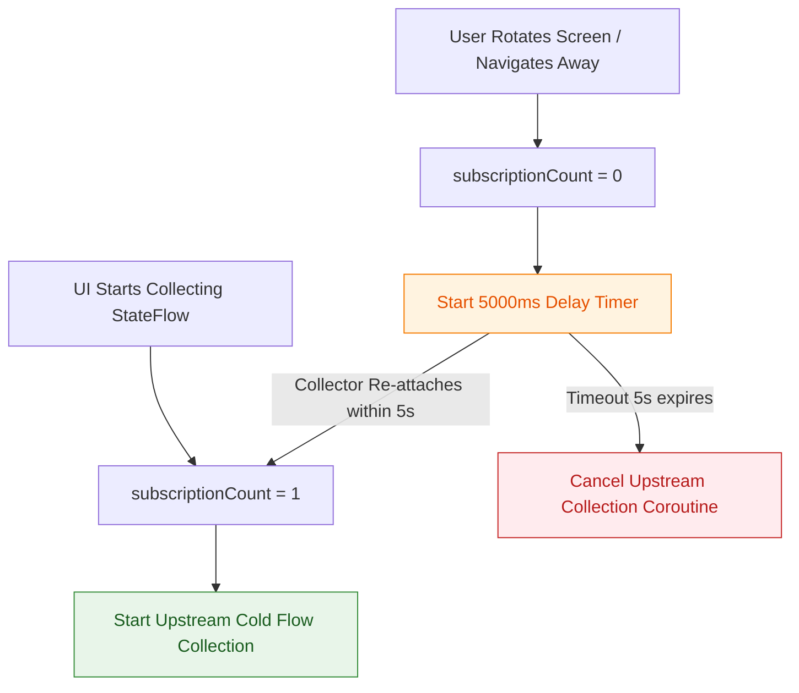

## stateIn은 명시적 수명 scope와 sharing policy를 요구한다

### 개념 (What)
`stateIn`은 **Cold Flow 스트림을 Hot `StateFlow`로 변환**하는 핵심 연산자다. 이를 안전하게 동작시키기 위해 **(1) 공유 코루틴이 실행될 `CoroutineScope`**, **(2) 업스트림 활성화/정지 시점을 정하는 `SharingStarted` 전략**, **(3) 초기 상태인 `initialValue`**를 필수 요구한다.

### 왜 필요한가 (Why)
1. **백그라운드 리소스 및 쿼리 누수 차단**: 앱이 백그라운드로 내려가거나 사용자가 화면을 이탈했을 때도 업스트림 데이터베이스 수집이나 네트워크 스트리밍이 계속 실행되는 것은 심각한 자원 낭비다.
2. **화면 회전 시 재요청 방지 (`WhileSubscribed(5000)`)**: 스마트폰 회전 시 Activity가 재창조되면서 기존 UI의 수집이 순간 끊겼다가 100ms 이내에 다시 수집된다. 이때 업스트림 스트림을 즉시 취소했다가 다시 열면 무거운 DB/네트워크 재요청이 일어난다. 5초(5000ms) 유예 기간을 두어 회전 동안 업스트림을 계속 유지시키는 최적화가 필수적이다.

### 내부 메커니즘 (How)
1. **`SharingStarted.WhileSubscribed(stopTimeoutMillis, replayExpirationMillis)` 메커니즘**:
   - `StateFlow` 내부에서는 구독자 수(`subscriptionCount`)를 원자적으로 추적한다.
   - `subscriptionCount`가 1 이상이 되면 업스트림 `collect` Coroutine이 즉시 시작된다.
   - `subscriptionCount`가 0으로 떨어지면 `stopTimeoutMillis` 타이머가 동작한다. 타이머가 만료되기 전에 구독자가 다시 들어오면 업스트림 취소 없이 연속 실행된다. 5초가 지나도록 구독자가 없으면 비로소 업스트림 Coroutine을 취소(`cancel`)한다.



### 현대 표준 vs 레거시 비교

| 비교 항목 | 레거시 (RxJava refCount / LiveData) | 현대 표준 (stateIn + WhileSubscribed) |
| :--- | :--- | :--- |
| **업스트림 유지** | `refCount()` 사용 시 구독자 0 즉시 취소되어 회전 시 문제 발생 | `WhileSubscribed(5000)`으로 화면 회전 유예 시간 확보 |
| **초기값 설정** | LiveData 생성 시 초기값 설정 불가능 | `stateIn` 파라미터로 필수 초기값 지정 강제 |
| **Scope 바인딩** | CompositeDisposable을 수동 관리하여 에러 가능성 존재 | `viewModelScope` 결합으로 [viewmodel](../../architecture/state-management/viewmodel.md) 파괴 시 100% 자동 소멸 |

### Idiomatic Kotlin 코드 예시

```kotlin
class ProductDetailViewModel(
    private val productId: String,
    private val productRepository: ProductRepository
) : ViewModel() {

    // stateIn 표준 아키텍처 패턴
    val uiState: StateFlow<ProductDetailUiState> = productRepository.getProductStream(productId)
        .map { product -> ProductDetailUiState.Success(product) }
        .catch { e -> emit(ProductDetailUiState.Error(e.message ?: "Load Failed")) }
        .stateIn(
            scope = viewModelScope, // ViewModel의 수명에 종속
            started = SharingStarted.WhileSubscribed(stopTimeoutMillis = 5_000), // 회전 최적화 5초 유예
            initialValue = ProductDetailUiState.Loading // 초기 로딩 상태
        )
}
```

공식 문서: [stateIn](https://kotlinlang.org/api/kotlinx.coroutines/kotlinx-coroutines-core/kotlinx.coroutines.flow/state-in.html)
