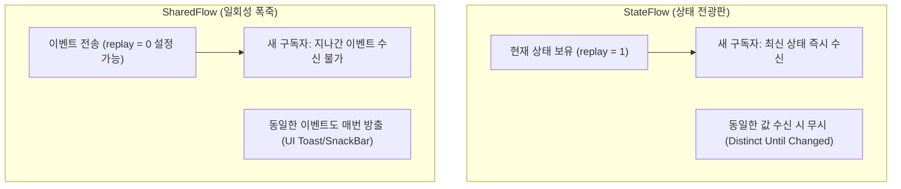

## StateFlow vs SharedFlow (Kotlin Hot Stream 비교)

### 1. 개요 (Overview)

[Kotlin Coroutines](../coroutines/kotlin-coroutines.md) 환경에서 구독자(Subscriber)가 없어도 데이터를 유지하고 발행하는 Hot Stream 의 두 핵심 클래스인 **`StateFlow`** 와 **`SharedFlow`** 는 **상태(State)를 보관하느냐, 이벤트(Event)를 발행하느냐**라는 서로 다른 목적을 갖는다.

---

#### 초보자를 위한 쉽게 이해하는 비유

- **StateFlow (온도계 / 최신 상태 전광판)**:
  - 전광판에 현재 온도(예: `25°C`)가 항상 적혀 있다. 늦게 전광판을 쳐다본 사람도 **가장 최신 온도값(초기값/마지막 값)을 즉시 확인**할 수 있다. 동일한 온도(`25°C` ➔ `25°C`)가 또 전송되면 전광판을 다시 그리지 않는다 (중복 전송 방지).
- **SharedFlow (버튼 누름 알림 / 일회성 폭죽)**:
  - 폭죽이 펑 하고 터지는 일회성 이벤트(Event). 폭죽이 터진 뒤에 늦게 도착한 사람은 **이미 터진 폭죽을 볼 수 없다 (지나간 이벤트 방출)**. 동일한 클릭 이벤트가 여러 번 들어와도 매번 폭죽을 팝업으로 방출한다.

---

### 2. StateFlow vs SharedFlow 핵심 비교표

| 비교 항목 | StateFlow (상태 유지용) | SharedFlow (이벤트 전달용) |
| :--- | :--- | :--- |
| **주요 목적** | **UI 최신 상태 (UiState) 보관 및 노출** | **일회성 UI 이벤트 (Toast, Navigation) 전달** |
| **초기값 필요 여부** | **필수 (Always has a value)** | **불필요 (Optionally no initial value)** |
| **`replay` 캐시 크기** | 고정 `replay = 1` | 자유롭게 설정 가능 (`replay = 0, 1, …`) |
| **동일 값 발행 처리** | 동일 데이터면 수신 무시 (`distinctUntilChanged`) | 동일한 데이터도 매번 방출 |
| **구독자 부재 시** | 최신 값 1 개 보관 후 새 구독 시 즉시 수신 | `replay=0` 설정 시 늦게 온 구독자는 **이벤트 유실** |

---

### 3. 연결 문서 (Related Links)

- [ViewModel](../../architecture/state-management/viewmodel.md) - StateFlow 를 활용하여 UI 상태를 관리하는 컴포넌트
- [Compose SSOT](../../jetpack-compose/runtime/compose-ssot.md) - StateFlow 기반 단일 진실 출처 원칙
